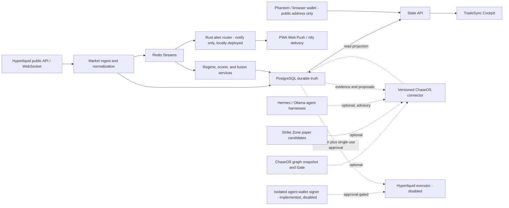

# TradeSync

<p align="center">
  
</p>

TradeSync is a standalone-first Hyperliquid market intelligence, paper-trading, alerting, evidence, and future governed-execution workstation.

Published by **ChaseInTech** as part of the ChaseInTech personal AI and
software-engineering brand. ChaseInTech is the legal licensor named in this
release's FSL-1.1-MIT notice; the canonical project case study is available at
[chaseintech.com/projects/tradesync](https://chaseintech.com/projects/tradesync/).

> **Public research-preview status:** first-party TradeSync software is available under the [FSL-1.1-MIT](LICENSE.md). This is a Fair Source, source-available licence—not an OSI-approved open-source licence—and each release converts to MIT after two years. Provider data, private ChaseOS/Hermes artifacts and credentials are excluded. Read the [public-source notice](PUBLIC_SOURCE_NOTICE.md), [third-party notices](THIRD_PARTY_NOTICES.md), [bring-your-own-credentials guide](docs/providers/BRING_YOUR_OWN_CREDENTIALS.md), and [security policy](SECURITY.md) before running or redistributing anything.

Latest evidence integration: [StrikeZone browser-research receipts in Integration Pipeline](docs/changes/2026-09-19_strikezone-research-evidence-pipeline.md). The dashboard now shows the newest ChaseOS research run, its freshness, source coverage and blockers without copying private artifacts or granting execution authority.

Latest wallet correction: [Phantom-only header connect, resilient Brave provider discovery and visible wallet Settings](docs/changes/2026-09-18_phantom-connect-and-wallet-settings.md). Physical approval in the operator's Brave profile remains the final acceptance step; no secret or signing authority is requested.

It becomes more capable when connected to ChaseOS, Strike Zone Crypto, local AI runtimes, or an isolated wallet, but none of those systems is required for its core market, regime, alert, chart, paper-review, and journal functions.

## Product contract

Trading-day preparation: [readiness checklist and remaining gates](docs/runbooks/TRADING_DAY_READINESS.md).
Managed-paper open/close/evidence controls are locally deployed; a rolled-back
integration check passed with live market observations, not a validated strategy.

Latest development: [17 September editorial market thesis and expanded-sidebar header acceptance](docs/changes/2026-09-17_editorial-thesis-and-expanded-header.md). Mission Control now explains the Bitcoin month, week and current session in paragraphs; Interactive Thesis Playback appears before the detailed article; measured evidence is an optional appendix; the synchronized voice script follows the same human-readable story before showing a scenario.

Runtime recovery, wallet manager and style-aware paper admission: [17 September engineering record](docs/changes/2026-09-17_wallet-runtime-and-style-admission.md).

Wallet and homepage correction: [DApp-style Phantom connection, market horizon map, briefing archive and missed-edition catch-up](docs/changes/2026-09-17_wallet-connect-and-market-briefing.md).

Interactive thesis: [synchronized ChaseOS narration, real chart chapters, temporary stored-level overlays and Market Canvas handoff](docs/changes/2026-09-17_interactive-thesis-playback.md).

Thesis horizon story: [weekly-to-hourly playback, clickable captions, explicit historical outcome mixes, structure candidates and Phantom missing-extension correction](docs/changes/2026-09-17_thesis-horizon-story.md).

Launcher and rendered acceptance: [desktop shortcut startup, wallet boundary and responsive 4-day liquidity QA](docs/changes/2026-09-17_launcher-wallet-liquidity-qa.md).

Earlier liquidity foundation: [14 September liquidity/intraday integration and remaining gates](docs/changes/2026-09-14_liquidity-intraday-and-integration-goal.md). The safe workstation profile is live; execution remains disabled and profitability remains unproven.

Wallet visibility: [public-address positions, open orders and recent fills](docs/changes/2026-09-14_watch-only-activity.md), without signing or live execution.

Mobile: [Android/iPhone notification foundation and setup gates](docs/changes/2026-09-14_mobile-alert-outbox.md). Physical-device delivery is not yet verified.

TradeSync has three explicit capability tiers:

| Tier | Name | Works when | Capability |
|---|---|---|---|
| A | Standalone workstation | Hyperliquid public data, PostgreSQL, Redis, State API, and Cockpit are available | Market state, regimes, charting, alerts, paper opportunities, evidence, journal, and historical review |
| B | Federated intelligence | Optional connectors are healthy | ChaseOS knowledge, Strike Zone candidates, local model explanations, and richer cross-project context |
| C | Governed execution | Wallet signer, risk policy, approval ledger, and reconciliation all pass | Preview, approval-required paper/live actions, and later bounded autonomous actions |

Tier A must continue when any Tier B connector is unavailable. Tier C always fails closed when ChaseOS approval authority, signer state, risk state, or reconciliation is unavailable.

## Current truth — 2026-09-17

Start with the [current capability and remaining-gate register](docs/ROADMAP_RECONCILIATION_2026-09-13.md).
Fleet has gateway state and confirmed controls; Signal Ledger has
cost-aware diagnostics and persisted scalp/swing research. The legacy strategy
is loss-making; a saved replay is not proof of profitability. Execution remains
disabled. The PWA, Activity & Evidence, operator surfaces, reconciliation,
paper economics and Web Push reliability are implemented. The Rust alert router,
partitioned v1 data plane and audited public-wallet registry are locally deployed.
Paper candidates are now gated by the selected style's measured horizon and
minimum implied move. [Build, runtime and QA evidence](docs/changes/2026-09-17_wallet-runtime-and-style-admission.md).

### Historical snapshot — 2026-09-02 (superseded where noted above)

- Hyperliquid is the only venue and authoritative market source.
- The local operator runtime is paper-only: `EXECUTION_ENABLED=false`, `DRY_RUN=true`.
- No wallet, private key, signer, live order authority, or mobile push deployment is configured.
- PostgreSQL 16 and Redis 7 are active dependencies; Qdrant is an optional evidence profile.
- CoinGecko and DefiLlama are free, context-only feeds. FRED is an optional free-key macro feed.
- The responsive Mission Control dashboard and read-only execution readiness surface are implemented locally.
- A private ChaseOS instance may be supplied through an operator-owned `CHASEOS_HOME` path. Its live knowledge connector remains optional to Tier A TradeSync operation; no private vault is bundled or required.
- The first Rust component is a shared contract crate. The Rust alert router and Hyperliquid real-time edge are roadmap work, not complete services.
- Quant Foundations Book 1 and a versioned paper-only regime-weight engine are implemented locally. They do not yet replace the legacy live dashboard classifier or scorer.
- A source-governed 17-feature catalog, cadence-governed market extractor, ordinary/robust normalizer, backend block aggregation, and private Regime Lab are implemented locally.
- The Docker-backed runtime has been verified with live Hyperliquid public data, seven-day Redis feature history, transactional migration application, PostgreSQL draft-experiment persistence, and Cockpit-to-State-API proxy recovery after a State API replacement. Fixed-window replay and active-scorer replacement remain planned.
- The read-only Integration Pipeline inspector is implemented at `/pipeline`. It combines live runtime probes with declared connector contracts, lists missing links and bounded recovery targets, and keeps Tier B connector health outside the Tier A readiness count.
- The current bounded profile does not start ingest-gateway, core-scorer, fusion-engine, an agent harness, Strike Zone, ChaseOS, or execution. The inspector reports those gaps instead of presenting repository code as a live integration.
- Hyperliquid 24-hour change remains deliberately blank and non-blocking in this slice. Direct liquidation flow remains unavailable and is not replaced with an OI proxy.

## Architecture at a glance



The detailed architecture lives in [docs/architecture/STANDALONE_FEDERATED_ARCHITECTURE.md](docs/architecture/STANDALONE_FEDERATED_ARCHITECTURE.md).

## Data and knowledge choices

| Technology | Authority | Purpose |
|---|---|---|
| PostgreSQL 16 | Durable TradeSync source of truth | Market history, signals, opportunities, decisions, approvals, orders, outcomes, notification ledger, and a queryable projection of ChaseOS graph snapshots |
| Redis 7 Streams | Transport, never canonical truth | Low-latency fan-out, consumer groups, backpressure, latest-state caches, and reconnect recovery |
| Qdrant | Rebuildable derived index | Semantic retrieval over approved evidence and knowledge; never approval or execution authority |
| Content-addressed files on E: | Raw evidence and immutable artifacts | Source documents, graph snapshots, receipts, exports, and large attachments |
| ChaseOS `GraphSnapshot` | Canonical knowledge artifact | Stable nodes, edges, confidence, provenance, and snapshot identity; database indexes are adapters derived from it |

No dedicated graph database is required for the first implementation. PostgreSQL adjacency tables and recursive queries are enough for the initial knowledge projection; a dedicated graph engine is considered only after measured query benchmarks justify it. TimescaleDB also remains an evaluated migration, not a current capability—the repository’s `TimescaleStore` is still a placeholder.

## Start TradeSync

Use the governed runtime environment already stored on E:. Do not copy credentials into this repository.

Use the desktop **TradeSync** shortcut, or run:

```powershell
.\tools\start-tradesync.ps1
```

The launcher first tries a normal Docker start. It repairs only the specifically
detected disposable-socket failure and preserves Docker volumes and quarantined
runtime directories. It starts operator, evidence and notification services;
paper execution remains opt-in and live execution remains disabled.

Open [http://localhost:3000/](http://localhost:3000/) or go directly to
[Regime Lab](http://localhost:3000/regime-lab) or the
[Integration Pipeline inspector](http://localhost:3000/pipeline).

### Bring your own provider access

TradeSync ships with **no API keys, accounts, wallet secrets, webhook secrets,
private datasets, or provider entitlements**. Each operator must create and
manage their own provider accounts and credentials, accept each provider's
current terms, and store secrets only in their private runtime environment.

The default paper-research path uses public Hyperliquid, CoinGecko, DefiLlama,
and Binance endpoints without a key. FRED is optional and requires the
operator's own `FRED_API_KEY`. TradingView webhook intake requires a new,
operator-generated `TRADINGVIEW_WEBHOOK_SECRET`; never reuse a credential from
another installation. Live execution keys are unsupported in the public
research-preview profile and execution remains disabled.

See [Bring your own credentials](docs/providers/BRING_YOUR_OWN_CREDENTIALS.md)
for the exact variables, least-privilege rules, and setup boundary.

On 2026-09-02 the bounded stack reported live public Hyperliquid observations
for 10 of the 17 catalog definitions. A non-scoring display value, a feature
collecting history, a zero-dispersion feature, and an unavailable source are
different states; the Regime Lab labels them separately. Counts and scores are
expected to change as the rolling windows advance.

Stop only the bounded services started above:

```powershell
docker compose `
  --env-file E:\Projects\TradeSync\dashboard-runtime\runtime.env `
  -f ops\compose.full.yml `
  -f ops\compose.market-command.yml `
  stop cockpit-ui state-api market-data redis postgres
```

Do not use `down -v`; that removes persistent volumes.

## Current dashboard surfaces

- `/` — Mission Control: a complete returning-trader thesis with BTC/ETH zones, month/week/day/4h alignment, explicit invalidations and conditional scenarios; then the horizon map, live market pulse, economic-event forecast/previous/reaction scenarios, opportunities, system output and safety state.
- `/market` — detailed market snapshots; the future Market Canvas drilldown starts here.
- `/regime-lab` — private paper-shadow feature evidence with source health, challenger weights judged by replaying stored decisions, and draft experiment history.
- `/pipeline` — live Tier A/federated topology, missing-link evidence, workflow edges, capability gaps, and recovery targets. The top-bar status is focus/hover inspectable from every route.
- `/opportunities` — paper opportunity review.
- `/sources` — temporary legacy surface; roadmap replacement is Knowledge Graph intake and provenance.
- `/logs` — Activity & Evidence: Decisions, Approvals, Orders and Outcomes from the bounded audit export over a chosen window, and the newest market alerts, each with its exact reading time and a refresh. Read-only.
- `/execution` — read-only readiness and activation gates; it contains no wallet secrets or arming controls.
- `/settings` — operator settings, connector/device readiness, retention, diagnostics and session-only browser credentials; secrets remain server-side.

## Verification commands

Frontend:

```powershell
Set-Location services\cockpit-ui
npm run build
```

Python context feeds:

```powershell
python -m pytest services\state-api\tests\test_context_feed.py -q
```

Rust contracts:

```powershell
$tradeSyncRoot=(Resolve-Path '.').Path
$env:CARGO_HOME=(Join-Path $tradeSyncRoot '.cache\cargo')
$env:CARGO_TARGET_DIR=(Join-Path $tradeSyncRoot '.cache\cargo-target')
cargo test --workspace
```

## Documentation

- [Documentation index](docs/README.md)
- [Roadmap](roadmap.md)
- [Quant Foundations — Book 1](docs/quant-learning/README.md)
- [Regime Rulebook v1 architecture](docs/architecture/REGIME_RULEBOOK_V1.md)
- [Market feature v1 contract](docs/contracts/MARKET_FEATURE_V1.md)
- [Integration Pipeline status v1](docs/contracts/INTEGRATION_PIPELINE_STATUS_V1.md)
- [Standalone and federated architecture](docs/architecture/STANDALONE_FEDERATED_ARCHITECTURE.md)
- [Data and knowledge plane](docs/architecture/DATA_AND_KNOWLEDGE_PLANE.md)
- [Mobile alert control plane](docs/architecture/MOBILE_ALERT_CONTROL_PLANE.md)
- [Rust boundaries](docs/architecture/RUST_BOUNDARIES.md)
- [Provider matrix](docs/providers/MARKET_PROVIDER_MATRIX.md)
- [Historical Market Command handover](docs/CHASEOS_MARKET_COMMAND_HANDOVER.md)

Historical documents and diagrams can describe removed venues or aspirational components. Current source, tests, this README, `roadmap.md`, the Hyperliquid-only migration record, and ChaseOS governance take precedence.
