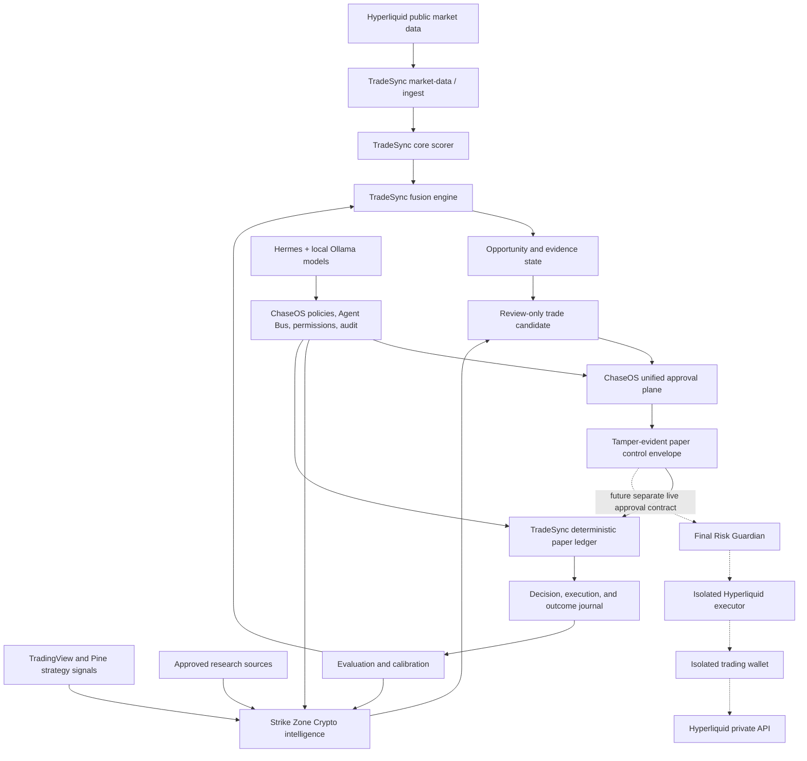

# ChaseOS Market Command

> Architecture status note — 2026-09-01: this handover remains historical programme context. Current standalone/federated boundaries, data choices, Rust adoption, notification control plane, and delivery phases are defined by the repository [README](../README.md), [roadmap](../roadmap.md), and [architecture index](README.md). Where this handover conflicts with those current documents or the Hyperliquid-only source, the current documents and source take precedence.

## Full System Handover for Architecture and Implementation Planning

- Handover date: 2026-08-20
- Recommended umbrella name: **ChaseOS Market Command**
- Short name: **Market Command**
- Internal slug: `chaseos-market-command`
- Description: **A local-first, human-governed market-intelligence, paper-evaluation, risk, journaling, and eventual Hyperliquid execution system.**
- Planning status: architecture foundation exists; end-to-end paper wiring and live execution do not.

## Phase 0 implementation update — 2026-08-23

The first resource/readiness foundation is now implemented:

- read-only `market-command-readiness.ps1` audit with E-drive, host resource, Docker, Ollama, WSL, Git, and fail-closed authority checks;
- evidence output routed to `E:\ChaseOSBuilds\market-command-phase0-resource-audit\evidence`;
- lean Compose overlay with a seven-service default paper core and optional `operator`, `evidence`, `paper-exec`, and `analytics` profiles;
- explicit container memory/CPU ceilings and log rotation;
- PostgreSQL bootstrap-path and Python-container health-check repairs;
- 17 focused tests passing.

The current host is **BLOCKED** for Docker/core startup: the enforced audit observed RAM and CPU above the 65%/30% thresholds, invalid TradeSync Git metadata, and a stopped Docker engine. External E-drive storage passed. No service or execution path was started.

> This document is designed to be copied into ChatGPT web as the complete starting context for a detailed implementation plan. It contains architecture, boundaries, current implementation truth, known gaps, and the decisions that still need to be made. It contains no wallet keys, seed phrases, passwords, tokens, or private credentials.

---

## 1. Naming Decision

The combined system should be called **ChaseOS Market Command**.

This is an umbrella name. It does not replace the identities of the systems being combined:

- **ChaseOS** remains the control plane and operator-governance system.
- **Strike Zone Crypto** remains the market-intelligence, strategy-research, signal, evidence, and paper-evaluation system.
- **TradeSync** remains the market-data, scoring, risk, state, journaling, paper-trading, and eventual execution system.
- **Hyperliquid** remains the only supported trading venue.
- **Hermes and local Ollama models** remain bounded reasoning/runtime adapters operating under ChaseOS authority.

The name “Market Command” is appropriate because the combined system is not merely a trading bot. It is a governed command structure that observes markets, assembles evidence, forms candidates, requests approval, evaluates decisions, records outcomes, and may later route tightly bounded orders.

Recommended language:

> ChaseOS Market Command is the governed umbrella system connecting Strike Zone Crypto intelligence, ChaseOS approvals, TradeSync risk and execution infrastructure, local AI runtimes, and Hyperliquid as the sole venue.

Do not describe it as autonomous today. Do not describe it as live-trading-ready today.

---

## 2. Executive Summary

The objective is to combine several existing personal systems into one coherent, auditable pipeline:

1. Observe Hyperliquid market data and trusted strategy signals.
2. Produce evidence-backed market theses and review-only trade candidates.
3. Route candidates into ChaseOS for an authenticated human decision.
4. Bind the exact candidate and approval into a tamper-evident control envelope.
5. Evaluate the candidate in TradeSync's deterministic paper environment.
6. Persist the full thesis, risk decision, simulated order, and outcome.
7. Feed verified outcomes back into Strike Zone research and TradeSync calibration.
8. Only after extensive paper evidence, introduce a separate isolated wallet and a new live-execution approval class.

The system currently has real foundations on both sides of the bridge:

- Strike Zone has a governed, paper-only ChaseOS unified-approval bridge.
- TradeSync has a deterministic Hyperliquid paper ledger.
- TradeSync has a new tamper-evident `tradesync_control_envelope_v1` contract.
- Docker and Ollama data have been moved to the external NTFS drive.
- Six local Ollama model manifests are stored externally.

However, the actual receipt-to-candidate adapter, shared approval-consumption ledger, end-to-end paper pipeline, isolated wallet, live signing path, and production-grade Hyperliquid executor are not complete.

The correct next programme is therefore:

```text
runtime reliability
    -> cross-system paper adapter
    -> end-to-end paper evidence
    -> reconciliation and risk hardening
    -> isolated wallet design
    -> testnet or minimum-risk live canary
    -> tightly capped production activation
```

---

## 3. Non-Negotiable System Boundaries

These constraints define the combined architecture.

### 3.1 Venue boundary

Hyperliquid is the only trading venue. Do not plan Binance, Bybit, Coinbase, Solana protocols, or generic multi-exchange abstraction as active scope.

Historical TradeSync documentation still contains multi-venue references. Those references are stale and must not be treated as current architecture.

### 3.2 Human authority boundary

No model, strategy, agent, scheduler, or market candidate may grant itself execution authority.

Every future live action must be bound to:

- the exact candidate or bounded batch;
- the exact symbol and side;
- maximum size;
- maximum leverage;
- stop and invalidation conditions;
- expiry;
- a fresh risk verdict;
- a fresh market snapshot;
- a single-use idempotency key;
- an authenticated human approval;
- an unconsumed approval record;
- a healthy kill switch;
- the intended isolated wallet and environment.

### 3.3 Current approvals are paper-only

The existing Strike Zone and TradeSync approval contracts authorize paper evaluation only. They must never be reinterpreted or upgraded into live execution approval.

A future live path requires a different schema and a different approval action. It must not reuse `paper_evaluation_only` receipts.

### 3.4 Wallet boundary

No trading wallet has been created for this programme.

When wallet work begins, it will use a separate purpose-built wallet with limited capital. Wallet creation, funding, secret storage, signing, and production activation are distinct operator-controlled stages.

Never place a seed phrase or raw private key in:

- Git;
- Markdown documentation;
- logs;
- model prompts;
- approval packets;
- Redis;
- Postgres decision records;
- Docker Compose files;
- screenshots;
- ChatGPT conversations.

### 3.5 Runtime authority boundary

Hermes, Ollama, Codex, OpenClaw, and future models are adapters. They do not own the system and cannot change risk policy, approval state, wallet authority, or canonical truth by themselves.

### 3.6 Intelligence is not execution

A high-confidence thesis is not permission to trade. A paper fill is not a live fill. A successful API request is not a confirmed position. A submitted order is not necessarily filled. A wallet connection is not activation authority.

---

## 4. Component Ownership

| Component | Primary role | Owns | Must not own |
|---|---|---|---|
| ChaseOS | Control plane | operator identity, approvals, authority, policy, audit, Agent Bus, runtime boundaries | market prediction, wallet keys, autonomous execution |
| Strike Zone Crypto | Intelligence and research | strategy signals, TradingView/Pine evidence, multi-timeframe thesis, charts, candidate generation, paper outcome analysis | live-order authority, wallet signing, self-approval |
| TradeSync | Trading systems layer | Hyperliquid market ingestion, scoring, opportunity state, risk preview, paper ledger, execution journal, eventual bounded adapter | governance authority, autonomous permission escalation |
| Hyperliquid | Sole venue | public market data and, later, signed order/account APIs | system governance or approval truth |
| Hermes | Bounded local operator runtime | scheduled analysis and workflow execution under ChaseOS declarations | ambient filesystem access, secrets, self-approval, uncontrolled trading |
| Ollama models | Local inference capacity | local reasoning, coding, summarization, classification, fallback inference | authoritative state, approvals, credentials, direct trading authority |
| Docker Desktop | Service runtime | isolated TradeSync infrastructure and service processes | canonical business or approval truth |
| PostgreSQL | Durable relational state | events, signals, opportunities, decisions, execution records, exposures, regimes, calibration | secrets and raw wallet keys |
| Redis | Low-latency transport/state | streams, transient coordination, idempotency and circuit-breaker state | permanent approval authority without durable reconciliation |
| Qdrant | Vector/evidence retrieval | embeddings and evidence retrieval when implemented | authoritative numerical trade state |
| TradeSync Cockpit | Operational visibility | opportunities, previews, positions, health and journals | independent execution authority |
| ChaseOS Studio | Operator control surface | approval review, runtime status, evidence inspection | invisible background approval or automatic order dispatch |

---

## 5. Architecture Overview



Solid lines describe the intended paper system. Dotted lines describe the future live lane, which is not currently authorized or complete.

---

## 6. Logical Layers

### Layer 1 — Operator and governance

**Owner:** ChaseOS.

Canonical local instance:

`${CHASEOS_HOME}`

Responsibilities:

- operator identity and authenticated approval;
- approval request and decision records;
- permission matrix and trust tiers;
- runtime manifests and bounded Agent Bus tasks;
- immutable audit and documentation history;
- approval expiry and consumption visibility;
- lifecycle controls for Hermes/OpenClaw/local runtimes;
- final human authority over any move from paper to live.

The chat window is not the system of record. Structured ChaseOS state and append-only receipts are the authority.

### Layer 2 — Market intelligence

**Owner:** Strike Zone Crypto.

Workspace:

`%USERPROFILE%\Documents\Projects\strikezone_crypto`

Productized workflow pack:

`%USERPROFILE%\Documents\Projects\strikezone_crypto\strikezone-workflow-pack`

Responsibilities:

- Pine Script and TradingView strategy signals;
- multi-timeframe technical evidence;
- chart receipt generation and SHA-256 integrity;
- trend, RSI, structural, regime, and invalidation analysis;
- two-sided thesis formation;
- paper-only governed proposal generation;
- outcome resolution and strategy scorecards;
- evidence-based self-review and controlled strategy improvement;
- Discord/member publication as a separate governed publishing concern.

The workflow pack declares 35 schedule intents. This proves packaged schedule definitions exist; it does not by itself prove every job is currently installed, running, healthy, or appropriate for Market Command.

The existing unified approval bridge publishes immutable Strike Zone paper proposals into the ChaseOS approval plane. It validates chart receipts, proposal hashes, approval digests, exact subjects, authenticated human actors, and single-use decision events. Its closed authority explicitly forbids exchange, wallet, credentials, signing, public publishing, strategy promotion, and live dispatch.

### Layer 3 — Market data, scoring, opportunity, and risk

**Owner:** TradeSync.

Current workspace:

`%USERPROFILE%\Documents\Projects\TradeSync-hyperliquid-only`

Responsibilities:

- Hyperliquid public market-data collection;
- normalized event storage;
- signal scoring;
- fusion and opportunity generation;
- evidence linking;
- risk preview;
- exposure checks;
- state APIs;
- deterministic paper execution;
- execution and outcome journaling;
- eventual isolated execution adapter.

Current service layout in `ops/compose.full.yml`:

| Service | Intended purpose | Current port/status posture |
|---|---|---|
| `postgres` | durable relational state | 5432; persistent Docker volume |
| `redis` | streams, idempotency, circuit state | 6379; append-only enabled |
| `qdrant` | vector evidence store | 6333; service declared |
| `market-data` | Hyperliquid market context/order-book polling | 8005; symbols currently BTC, ETH, SOL |
| `ingest-gateway` | normalized event ingestion | 8080 |
| `core-scorer` | technical bias/confidence scoring | host 8001 |
| `fusion-engine` | confluence and opportunities | 8002 |
| `state-api` | state, evidence, preview, execution routing | 8000; execution disabled in Compose |
| `exec-hl-svc` | Hyperliquid dry-run/execution boundary | 8004; `DRY_RUN=true`, `EXECUTION_ENABLED=false` |
| `cockpit-ui` | operator-facing TradeSync dashboard | 3000 |
| `backtest-runner` | optional replay/backtest profile | disabled unless profile selected |

### Layer 4 — Paper twin and control envelope

TradeSync Step 9C implements a deterministic fixture-driven paper ledger.

It consumes `trade_candidate_v1`, evaluates activation and invalidation conditions against closed candles, and appends one deterministic result. It does not call a venue or access credentials.

Current Step 9C authority:

```text
paper_only=true
execution_enabled=false
wallet_enabled=false
private_api_enabled=false
credential_access_enabled=false
```

TradeSync Step 9D implements `tradesync_control_envelope_v1`.

The envelope binds:

- source system: Strike Zone Crypto;
- control plane: ChaseOS;
- destination: TradeSync;
- venue: Hyperliquid;
- mode: paper only;
- complete candidate payload;
- canonical SHA-256 candidate hash;
- ChaseOS approval ID;
- approval digest;
- decision event ID;
- approval timestamp;
- single-use scope;
- deterministic envelope ID;
- closed authority declarations.

The envelope rejects:

- payload modification after approval;
- authority expansion;
- a live-capable candidate;
- a non-Hyperliquid venue;
- a non-paper mode;
- an approval after candidate expiry;
- invalid identity or approval fields;
- wallet, credential, signing, private-API, or self-escalation authority.

Current Step 9D authority:

```text
paper_evaluation_authorized=true
live_execution_authorized=false
wallet_authorized=false
credential_access_authorized=false
signing_authorized=false
private_api_authorized=false
authority_escalation_allowed=false
```

Step 9D is a contract foundation, not yet a running bridge.

### Layer 5 — Future live execution

The current `exec-hl-svc` is not a production Hyperliquid executor.

It currently:

- fails closed when `EXECUTION_ENABLED=false`;
- supports idempotency state in Redis;
- exposes a circuit-breaker state;
- performs limited preflight checks;
- creates mock payloads and simulated order IDs in dry-run mode;
- returns “Real HL execution not implemented” when dry-run is disabled.

Therefore, live execution is **NOT BUILT**, even though an execution service and routes exist.

The future live service must include:

- official Hyperliquid SDK integration;
- correct account/wallet model;
- secure signer boundary;
- public-data versus private-trading endpoint separation;
- asset metadata and precision handling;
- nonce and replay protection;
- order acknowledgement and fill reconciliation;
- partial-fill handling;
- reduce-only close logic;
- stop-loss and take-profit lifecycle;
- cancel/replace logic;
- websocket and REST recovery;
- rate-limit handling;
- startup reconciliation against actual account state;
- dead-man/kill-switch behavior;
- durable audit receipts without secret leakage.

---

## 7. Current Data Model

TradeSync's current PostgreSQL schema includes:

### `events`

Normalized timestamped market/source events with symbol, timeframe, payload, provenance, and a unique hash.

### `signals`

Agent/scorer conclusions containing symbol, timeframe, direction, confidence, features, linked event IDs, and thesis notes.

### `opportunities`

Ranked market opportunities containing symbol, timeframe, bias, quality, confluence, direction, evidence links, status, and expiry.

### `decisions`

Risk and preview decisions bound to an opportunity and venue, with requested order information and the risk verdict.

### `exec_orders`

Order-attempt records bound to one decision, including request, response, status, dry-run state, and optional transaction ID.

### `exposures`

Per-symbol and per-venue exposure state.

### `regimes`

Detected market regimes by symbol and timeframe.

### `calibration_params`

Per-agent, per-regime calibration parameters and optional Brier scores.

The desired “full thesis journal” should join these layers:

```text
evidence/events
    -> scored signal
    -> opportunity and confluence
    -> risk decision
    -> paper/live execution attempt
    -> venue/account reconciliation
    -> outcome and PnL
    -> strategy/calibration feedback
```

The schema does not yet fully represent approval envelopes, consumption receipts, wallet identities, account snapshots, fills, fees, funding, liquidation distance, or post-trade review. These should be added through versioned migrations rather than ad hoc JSON additions.

---

## 8. Intended End-to-End Paper Flow

### Stage A — Observation

1. Hyperliquid public market data enters TradeSync.
2. TradingView/Pine alerts and research evidence enter Strike Zone.
3. Inputs receive timestamps, provenance, symbol normalization, and content hashes.
4. No input carries execution authority.

### Stage B — Intelligence and candidate formation

1. Strike Zone builds a two-sided thesis.
2. TradeSync produces signal, bias, confluence, and opportunity state.
3. A candidate assembler merges the necessary evidence into `trade_candidate_v1`.
4. The candidate remains `review_only` with size and leverage unapproved.
5. Activation, invalidation, evidence cutoff, valid-from, and expiry are explicit.

### Stage C — ChaseOS review

1. The immutable proposal and chart receipt are submitted to ChaseOS.
2. ChaseOS presents the evidence, risk preview, expiry, and authority disclosure.
3. The authenticated operator approves or declines the exact proposal once.
4. The result is recorded as a canonical single-use decision event.

### Stage D — Control-envelope creation

1. A bridge reads the canonical Strike Zone approval-consumption receipt.
2. It translates the approved proposal into the canonical TradeSync candidate.
3. It creates `tradesync_control_envelope_v1`.
4. TradeSync independently recalculates hashes and validates all authority fields.
5. A durable consumption ledger atomically marks the envelope consumed.

### Stage E — Paper evaluation

1. TradeSync obtains only closed-candle evidence inside the candidate window.
2. Invalidation is checked before activation.
3. A deterministic paper fill or rejection is created.
4. The ledger records no wallet action, credential access, private API, or live order.
5. Replaying the same candidate and evidence returns the same result without a duplicate row.

### Stage F — Outcome resolution

1. Later candles resolve stop, target, timeout, or other defined exit behavior.
2. Fees, funding, slippage assumptions, and latency assumptions are applied explicitly.
3. Results are appended rather than mutating the historical proposal.
4. Strategy scorecards separate signal quality, execution assumptions, and realized market path.

### Stage G — Learning without self-authorization

1. TradeSync updates calibration evidence.
2. Strike Zone receives outcome evidence for strategy review.
3. Models may propose weight or strategy changes.
4. Proposed changes enter review/quarantine.
5. No strategy promotes itself and no model changes live risk limits automatically.

---

## 9. Future Live Flow

Live trading must be a separate pipeline after paper acceptance.

```text
accepted paper candidate
    -> fresh live candidate
    -> independent Risk Guardian verdict
    -> exact live approval request
    -> authenticated approval
    -> atomic approval consumption
    -> final freshness and kill-switch check
    -> isolated signer
    -> Hyperliquid order submission
    -> acknowledgement
    -> fill/account reconciliation
    -> stop/target supervision
    -> immutable journal and operator notification
```

The final execution gate should behave like a logical AND across independent controls:

```text
may_dispatch =
    execution_feature_enabled
    AND environment_is_expected
    AND isolated_wallet_is_expected
    AND candidate_is_fresh
    AND market_snapshot_is_fresh
    AND risk_verdict_is_allowed
    AND approval_is_authenticated
    AND approval_matches_exact_order
    AND approval_is_unexpired
    AND approval_is_unconsumed
    AND idempotency_key_is_unused
    AND kill_switch_is_healthy
    AND account_reconciliation_is_current
```

Failure of any condition must stop before signing or submitting an order.

---

## 10. Risk Architecture

The current TradeSync Risk Guardian covers market microstructure and exposure concepts such as:

- spread;
- estimated slippage/impact;
- order-book depth;
- liquidity score;
- margin stress;
- per-symbol exposure;
- leverage;
- opportunity quality.

There is documentation drift that must be reconciled before relying on defaults:

- `.env.example` uses `MIN_DEPTH_25BP_USD=100000` and `MAX_IMPACT_BPS_5K=25.0`.
- `docs/contracts/RISK_LIMITS.md` describes defaults of 5,000 and 100 respectively.

Market Command needs one versioned risk-policy schema with environment-specific profiles.

Recommended risk hierarchy:

1. **Constitutional controls:** human approval, isolated wallet, no self-escalation.
2. **Programme controls:** paper/testnet/live environment, feature flags, wallet allowlist.
3. **Portfolio controls:** maximum daily loss, account drawdown, total exposure, correlated exposure.
4. **Position controls:** per-symbol notional, leverage, liquidation distance, stop requirement.
5. **Market controls:** spread, depth, impact, volatility, stale data, funding extremes.
6. **Strategy controls:** allowed strategies, regime fit, minimum sample size, confidence calibration.
7. **Order controls:** order type, limit bounds, reduce-only semantics, slippage ceiling.
8. **Runtime controls:** circuit breaker, rate limits, clock drift, API health, reconciliation freshness.
9. **Operator controls:** global kill switch, wallet freeze, cancel-all, close-only mode.

The plan should define conservative initial caps, but the operator must approve all financial thresholds before activation.

### Planned logical books: `swing` and `ltf`

Market Command must model the operator's two Hyperliquid account strategies as separate logical risk books from the beginning:

- `swing`: lower leverage, higher-timeframe bias, longer holding periods, slower expiry, and lower turnover;
- `ltf`: intraday/scalp timing, shorter candidate and approval lifetimes, stricter retry limits, and tighter daily-loss controls.

This separation is **PLANNED**, not implemented in the current schema. Portfolio risk must still aggregate both books and correlated BTC/ETH/SOL exposure. Three nominally separate short positions must not bypass a combined bearish-exposure ceiling merely because they belong to different symbols or books.

---

## 11. Approval and Replay-Protection Architecture

Three records must remain distinct:

### Approval request

An immutable request describing the proposed action, evidence, scope, risk, and expiry.

### Approval decision

An authenticated human decision over the exact request digest.

### Approval consumption

An atomic record proving the decision was used once for the intended action.

The next foundation must implement a shared durable consumption store. `scope=once` in a JSON envelope is necessary but not sufficient by itself.

Recommended persistence fields:

- approval ID;
- approval digest;
- decision event ID;
- actor/authentication context reference;
- candidate hash;
- envelope ID;
- environment;
- wallet public address or wallet identifier, never secret material;
- order intent hash;
- idempotency key;
- expires at;
- consumed at;
- consumer service;
- result status;
- resulting order ID or paper simulation ID;
- reconciliation status.

Consumption should be transactional and unique-constrained so concurrent workers cannot use the same approval twice.

---

## 12. Local AI Runtime Architecture

Ollama is installed as local model infrastructure with model storage configured at:

`E:\ChaseOS-Runtime\Models\Ollama`

The six currently present model manifests are:

- `deepseek-r1:8b`
- `phi4-mini:latest`
- `qwen3:4b`
- `qwen2.5-coder:7b`
- `gemma3:12b`
- `qwen3:14b`

Intended model roles should be bounded by task and hardware:

| Model class | Suggested role | Constraint |
|---|---|---|
| 4B / mini models | routing, classification, extraction, short summaries | fastest local tier |
| 7B/8B models | coding, structured reasoning, thesis synthesis | primary practical local tier |
| 12B/14B models | deeper offline review or comparison | load singly; likely slow on this host |

The workstation has historically been recorded as approximately 16 GB RAM with 4 cores/8 threads and WSL capped near 6 GB. External storage solves capacity, not inference speed or memory pressure. Large models should not be loaded concurrently.

Models must never directly hold or receive wallet secrets. Their outputs are proposals and analysis, not approvals or signed transactions.

Current 2026-08-20 runtime observation:

- all six manifests remain on the external drive;
- the Ollama API is not currently reachable;
- Hermes-to-Ollama post-start connectivity is therefore not currently verified.

---

## 13. Storage and Runtime Layout

External drive:

- Drive letter: `E:`
- Label: `ChaseOS_Runtime`
- Filesystem: NTFS
- Capacity: approximately 1 TB
- Free space observed 2026-08-20: approximately 794.1 GiB

Primary runtime root:

`E:\ChaseOS-Runtime`

Important paths:

```text
E:\ChaseOS-Runtime\Docker\DockerDesktopWSL\disk\docker_data.vhdx
E:\ChaseOS-Runtime\Models\Ollama
E:\ChaseOS-Runtime\Artifacts
E:\ChaseOS-Runtime\Backups
E:\ChaseOS-Runtime\TradeSync
E:\ChaseOS-Runtime\Market-Data
E:\ChaseOS-Runtime\Backtests
```

The Docker VHDX is present externally and the Ollama model cache is not duplicated under `%USERPROFILE%\.ollama\models`.

Current 2026-08-20 runtime observation:

- Docker Desktop's engine is not running.
- Ollama's API is not running.
- The storage migration remains present.
- Automatic daemon startup is not accepted and must be repaired before relying on scheduled services.

The external drive must be connected and mounted before Docker, Ollama, TradeSync, or any dependent scheduler begins. A missing or incorrectly mounted drive should fail closed and raise an operator-visible readiness error.

---

## 14. Observability and Journaling Requirements

Market Command should provide one correlation chain across every stage:

```text
source_item_id
event_id
signal_id
opportunity_id
candidate_id
proposal_id
approval_id
decision_event_id
envelope_id
risk_decision_id
paper_simulation_id or live_order_intent_id
venue_order_id
fill_id
outcome_id
review_id
```

Required operational views:

- system readiness;
- external-drive readiness;
- Docker/Ollama/Hermes/service health;
- market-data freshness;
- stream lag;
- active opportunities;
- approval queue and expiry;
- paper-ledger results;
- current live exposure when eventually enabled;
- risk blocks by reason;
- order/fill reconciliation;
- strategy performance by regime and sample size;
- model/runtime usage without exposing prompts containing sensitive data;
- immutable audit trail.

Required alerts:

- stale market data;
- unexpected service restart;
- missing external drive;
- approval replay attempt;
- hash mismatch;
- risk-policy mismatch;
- order submission without reconciliation;
- wallet/account mismatch;
- circuit breaker opened;
- kill switch unhealthy;
- position divergence between local state and Hyperliquid;
- disk headroom below the ChaseOS threshold.

---

## 15. Security Model

### Secret handling

Replace direct `.env` private-key dependence before live work. The current placeholder `HYPERLIQUID_WALLET_PK` is acceptable only as evidence of unfinished configuration, not as the final secret architecture.

The plan should choose a Windows-compatible secret/signing approach that provides:

- at-rest encryption;
- no secret material in Docker image layers;
- no secret values in Compose output;
- no raw secret in logs or crash reports;
- process-level least privilege;
- explicit wallet identity checks;
- rotation/revocation procedure;
- operator-controlled funding;
- documented recovery and freeze procedure.

### Network separation

Separate:

- public Hyperliquid market-data access;
- private account/read access;
- signing/order submission;
- public research and Discord content;
- local model inference;
- operator approval state.

The TradeSync execution service should be the only component capable of requesting a signature, and only after consuming a valid live approval.

### Data minimization

Models and dashboards should see wallet identifiers and account state only to the extent necessary. No component outside the signer should see raw signing material.

---

## 16. Current Truth Matrix

| Capability | Current state | Evidence/qualification |
|---|---|---|
| ChaseOS control-plane architecture | IMPLEMENTED locally | canonical vault and approval/Agent Bus infrastructure exist |
| Strike Zone strategy/R&D workspace | IMPLEMENTED | Pine, Discord, research, workflow and evidence surfaces exist |
| Strike Zone paper approval bridge | IMPLEMENTED / PAPER ONLY | immutable proposal/chart/decision validation exists |
| TradeSync Hyperliquid-only migration | IMPLEMENTED in this worktree | sole-venue tests and migration record exist |
| TradeSync microservice source | IMPLEMENTED / NOT CURRENTLY RUNNING | Compose and service code exist; Docker engine offline on 2026-08-20 |
| Hyperliquid public-data collectors | IMPLEMENTED in source / live freshness unverified now | market-data and ingest code exist |
| Risk preview | IMPLEMENTED in source / policy drift exists | state API and shared Risk Guardian exist |
| Deterministic paper ledger | VERIFIED locally | Step 9C fixture tests passed |
| Paper control envelope | VERIFIED locally | Step 9D focused tests passed |
| Receipt-to-candidate adapter | NOT BUILT | documented next seam |
| Shared atomic approval-consumption ledger | NOT BUILT | `scope=once` exists but shared durable consumption does not |
| End-to-end paper pipeline | NOT VERIFIED | components are not wired end to end |
| Docker external storage | CONFIGURED / daemon offline | external VHDX exists |
| Ollama external model storage | CONFIGURED / API offline | six model manifests exist externally |
| Hermes local fallback after current startup | UNVERIFIED | Ollama API currently unreachable |
| Production Hyperliquid SDK executor | NOT BUILT | real execution explicitly returns not implemented |
| Isolated wallet | NOT CREATED | intentionally deferred |
| Live signing | NOT BUILT | no signer boundary accepted |
| Live orders | NOT AUTHORIZED / NOT VERIFIED | execution remains disabled |
| Production release readiness | NO-GO | paper, security, reconciliation and canary gates remain |

---

## 17. Known Drift, Defects, and Planning Risks

### 17.1 Broken Git worktree metadata

The current TradeSync path reports that its linked-worktree metadata points to a missing parent repository location. Commands such as `git status`, `git worktree list`, and tests that call `git ls-files` fail.

This must be repaired or replaced with a clean, verified worktree before large implementation work, commits, or merges.

### 17.2 Stale documentation

Several documents describe retired multi-venue architecture, old filesystem paths, a Node/TypeScript Hyperliquid service that does not match current Python source, and future capabilities as if they exist.

Planning must prioritize code and current tests over old README, roadmap, session summaries, and system-design claims.

### 17.3 Runtime startup failure

Docker Desktop and Ollama data persist externally, but the daemons do not reliably start after login. Market Command cannot be treated as scheduled or self-recovering until mount ordering and startup readiness pass a full reboot test.

### 17.4 Risk-policy drift

Risk defaults differ between `.env.example` and the risk contract document. One canonical versioned policy is required.

### 17.5 Execution-service incompleteness

The existing service supports dry-run payload construction, Redis idempotency, and a circuit breaker, but lacks real SDK execution, durable fill reconciliation, and production wallet handling.

### 17.6 Storage does not solve compute limits

The external SSD provides capacity for Docker, databases, artifacts, and models. It does not increase RAM, CPU, or GPU capability. Concurrent large-model inference, heavy backtests, and the full Docker stack require resource budgeting.

### 17.7 Paper assumptions can create false confidence

Paper results must include realistic fees, funding, slippage, latency, missed fills, partial fills, candle ambiguity, and liquidation/margin effects. A deterministic paper fill is pipeline evidence, not performance proof.

### 17.8 Duplicate sources of truth

ChaseOS approvals, Strike Zone proposal ledgers, TradeSync decision rows, Redis idempotency state, and future Hyperliquid order state must be reconciled through stable identifiers. None should silently supersede the others.

---

## 18. Recommended Programme Phases

### Phase 0 — Restore trustworthy development/runtime baseline

Deliverables:

- repair or recreate the TradeSync Git worktree without losing current files;
- inventory and classify stale docs;
- repair Docker and Ollama automatic startup ordering;
- add an external-drive readiness preflight;
- verify Docker images, Ollama tags, WSL reachability, and Hermes fallback after reboot;
- measure RAM/CPU/disk use for a minimal service profile;
- define canonical environment naming: fixture, paper-live-data, testnet/canary, production.

Exit gate:

Two consecutive cold reboot/logon acceptance passes with no C-drive model/data duplication and no services starting before `E:` is ready.

### Phase 1 — Complete the paper bridge

Deliverables:

- versioned Strike Zone proposal-to-`trade_candidate_v1` adapter;
- exact field mapping and schema validation;
- candidate/proposal/approval lineage;
- durable atomic approval-consumption ledger;
- envelope replay rejection;
- expired, declined, tampered, duplicate, and mismatched-case tests;
- deterministic end-to-end fixture runner;
- machine-readable run manifest.

Exit gate:

One command produces a fully traceable paper result from a fixed Strike Zone proposal and ChaseOS approval fixture, while every authority-escalation test fails closed.

### Phase 2 — Run against live public data, still paper-only

Deliverables:

- Hyperliquid public-data readiness and freshness checks;
- closed-candle candidate evaluation;
- realistic fee/funding/slippage model;
- outcome resolver;
- scheduled scorecards;
- daily journal and reconciliation report;
- cockpit/Studio read-only visibility;
- alerting for stale data and bridge failures.

Exit gate:

At least several weeks of stable operation with no duplicate candidates, no replayed approvals, no missing outcomes, and quantified data quality.

### Phase 3 — Risk and evaluation maturity

Deliverables:

- canonical versioned risk profiles;
- walk-forward evaluation;
- calibration and Brier scoring;
- regime segmentation;
- drawdown and losing-streak controls;
- comparison against simple baselines;
- source/strategy contribution analysis;
- paper-versus-market realism audit.

Exit gate:

Predefined statistical and operational acceptance criteria are met without changing thresholds after seeing the results.

### Phase 4 — Isolated wallet and signer foundation

Deliverables:

- new isolated wallet created by the operator;
- no seed/private key exposed to chat or documentation;
- wallet public identity recorded and allowlisted;
- secure signer design;
- read-only account connectivity first;
- funding cap and recovery/freeze SOP;
- wallet/account mismatch fail-closed tests;
- explicit operator approval for each activation step.

Exit gate:

Read-only account state reconciles reliably and signer isolation is reviewed. No live order yet.

### Phase 5 — Testnet or minimum-risk canary execution

Deliverables:

- separate live-execution approval schema;
- official SDK order adapter;
- tiny capped order size;
- reduce-only close path;
- cancel-all and kill switch;
- acknowledgement/fill reconciliation;
- restart recovery;
- operator-visible evidence packet before and after every action.

Exit gate:

The complete lifecycle is proven with bounded capital and verified rollback/close behavior.

### Phase 6 — Guarded production

Deliverables:

- explicit production enablement ceremony;
- hard per-order, daily, and account caps;
- one-order approvals initially;
- 24/7 readiness and alerting expectations;
- incident response and wallet freeze procedures;
- periodic access and authority audits;
- independent performance and safety review.

Exit gate:

Operator accepts the remaining financial, software, venue, and operational risks. Autonomous approval remains forbidden.

---

## 19. Decisions the Planning Session Must Make

The ChatGPT web planning session should resolve these questions explicitly:

1. What is the canonical repository/worktree strategy for Market Command?
2. Does the cross-system bridge run inside TradeSync, Strike Zone, or as a separate ChaseOS adapter?
3. Which database owns durable approval consumption?
4. What is the canonical symbol vocabulary: `BTC-PERP`, `BTC-USD-PERP`, or Hyperliquid asset names at each boundary?
5. What is the canonical candidate schema and versioning policy?
6. What fields must be first-class database columns rather than JSON?
7. What is the minimum Docker service profile for this 16 GB host?
8. Which services are always-on and which run on demand?
9. What exact paper-market assumptions will be used for fees, funding, slippage, and fills?
10. What sample size and stability period are required before wallet work?
11. Which ChaseOS surface presents approvals and operational readiness?
12. How are Strike Zone charts/evidence presented without duplicating large files?
13. What secret store and signer boundary will be used on Windows?
14. Does Hyperliquid testnet satisfy the canary requirements, or is a minimum-capital mainnet canary necessary later?
15. What are the initial maximum order size, leverage, daily loss, total exposure, and correlated exposure limits?
16. How will startup reconciliation behave if Docker, Redis, Postgres, or the external drive is unavailable?
17. What is the exact kill-switch hierarchy and who can activate/reset it?
18. What evidence is required to declare an order placed, filled, closed, and reconciled?
19. How will model proposals be separated from deterministic trading policy?
20. What constitutes a production NO-GO regardless of strategy performance?

---

## 20. Recommended Planning Output

Ask ChatGPT web to produce:

1. A reconciled target architecture.
2. A dependency-ordered implementation roadmap.
3. A repository and service ownership map.
4. Versioned schemas for candidate, approval, consumption, risk decision, order intent, fill, and outcome.
5. A threat model covering wallet compromise, approval replay, prompt injection, stale data, duplicate orders, and local-service failure.
6. A minimal resource profile for the current workstation.
7. A test strategy from unit tests through reboot, paper-live-data, reconciliation, and canary acceptance.
8. A migration plan for stale TradeSync docs and broken Git metadata.
9. A wallet/signer design that never exposes secrets to models or logs.
10. Explicit phase gates, rollback paths, and NO-GO conditions.

The plan must not begin by enabling execution. It must begin by restoring runtime reliability and completing the paper bridge.

---

## 21. Copy-Paste Prompt for ChatGPT Web

Use the full handover above as context, then append this request:

> Act as a principal systems architect, quantitative trading infrastructure engineer, security engineer, and technical programme lead. Build a detailed implementation plan for **ChaseOS Market Command** using the architecture and truth-state in this handover. Preserve the ownership boundaries: ChaseOS is the control plane; Strike Zone Crypto owns intelligence and paper research; TradeSync owns market state, risk, journaling, paper evaluation, and eventual fail-closed execution; Hyperliquid is the sole venue; Hermes/Ollama are bounded adapters. Do not assume live execution exists. Do not reuse paper approval as live authority. Start with runtime/Git repair and the receipt-to-candidate paper bridge. For every phase, specify deliverables, repositories/files/services affected, schema changes, tests, evidence, dependencies, security controls, rollback procedure, acceptance gates, and explicit NO-GO conditions. Highlight contradictions or missing decisions rather than inventing them. End with a prioritized first 30-day build plan and a checklist of operator decisions needed before implementation.

---

## 22. Source-of-Truth References

### ChaseOS

- `${CHASEOS_HOME}`
- `00_HOME/Now.md`
- `06_AGENTS/Agent-Control-Plane.md`
- `06_AGENTS/Permission-Matrix.md`
- `HERMES.md`

### Strike Zone Crypto

- `%USERPROFILE%\Documents\Projects\strikezone_crypto`
- `%USERPROFILE%\Documents\Projects\strikezone_crypto\strikezone-workflow-pack`
- `pack/scripts/strikezone/quant_eval/unified_approval.py`
- `pack-meta/strikezone-schedule-intents.json`

### TradeSync

- `%USERPROFILE%\Documents\Projects\TradeSync-hyperliquid-only`
- `STEP9C.md`
- `STEP9D.md`
- `libs/tradesync_core/tradesync_core/paper_ledger.py`
- `libs/tradesync_core/tradesync_core/control_envelope.py`
- `ops/compose.full.yml`
- `ops/sql/schema.sql`
- `services/state-api/app/main.py`
- `services/exec-hl-svc/app/main.py`
- `docs/contracts/RISK_LIMITS.md`
- `docs/contracts/PREVIEW_CONTRACT.md`
- `docs/changes/2026-07-11_hyperliquid-only-venue-removal.md`

### Current caution

Older `README.md`, `roadmap.md`, `SESSION_SUMMARY.md`, and `docs/SYSTEM_DESIGN.md` material contains stale paths, retired venue references, or aspirational components. Reconcile those documents against current source and tests before treating them as requirements.

---

## 23. Final Truth Statement

ChaseOS Market Command is currently a **partially implemented, local-first, paper-only governed trading architecture**.

The strongest existing assets are:

- ChaseOS governance and unified approvals;
- Strike Zone strategy/evidence workflows;
- TradeSync market/risk/service foundations;
- deterministic paper evaluation;
- the tamper-evident paper control envelope;
- external Docker/model storage;
- local model capacity.

The main missing seam is not “more AI.” It is reliable, versioned, transaction-safe wiring from proposal to approval to paper evaluation to outcome, followed by disciplined risk evidence. Live trading should remain disabled until that seam, runtime persistence, wallet isolation, signing, reconciliation, and canary safety are proven independently.
