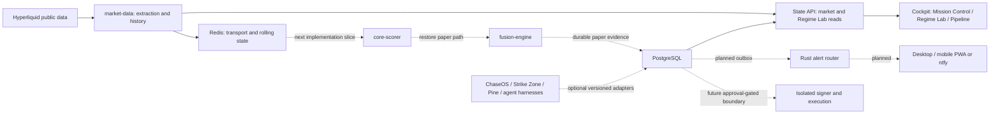

# TradeSync / ChaseOS Market Command — Claude continuation handover

Prepared 7 September 2026. This is a development handover, not a claim that the complete trading system is operational.

## 1. Repository truth and immediate starting point

- Continue in `E:\Projects\TradeSync\dashboard-overhaul-2026-09-01`.
- Verified branch: `codex/2026-09-01-dashboard-overhaul`.
- Verified HEAD: `9dbdc43 feat: add inspectable integration pipeline`.
- Earlier commits: `175baca` trace-safe logging, `dfea0f7` live Regime Lab runtime repair, `d596aed` private Regime Lab operating slice.
- Checkout was clean before this documentation-only handover. This handover and its documentation-index link are new, uncommitted work.
- Do NOT start from `E:\Projects\TradeSync\Project Root`: its `.git` points to `/mnt/c/Users/operator/Documents/Projects/TradeSync/.git/worktrees/TradeSync-hyperliquid-only`, which Git cannot resolve. Do not repair, replace, or merge that checkout as an incidental action.
- E: was available with approximately 190.7 GiB free at this inspection. Recheck before heavy builds. Stop if below 10 GiB or 5% free; never silently move heavy output to C:.
- Docker's Linux engine was NOT reachable today: the `dockerDesktopLinuxEngine` named pipe was missing. No containers or live data were verified today. Docker was not restarted for this handover.

Changes this turn: documentation only. Untouched: application code, containers, volumes, credentials, execution settings, canonical ChaseOS vault, external providers, Git history. No push, merge, deployment, wallet connection, or order submission occurred.

The September 2 README/runtime evidence remains useful but is dated. In particular, “implemented locally”, “previously passed”, “currently running”, and “end-to-end integrated” are different statements.

## 2. Product intent and non-negotiable boundaries

TradeSync is the private operator workstation within the broader ChaseOS Market Command concept. It combines market intelligence, deterministic regime analysis, paper opportunities, evidence, learning, and eventual governed alerts/execution. This is a personal project, not an open-source or multi-tenant product requirement.

Hyperliquid is the ONLY trading venue. Start with free public data and free infrastructure. Paid feeds, subscriptions, public deployment, publishing, or spending require a separate decision.

ChaseOS means exactly `retired private ChaseOS stub`, not Chaser West. That vault is canonical and must not be moved, copied, or broadly rewritten. The connector is not proof of permission to write its knowledge graph.

> **Corrected 2026-09-08, reconfirmed 2026-09-11:** the canonical instance is
> `${CHASEOS_HOME}`. `retired private ChaseOS stub` is a stub and must not be used.

Three capability tiers:

| Tier | Intended capability | Dependency rule |
|---|---|---|
| A: standalone | Market data, regimes, charting, alerts, paper opportunities, journal and evidence | Must work without any optional external intelligence system |
| B: federation | ChaseOS graph context, Strike Zone research, TradingView/Pine signals, Hermes/Ollama and agent jobs | Enrichment only; outage must be inspectable and must not break Tier A |
| C: execution | Wallet preview, explicit approval, isolated signing, risk checks and reconciliation | Fail closed; not an enabled capability today |

Keep `DRY_RUN=true`, `EXECUTION_ENABLED=false`. Do not start `exec-hl-svc` as part of restoring the dashboard. Models, research candidates, graph facts, and favorable scores never grant execution authority. Do not request or place private keys in chat, UI fields, repository files, logs, or ordinary database rows.

## 3. Architecture: implemented seams versus destination



Dashed arrows are integration work or future boundaries, not verified live flows. Consult source contracts for exact storage paths: this diagram is not a claim that every market observation already persists in PostgreSQL.

Database choices:

- PostgreSQL 16: durable TradeSync records. Existing thesis/risk/venue chain is `signals -> opportunities -> decisions -> exec_orders`; planned extensions include outcomes, approvals, notification ledger and graph projection. A schema/table is not proof its producer is running.
- Redis 7: streams, consumers, short-lived state and feature history. Not canonical knowledge or approval authority.
- Qdrant: optional, rebuildable semantic evidence index; not needed for standalone startup.
- ChaseOS GraphSnapshot: canonical knowledge artifact; TradeSync should consume approved, versioned snapshots into a local projection. PostgreSQL adjacency tables are the initial design; no dedicated graph database is required yet.
- Large evidence/artifacts belong on E:. TimescaleDB is not an active implementation; `TimescaleStore` is a placeholder.
- Python/FastAPI/Pydantic remain service foundations; Cockpit uses TypeScript/React. Rust shared contracts exist; a Rust notification router and real-time market edge are planned, not complete services. Do not rewrite working services solely to increase Rust usage.

## 4. What is already built

Read `README.md`, `CLAUDE.md`, `AGENTS.md`, `roadmap.md`, and `docs/README.md` first. Apply current operator governance above historical instructions such as the old `C:\TradeSync` working path.

- Responsive Mission Control, market surfaces, private Regime Lab and read-only execution readiness.
- A 17-feature catalog, cadence-governed extraction, ordinary/robust normalization, deterministic block aggregation and versioned paper weight configuration.
- Regime Lab comparison and PostgreSQL draft-experiment persistence. Fixed-window replay and replacement of the legacy active scorer/classifier remain unfinished.
- Integration Pipeline API at `GET /state/integration-pipeline`, schema `integration_pipeline_status_v1`, with Cockpit route `/pipeline`.
- Pipeline inspector exposes missing links, node evidence, impact, recovery guidance, optional connector contracts and capability gaps. Top-bar status supports hover/focus; node details expand. Recovery commands are explanatory text, not executable restart buttons.
- Market snapshot proxy and integration HTTP probes were moved into bounded worker-thread reads using `asyncio.to_thread`, following observed internal proxy timeouts. Do not assert a fully proven root cause beyond the recorded behavior.
- Quant Foundations Book 1, mathematical explanations, practice labs, architecture and provider documentation, and canonical TS brand mark at `docs/brand/assets/tradesync-mark.png`.

Useful source entry points:

| Area | File |
|---|---|
| Pipeline assembly/probes | `services/state-api/app/integration_pipeline.py` |
| API registration/proxy | `services/state-api/app/main.py` |
| Regime Lab | `services/state-api/app/regime_lab.py` |
| Pipeline UI | `services/cockpit-ui/src/pages/Pipeline.tsx` |
| Polling hook | `services/cockpit-ui/src/api/hooks/useIntegrationPipeline.ts` |
| Legacy signal producer | `services/core-scorer/app/main.py` |
| Opportunity producer | `services/fusion-engine/app/main.py` |
| Runtime boundary | `ops/compose.full.yml`, `ops/compose.market-command.yml` |

## 5. Gaps that must stay visible

September 2's recorded bounded runtime was Tier A partial, 4/7 ready: Hyperliquid and normalization live; Redis/PostgreSQL healthy; regime and journal partial; scorer/fusion not configured. TradingView/Pine was offline. Strike Zone, ChaseOS and harnesses were contract-only. Execution was locked. These are historical observations, not today's live status.

- Core-scorer and fusion must be reconciled with `market_feature_v1` before useful paper opportunities are expected. An empty opportunity panel must not be filled with fabricated examples presented as live results.
- Health checks alone do not prove data delivery, current provenance, or end-to-end processing. Review inspector freshness and edge semantics; require actual receipts for future claims of verified flow.
- Hyperliquid 24-hour price change is explicitly deferred/non-blocking. Do not invent a value or prioritize it over the intelligence pipeline.
- Direct liquidation data is unavailable. OI pressure is a proxy, not observed liquidations; do not imply real long/short liquidation totals.
- Do not assume “eight-class” language in earlier dictated messages describes an implemented classifier. Verify existing classifier/configuration and clarify only if a material choice remains.
- CoinGecko/DefiLlama are context-only; FRED is optional free-key macro context. Feed documentation does not prove current delivery. ETF flows, Coinbase premium, geopolitical inputs and liquidity heatmaps require separately verified source availability, timing, provenance and permitted use.
- Sources should evolve into Knowledge Graph intake: quarantine -> extraction -> proposed graph delta -> approved promotion, not direct canonical writes.
- Decisions/Orders should become useful Activity & Evidence views: decisions, approvals, orders, alerts, outcomes. Settings should describe actual connections, freshness, notifications, paper policy and diagnostics; profile controls need defined local behavior rather than decorative placeholders.
- TradingView/Pine, Strike Zone and agent recurring-job adapters must be versioned, authenticated where needed, replay-safe and optional. Do not recreate existing jobs or activate automation merely because a contract exists.

## 6. Recommended next development slice

Objective: one truthful standalone paper path from Hyperliquid observations to a ranked, persisted opportunity with an inspectable explanation.

1. Verify checkout, dirty state, disk capacity and applicable governance. Read feature, weight, regime and opportunity contracts; legacy multi-venue documents must not define new authority.
2. Diagnose Docker availability. With operator development authority, start Docker Desktop and only the bounded dashboard services; preserve volumes and unrelated projects.
3. Inspect scorer/fusion input assumptions, existing schemas and tests. Identify the exact adapter needed between admitted market features/regime evidence and legacy inputs.
4. Implement the narrowest native Hyperliquid paper pipeline. Optional Pine, ChaseOS, Strike Zone and AI services must not become signal-generation prerequisites.
5. Persist source timestamps, feature IDs, config version/digest, quality/coverage, per-block contributions, rejection reasons and paper labels. Reject stale/future/unavailable or inadmissible proxy inputs. Insufficient evidence should explain why no opportunity was produced.
6. Add deterministic missing-source, duplicate/replay, timestamp, optional-outage and restart-persistence tests. Separate scoring from approval/execution.
7. Admit scorer/fusion into the runtime only after reviewing their side effects. The bounded override currently leaves `PIPELINE_CORE_SCORER_URL`, `PIPELINE_FUSION_ENGINE_URL` and `PIPELINE_INGEST_GATEWAY_URL` empty by default. Starting a service alone will not configure State API probes; configure only admitted endpoints and recreate the affected service deliberately.
8. Verify one real paper opportunity end to end: observation -> signal -> opportunity -> PostgreSQL -> API -> visible dashboard explanation. Validate desktop/mobile rendering and console errors, not merely a passing build.
9. Update roadmap, contracts, change record and documentation index with exact evidence. Stop for user learning/input when a thesis, syllabus mapping, risk preference or governed action genuinely requires the operator.

Do not claim “fully operating” until this gate is passed. Afterward prioritize outcomes/journal, fixed-window champion/challenger replay, optional adapters and mobile alerts. Wallet connection is a separately gated phase, not an implicit continuation of the paper slice.

## 7. Operations and verification

Run from the correct checkout, and inspect Compose configuration/service side effects first. Do not print or copy the contents of the runtime environment file.

```powershell
Set-Location 'E:\Projects\TradeSync\dashboard-overhaul-2026-09-01'
git status --short
git log -4 --oneline
Get-PSDrive E
docker ps

# Bounded dashboard startup, when runtime work is authorized:
docker compose `
  --env-file E:\Projects\TradeSync\dashboard-runtime\runtime.env `
  -f ops\compose.full.yml `
  -f ops\compose.market-command.yml `
  up -d postgres redis schema-init market-data state-api cockpit-ui
```

Dashboard: `http://localhost:3000/`; inspect `/pipeline` and `/regime-lab`. Check direct/API-proxied reads separately when diagnosing apparent empty data. Never run `down -v`, broad process kills, or the unrestricted full stack as a shortcut.

Historical tests recorded in `docs/changes/2026-09-02_integration-pipeline-inspector.md`:

- State API integration + Regime Lab: 8 passed.
- Shared market-feature + regime-weight tests: 21 passed.
- `npx tsc --noEmit --pretty false`: passed.
- `npx vite build`: passed, 1,867 modules.
- Market-data suite: 20 passed, one Windows wall-clock assertion failed at roughly 0.184–0.195 seconds against a 0.15-second ceiling. The record calls it pre-existing; do not claim baseline causality without reproducing/comparing it.
- Browser evidence covered focus inspector, expanded recovery, navigation, live market rows and 390x844 mobile layout. Final recorded console had no warnings/errors.

Example targeted backend command, after verifying the existing environment:

```powershell
$tradeSyncRoot = (Get-Location).Path
$env:PYTHONPATH = "$tradeSyncRoot\services\state-api;$tradeSyncRoot\libs\tradesync_core"
.\.venv\Scripts\python.exe -m pytest services\state-api\tests\test_integration_pipeline.py services\state-api\tests\test_regime_lab.py -q
```

Run frontend checks from `services/cockpit-ui`. Run Rust tests when Rust changes, with caches/build output on E:. None of the historical application tests were rerun for this documentation-only handover.

Visual evidence home: `E:\Visual QA\TradeSync Visual QA\Current Reviews\2026-09-02-integration-pipeline`. New evidence must use a new dated review under this exact project's QA home.

## 8. Personal mathematics and experimental controls

The operator is learning while building. Explain every new symbol and unit before relying on formulas. Distinguish a formula from an equation, time index from physical time, mean and standard deviation, z-score and robust normalization, and `tanh` from `tan`. Explain basis points, comparator, weights, quality multiplier, and paper-risk cap in ordinary language with worked examples.

Weights are configurable research hypotheses, not universal facts. Preserve immutable experiment/config versions while allowing new challenger versions. Compare champion/challenger on the same fixed evidence window; log provenance and avoid look-ahead, silent tuning or promotion. A paper-risk reduction is a policy cap, not a predicted probability or instruction to place a trade.

For ambiguous fundamentals such as war, ETF flows or premium/liquidity changes: separate sourced observation, event taxonomy, timestamp/availability, deterministic mapping, quality, decay and explicit policy from narrative speculation. Do not automatically turn a geopolitical headline into trade direction.

Use the existing learning book and labs. Map practice to the operator's real Year 2 syllabus when supplied; exact module names are not confirmed here. Public-facing writeups may be prepared from redacted evidence, but publishing is a separate approval and this remains a private project.

## 9. Canonical reading and evidence index

- [Documentation index](README.md)
- [Roadmap](../roadmap.md)
- [Standalone/federated architecture](architecture/STANDALONE_FEDERATED_ARCHITECTURE.md)
- [Data and knowledge plane](architecture/DATA_AND_KNOWLEDGE_PLANE.md)
- [Rust boundaries](architecture/RUST_BOUNDARIES.md)
- [Mobile alert control plane](architecture/MOBILE_ALERT_CONTROL_PLANE.md)
- [Regime rulebook](architecture/REGIME_RULEBOOK_V1.md)
- [Feature contract](contracts/MARKET_FEATURE_V1.md)
- [Weights contract](contracts/REGIME_WEIGHT_CONFIG_V1.md)
- [Regime Lab API](contracts/REGIME_LAB_API.md)
- [Pipeline contract](contracts/INTEGRATION_PIPELINE_STATUS_V1.md)
- [Knowledge sync contract](contracts/KNOWLEDGE_SYNC_V1.md)
- [Provider matrix](providers/MARKET_PROVIDER_MATRIX.md)
- [Quant Foundations](quant-learning/README.md)
- [Pipeline implementation/test record](changes/2026-09-02_integration-pipeline-inspector.md)
- [Regime runtime record](changes/2026-09-02_regime-lab-live-runtime.md)

The old `CHASEOS_MARKET_COMMAND_HANDOVER.md`, historical phase reports and retired multi-venue diagrams are background only. Read current source and contracts before reusing them. This handover does not certify current ChaseOS Agent Bus availability or runtime policy; inspect applicable governance before any governed integration/writeback.

## 10. Prompt to give Claude

> Read this handover completely, then the current AGENTS.md, CLAUDE.md, README, roadmap and relevant contracts in this checkout. Verify repository and runtime truth before editing. Continue the next bounded slice: restore the standalone Hyperliquid feature/regime -> scorer -> fusion -> persisted paper opportunity path with inspectable evidence. Preserve unrelated work, keep optional connectors optional, use free resources and keep execution disabled. Do not repair the old Project Root checkout, use secrets, modify the canonical ChaseOS vault, publish, deploy, or connect a wallet without separate authority. Explain mathematical controls in plain English and retain learning exercises. Verify with targeted tests and rendered dashboard evidence, then report exactly what is implemented, running, tested, still missing and requiring my input.
