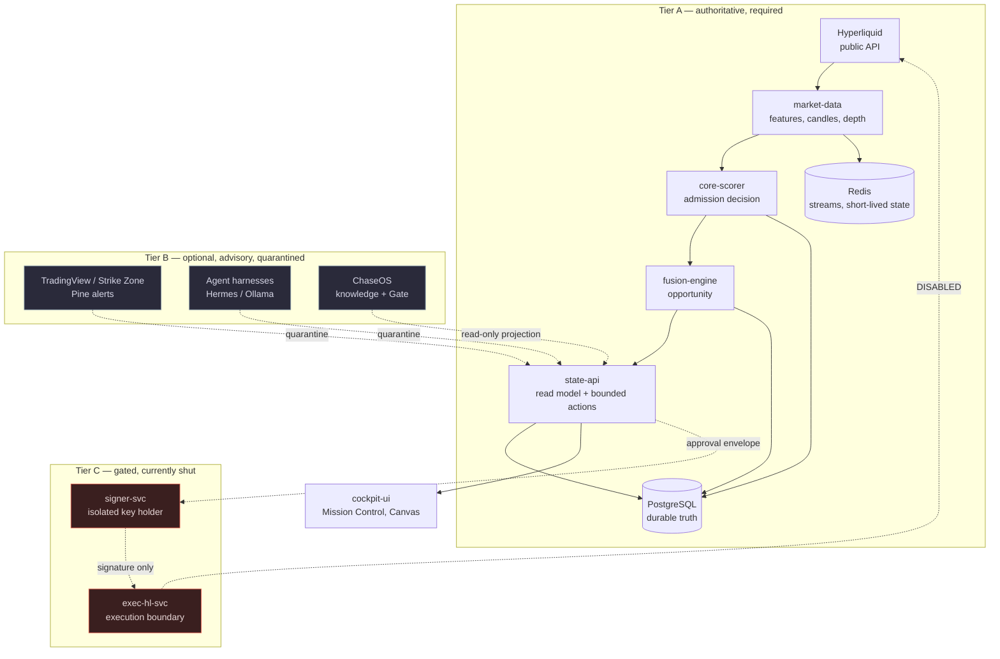
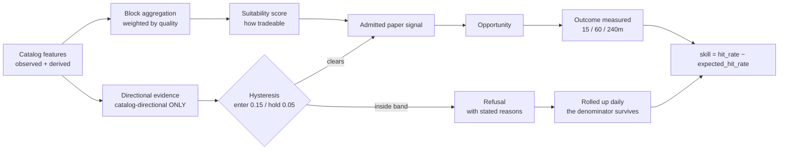

# TradeSync — full state handover, 2026-09-09

<!-- venue-guard-exempt: discusses the removed venue by name
     records that the guard had been red at HEAD, which needs the token quoted -->

Written for whoever picks this up next, including another agent asked to produce
a plan. Read this before proposing anything.

It covers: what the system is, what was built, **what the measurements actually
say**, every complication and defect found, and what is genuinely next.

---

## 0. Read this part first: the authority constraints

These are not preferences. They are the operator's standing instructions and
they override any plan, checklist, or completion pressure.

- **Hyperliquid is the only venue** and the only authoritative market source.
- **Paper mode is the default**: `DRY_RUN=true`, `EXECUTION_ENABLED=false`.
- **No key, signer, wallet, deployment, spend, or live execution without
  explicit operator approval AND passing roadmap gates.** Two conditions, joined
  by *and*. Approval alone is not sufficient.
- **ChaseOS** means the canonical private instance at
  `${CHASEOS_HOME}`. `retired private ChaseOS stub` is a stub
  and is **not** the knowledge graph.
- Optional context providers and AI models **never** grant risk, approval,
  wallet, or execution authority.
- Never use `docker compose down -v` during ordinary development.
- Never print or copy the contents of `dashboard-runtime\runtime.env`.
- **Never** add an AI tool as author, committer or co-author on any commit.

### The gate that matters

**Skill gate 1.2 returns NEGATIVE.** The system has no demonstrated edge in any
regime at any horizon. Everything downstream of that — governed alerts, live
execution — stays closed regardless of what has been built.

---

## 1. What this system is

A private, single-operator, Hyperliquid-only paper-trading research
workstation. It is not a trading bot. Its purpose is to answer one question
honestly: *does this signal have skill above the market's own base rate?*

Everything in the architecture serves that question, which is why so much of it
is about refusing to overstate what it knows.



**The tier rule:** Tier B never gates Tier A. External material becomes
quarantined evidence, never a signal, and cannot approve or execute.

---

## 2. What the measurements actually say

This is the part that should drive any plan.

### Gate 1.2 — skill across two regimes: **NEGATIVE**

Measured 2026-09-09, overlap-corrected:

| Horizon | Regime | n | effective n | Skill | SE | Significant |
|---|---|---|---|---|---|---|
| 15m | falling | 116 | 116 | +5.4 pts | +1.16 | No |
| 15m | rising | 143 | 143 | −0.4 pts | −0.09 | No |
| 60m | falling | 141 | 58.0 | −5.2 pts | −0.79 | No |
| 60m | rising | 110 | 49.5 | +0.3 pts | +0.05 | No |
| 240m | falling | 34 | 2.1 | −4.0 pts | −0.11 | No |
| 240m | rising | 40 | 2.1 | −18.8 pts | −0.54 | No |

**Nothing reaches two standard errors.** The system is indistinguishable from
chance.

### Two false positives were caught, and both are instructive

**Simpson's paradox.** A pooled 60m figure of −10.2 pts (−2.4 SE) looked
significant. Split by regime it is −2.9 (−0.5 SE) and −5.0 (−0.7 SE) — noise.
Pooling regimes with different base rates manufactured an effect. The endpoint
now refuses to pool.

**Overlapping windows.** On 2026-09-09 the 240m rising cell reported −18.8 pts
at **−2.37 SE, `significant: true`**. The sample was 74 observations spanning
5.6 hours. A 240-minute horizon over 5.6 hours is **1.4 non-overlapping windows
per symbol** — roughly 4 genuinely independent observations. Corrected:
**−0.54 SE, not significant.**

The endpoint now reports `effective_observations` beside `measured`, plus
`overlap_inflation`. **Trust the effective figure.**

### The decay pattern is the real finding

The strongest early reading was 15m falling at **+11.4 pts on n=68**. As data
accumulated it fell to **+5.4 pts on n=116**. Regression toward zero as n grows
is what noise does. A real edge does the opposite.

### What it would take to answer properly

To detect a 5-percentage-point edge at 2 SE (~400 effective observations):

| Horizon | effective n now | Runtime still needed |
|---|---|---|
| 15m | 259 | **~12 hours** |
| 60m | 63 | **~4.7 days** |
| 240m | 4.2 | **~22 days** |

The binding constraint is **independent windows**, not observations. More
symbols would help the longer horizons proportionally, but BTC/ETH/SOL are
correlated, so the real gain is less than arithmetic suggests.

A scheduled check re-measures the 15m horizon at 21:30 on 2026-09-09.

---

## 3. What was built

20 commits, 171 files, ~21,000 lines, 7 migrations, 35 new endpoints,
**590 tests across six suites**, 14 change records in `docs/changes/`.

### The paper decision path



**Two rules that were learned the hard way:**

- **Direction comes only from catalog-`directional` features.** Suitability
  never sets a side. Reading the sign of a suitability score as a direction was
  the bug behind LONG/SHORT flipping minute to minute.
- **Coverage is evidence availability, never win probability.**
  `data_coverage = Σ(weight × quality)`. It says how much evidence exists, not
  how likely the call is right.

### By slot

| Slot | State |
|---|---|
| 0 — foundations | Complete |
| 1 — regime + replay | Complete. **Gate 1.2 NEGATIVE** |
| 2 — health states and ageing | Delivered |
| 3.1 — quarantine intake | Delivered |
| 3.2 — Strike Zone | Corrected: it is a Pine repo, not a service |
| 3.3 — agent harnesses | Delivered — boundary enforced in code |
| 3.4 — ChaseOS knowledge + Gate | Delivered |
| 3.5 — Pine → `trade_candidate_v1` | Delivered. **Ingress still open** |
| 3.6 — directional evidence | Coinbase premium promoted to scoring |
| 4 — governed alerts | **CLOSED by gate 1.2** |
| 5 — Market Canvas | Complete |
| 6a — reconciliation, preflight, approval, risk | Delivered |
| 6b — signer boundary | Specified and guarded |
| 6c — signer + wallet preview | Built on explicit approval. **All gates shut** |

### Boundaries that are structural, not documented

Every Tier B connector refuses privilege escalation **by name** rather than
stripping it, because a connector trying to grant itself authority is a finding,
not a formatting problem.

- **Agent harness**: the intent vocabulary has no word for deciding. A response
  carrying `approved`, `score`, `direction`, `side`, `order` or any of eighteen
  such fields is refused — including nested, in lists, and inside the answer's
  own JSON. Proven against a live `qwen3:4b` prompted into emitting
  `{"approved": true, "side": "LONG", "score": 0.99}`.
- **ChaseOS graph**: no write path to the vault exists in code, and the mount is
  `:ro` (proven by a refused `touch`).
- **Strike Zone**: authority fields are *written* by the adapter, never *copied*
  from the receipt. A Pine script is a text file on a third party's server.
- **Signer**: receives a 32-byte digest, never a payload. Cannot be asked what it
  holds. Enforces single-use approvals itself rather than trusting the caller.

---

## 4. Complications — what went wrong, and what it cost

**Roughly two dozen real defects.** The pattern worth carrying forward: nearly
every one was something that *looked* like it worked.

### Defects in shipped code

| What | Why it mattered |
|---|---|
| `ingest-gateway` had both `app/models.py` and `app/models/` | `app/ingest.py` and `app/collectors/` were unimportable **inside the container** — dead code that looked live |
| `ingest-gateway` depended on two global names | Resolved only because the Dockerfile laid two trees side by side |
| `backtest-runner` imported itself absolutely | A package referring to itself by a name it does not own |
| **Hysteresis was dead** | `last_admitted_direction` had no time bound, so a side admitted once stayed "held" forever and the entry threshold stopped applying permanently |
| `execution_enabled=True` hardcoded ×3 | Reported the gate as open while it was closed |
| `dry_run=False` hardcoded ×3 | Asserted "this was a live action" about requests that never left the building |
| Market proxies returned **500** for an unsupported venue | Nothing had failed; the operator asked for a venue we do not carry |
| Signer's Pydantic model dropped unknown fields | Its own authority check was dead code at the HTTP layer |
| Macro endpoint blocked **16.7s** on external feeds | Same shape as an earlier read-path regression in the same session |
| Redis `x:market.norm` unbounded at 173MB | Never read (`last-delivered-id 0-0`) |
| Refusal rows unbounded at ~4,300/day | Fixed by rolling up before deleting — the denominator must survive |

### Defects in the measurement apparatus

These matter most, because they produce confident wrong answers.

- **Pooled regimes** → Simpson's paradox → false "anti-predictive" reading
- **Overlapping windows** → understated SE ~4× → false "significant" reading
- **The venue guard had been red at HEAD**, firing on the English word "drift"
- **Every funding test was scoring an empty list** — they used a source the
  scorer filters out, so none would have reached it in production either

### Operational

- **PostgreSQL crashed** on 2026-09-08 at 23:20 under load from concurrent test
  runs and container builds (backend killed, exit code 2). WAL replay was clean,
  **no data lost**, but it took four services down and interrupted collection.
  Disk was fine (274GB free) — it is memory pressure.
- **Docker orphaned Unix sockets** after a force-kill, fixed by renaming
  `Docker\run`. **Do not click "Reset to factory defaults"** — it deletes
  `pgdata`.
- Test suite could not complete collection at all: every service packages its
  code as `app`, so whichever test sorted first decided what `app` meant.

---

## 5. What is genuinely next

In priority order, with the reasoning.

### 1. Let it run. Measure. (blocking everything else)

The 15m gate is ~12 hours from being answerable. **Nothing downstream should be
planned in detail until that reads.** If it stays negative — which the decay
pattern suggests — the question becomes *why*, not *what next*.

### 2. If the gate stays negative: the feature catalog, not the plumbing

The plumbing is sound. The signal is not. That points at evidence, not code:

- `positioning` and `macro_flows` declare no generically admitted feature
- `hl_direct_liquidation_flow` is unavailable — Hyperliquid does not publish
  liquidation events on an admitted feed, and the OI proxy is barred from
  standing in for it
- Directional features are currently three: `hl_return_1h_pct`,
  `hl_direct_cvd`, `coinbase_premium_bps`

A plan that adds admitted directional evidence has a chance of moving the gate.
A plan that adds more dashboards does not.

### 3. Operator decisions that are genuinely blocked

- **Webhook ingress** — Cloudflare Tunnel plus the four-IP WAF allowlist.
  Config and runbook are written (`ops/ingress/`, `ops/compose.ingress.yml`);
  creating the tunnel needs Cloudflare credentials.
- **ChaseOS snapshot cadence** — the adapter works against a real 7,314-node
  snapshot, but ChaseOS does not yet write to `.chaseos/graph/` itself.
- **More symbols** — would shorten the 60m/240m gates proportionally.

### 4. Not next, and should be argued with if proposed

- **Governed alerts** (Slot 4) — closed by gate 1.2. An alert rule on a signal
  with no demonstrated skill is the trap the gate exists to prevent.
- **Enabling execution** — `SIGNING_ENABLED`, `EXECUTION_ENABLED`. The machinery
  exists; the evidence does not. The constraint requires a passing gate *and*
  approval.

---

## 6. Running and verifying it

```bash
docker compose \
  --env-file E:\Projects\TradeSync\dashboard-runtime\runtime.env \
  -f ops\compose.full.yml -f ops\compose.market-command.yml \
  up -d postgres redis market-data state-api cockpit-ui core-scorer fusion-engine
```

```bash
python tools/run_tests.py --integration
```

Six suites, each in its own process — the service suites are deliberately
written against `app` as their containers import them, so they cannot share one.
Integration tests need the stack up and are excluded by default: a service
restarting mid-run is not a code failure.

**Confirm collection is live, not just containers running:**

```bash
docker exec tradesync-full-postgres-1 psql -U tradesync -d tradesync -c "select count(*) from signals where created_at > now() - interval '5 minutes';"
```

Expect ~15 (3 symbols × 5 one-minute cycles). Zero means the producers did not
reconnect.

### Optional connectors — all off by default

| Variable | Enables |
|---|---|
| `CHASEOS_GRAPH_DIR` | ChaseOS graph projection |
| `AGENT_HARNESS_URL` | Advisory harness |
| `TRADINGVIEW_WEBHOOK_SECRET` | Pine webhook |
| `WALLET_ADDRESS` | Wallet preview (read-only, public address) |
| `SIGNER_PRIVATE_KEY` + `SIGNING_ENABLED` | **The signer. Both gates plus `EXECUTION_ENABLED`.** |

---

## 7. Where to read further

| Topic | File |
|---|---|
| Slot-by-slot status, carried defects | `docs/IMPLEMENTATION_SEQUENCE.md` |
| Every slice, with what was verified and how | `docs/changes/` (14 records) |
| Feature and regime mathematics | `docs/architecture/FEATURE_AND_REGIME_MATH.md` |
| Paper signal dataflow | `docs/architecture/PAPER_SIGNAL_DATAFLOW.md` |
| Known failure modes | `docs/architecture/FAILURE_MODES.md` |
| Webhook ingress security analysis | `docs/architecture/WEBHOOK_INGRESS_SECURITY.md` |

---

## 8. If you are an agent asked to produce a plan from this

Three things to hold on to:

**The gate is the plan's input, not its obstacle.** A plan that routes around a
negative skill measurement is a plan to lose money confidently.

**The constraint reads "explicit operator approval AND passing roadmap gates".**
Approval was given for the signer on 2026-09-08. The gate has not passed. Both
are required.

**This system's failures have all been the same shape:** a number that meant
less than it appeared to. A hit rate without a base rate. Coverage read as
confidence. A pooled average across different base rates. Observations counted
as independent when they overlapped. A healthcheck that proved a port was open.
Whatever you propose, ask what it would look like if it were wrong, and whether
this system would be able to tell.
