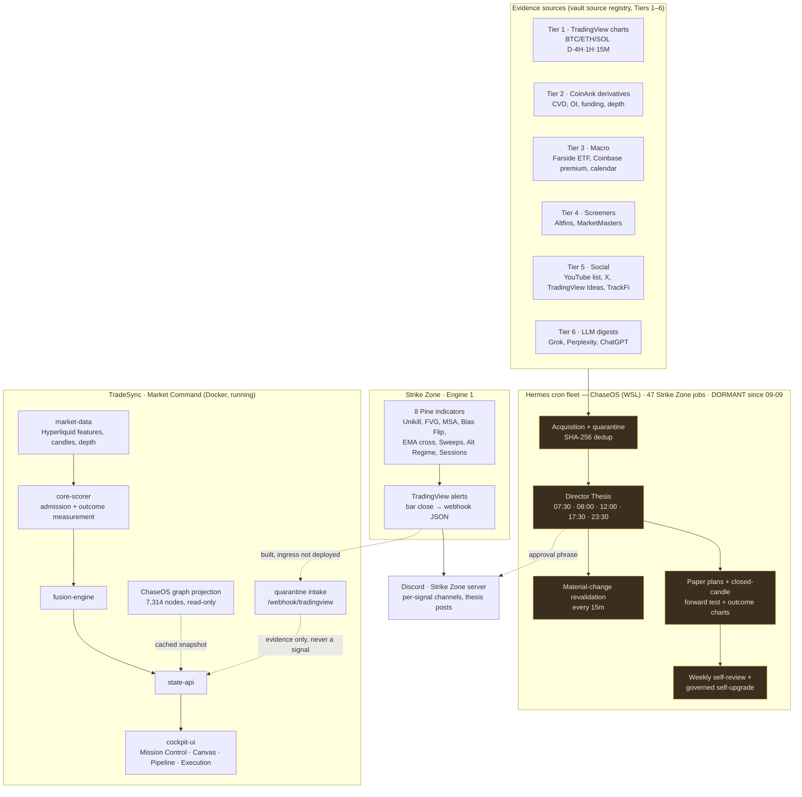
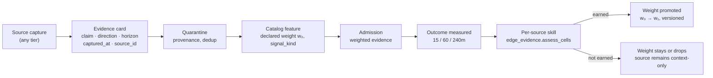

# Market Command — the plan, and how everything you already have fits it

13 September continuation: [current capabilities, measured strategy failures and remaining gates](ROADMAP_RECONCILIATION_2026-09-13.md).
Pine acceptance is complete; live Fleet management and separate scalp/swing
research are available. Neither the old nor new strategy has earned live authority.

Date: 2026-09-11. Written for the operator, in one place, so the direction
survives sessions. Every claim about an existing system was checked against the
running stack or the canonical vault (`${CHASEOS_HOME}`)
today; where something is a proposal or needs research, it says so.

**Where this file lives:** `E:\Projects\TradeSync\dashboard-overhaul-2026-09-01\docs\MARKET_COMMAND_PLAN_2026-09-11.md`

Companion documents (same `docs\` folder):

| File | What it is |
|---|---|
| `HANDOVER_2026-09-09_FULL_STATE.md` | What TradeSync is, what was built, the measurements |
| `IMPLEMENTATION_SEQUENCE.md` | Slot-by-slot status and carried defects |
| `REVIEW_20260909_USABILITY_AND_WALLETS.md` | Codex's review — the delivery sequence being followed |
| `architecture\FEATURE_AND_REGIME_MATH.md` | The mathematics behind scoring |
| `changes\` | One dated record per delivered slice |

---

## 1. What you asked for, restated

Market Command becomes the single place you trade *from*: your old manual
workflow (YouTube watchlist, X feed, Altfins, TradingView Ideas, the daily
thesis you used to write with ChatGPT) plus Strike Zone's Pine alerts, plus the
Hermes cron fleet, plus TradeSync's own measured signals — combined into a
**daily market thesis you can read, weighted by evidence type, eventually as a
video, on desktop, mobile and Discord.** With clear diagrams and a path to
continue.

## 2. The finding that has to sit on top of the plan

Two independent engines have now measured themselves, and both say the same
thing:

| Engine | Method | Result |
|---|---|---|
| TradeSync paper path | 882 measured 15m outcomes, skill vs. base rate, per regime | **−0.7 / −2.7 pts, not detectable** |
| Strike Zone shadow strategy (`ema-9-21-cross-atr`) | 220 resolved paper trades with fees/slippage | **36% hit rate, −275 USDC paper** |

The 15m gate crossed its ~400-observation threshold today and the strongest
early reading finished its decay: **+11.4 → +5.4 → −0.7 points.** So the honest
premise of everything below is: *the plumbing works; the evidence does not yet.*
The plan's job is to add evidence that could change that — and to measure
whether it does — not to add screens.

---

## 3. The whole system, as it actually is today

**How to read it.** There are three systems, and today they barely touch:

1. **Hermes / ChaseOS** owns your *old* workflow — it already scrapes, drafts
   the thesis, forward-tests, and reviews itself. It ran until **09-09 10:32**
   and has been dormant since (its WSL host is stopped, and it was writing to
   the retired `retired private ChaseOS stub` stub — both being fixed by the two task chips
   from earlier today).
2. **Strike Zone Engine 1** is your Pine indicators. They speak *only* through
   TradingView alerts → webhooks → Discord. TradeSync already has the receiving
   endpoint built; it has no public address yet.
3. **TradeSync** owns Hyperliquid observation, measured paper signals, the
   canvas and the dashboard. It reads a cached copy of the ChaseOS graph and
   nothing from Hermes.

Market Command is the act of making (1) and (2) feed (3), **with each source
carrying a weight that is measured, not assumed.**

---

## 4. What TradeSync already has that the plan reuses

Nothing in this section needs building. It needs *connecting*.

| Already built | Where | What it gives the plan |
|---|---|---|
| Quarantine intake, refuses authority fields by name | `services/state-api` `/state/quarantine` | Every external source lands here first |
| TradingView webhook receiver with HMAC secret + IP allowlist | `/webhook/tradingview`, `docs/architecture/WEBHOOK_INGRESS_SECURITY.md` | Pine alerts into TradeSync — needs the tunnel |
| Cloudflare Tunnel + WAF runbook | `ops/ingress/`, `ops/compose.ingress.yml` | The missing public address |
| Feature catalog with `directional` / suitability split | `config/features/market-feature-catalog-v1.json` | Where a new evidence source gets a declared weight |
| Skill measurement: entry-time regimes, counted independence, three verdicts | `libs/tradesync_core/{entry_regime,independence,edge_evidence}.py` | Decides whether a source *earned* its weight |
| Fixed-window replay | `libs/tradesync_core/replay.py` | Tests a new weighting on frozen evidence before it goes live |
| Agent harness boundary (intent vocabulary has no word for "decide") | `services/state-api/app/agent_harness*.py` | Hermes/Ollama can *explain* the thesis, never set it |
| ChaseOS graph projection, read-only mount | `/state/knowledge/graph/*` | Your vault's knowledge, queryable from the dashboard |
| Market Canvas with drawings, funding, OI, depth, outcome timeline | `services/cockpit-ui/src/pages/MarketCanvas.tsx` | The chart surface the thesis annotates |

---

## 5. The gaps — what must be built, and what must be researched first

### 5.1 Evidence weighting (the heart of it)

Your source registry already ranks sources into six tiers. What it does not
have is a **measured** weight. The design:

Rules that keep it honest — the ones the measurement work this week exists for:

- A source starts **context-only** (weight 0 in admission) and is *recorded*
  against outcomes. It earns a scoring weight only when its own cell shows
  `positive_skill` after the multiple-comparison adjustment.
- Weights are versioned in the catalog (`1.6.0`, `1.7.0` …) and every stored
  signal records the version it was taken under, so a weight change never
  rewrites history.
- A "deterministic" event (ETF flow print, FOMC time, funding settlement) is
  still a *feature with a measured effect*, not a rule you assert. Its
  predictive value is exactly as large as the outcome data says.

**The maths you'd be learning** to own this, in the order it becomes useful:
base rates and conditional probability (why hit rate alone lies) → standard
error and why overlapping windows inflate it → multiple comparisons (Holm) →
block bootstrap → then, for weighting, **likelihood ratios / Bayesian updating**
— each source moves a prior by an amount you *measure* from its track record.
That last step is the natural bridge to your university mathematics, and it is
also where the current system stops: it can tell you whether a source has skill;
it does not yet combine sources by their likelihood ratios. That combination is
the piece of quant work genuinely still to be designed.

### 5.2 The Daily Thesis on the dashboard

Your Daily Thesis SOP already defines the *minimum valid thesis*: chart
structure, anchor levels, confirmation stack, invalidation, no-trade conditions,
confidence, public/private separation. The plan is to render exactly that
object, from evidence cards, on a **Thesis page** in Cockpit:

- Each line carries its source tier, capture time, and freshness.
- Confidence shown as *evidence coverage*, the way `data_coverage` already is —
  never as win probability. (This is the exact mistake the canvas fixed.)
- Hermes drafts prose *only* through the harness boundary, so it can explain
  and compare but cannot set direction or confidence.

### 5.3 Video thesis (research, then build)

Feasible privately with open-source parts, and worth doing *after* the text
thesis exists, because the video is a rendering of it:

- Chart frames: already rendered by `lightweight-charts` on the canvas; a
  headless capture (Playwright, which the repo already uses for QA) produces
  the images.
- Narration: an open-source TTS (Piper or Coqui XTTS run locally).
- Assembly: `ffmpeg` stitches frames + narration into an MP4.
- Delivery: the artifact goes to `07_LOGS/Operator-Briefs/` and, via the
  existing Strike Zone publish allowlist, to a *private* Discord channel.

What I will not claim yet: real-time generation. A daily/session edition is
realistic; "live" is not, and the SOP's freshness gates would refuse a stale one
anyway.

### 5.4 Inbound sources — what needs research and confirmation

| Source | What is true today | What must be confirmed |
|---|---|---|
| **TradingView → TradeSync** | Alerts can POST JSON to a webhook (that is how Engine 1 reaches Discord today). Receiver is built. | Cloudflare Tunnel is an operator decision (credentials). TradingView has **no data-export API**: live TV data reaches us only as alerts or screenshots — Pine cannot stream candles out. |
| **Pine script upgrades** | 8 indicators, versioned in `Documents\Projects\strikezone_crypto\Paid indicators\`. | Per-indicator gap audit against what TradeSync measures. Emitting the *evidence* (structure state, sweep, regime) rather than just entry signals would let each become a catalogued feature. |
| **YouTube watchlist** | 10 channels registered, gated `youtube_transcript`. | Open-source transcript capture (`yt-dlp` / transcript API) into quarantine, title-relevance rule from the SOP. Tier 5 → context-only until measured. |
| **X feed** | Gated browser capture on an isolated profile. | Official API is paid; browser capture stays screenshot/card-based. Never the posting profiles. |
| **Altfins / TradingView Ideas / MarketMasters** | Registered, screenshot-based. | Same path as YouTube; Tier 4/5. |
| **Hermes cron jobs** | 47 jobs, dormant, writing to the retired stub. | The two task chips repoint them; then decide which jobs' *outputs* become TradeSync evidence cards (thesis editions, revalidation verdicts, paper outcomes). |
| **Discord regime charts** | Rendered by Hermes' paper-outcome resolver, posted to Strike Zone. | Point their writeback at the canonical vault; Cockpit reads them from the graph projection. They are *not* TradeSync's outcomes — different strategy, different fees — keep them labelled as Strike Zone's. |

---

## 6. Sequence

This follows Codex's review order; slice 1 is accepted today.

| # | Slice | Depends on | Gate to pass |
|---|---|---|---|
| 1 | **Usability/health** — Codex's canvas toggle, watch-only wallet, pipeline read-backs | — | ✅ accepted in browser 2026-09-11 |
| 2 | **Paper rehearsal** — preview / refuse / journal, no wallet | 1 | duplicate submissions and missing dependencies handled |
| 3 | **Measurement wired in** — entry regimes + three verdicts on the endpoint and Cockpit; a sourced Hyperliquid fee file | — | old `significant` flag gone |
| 4 | **Hermes re-pointed and awake** | task chips | jobs write to `active private ChaseOS instance`; fleet health green |
| 5 | **Evidence cards + source weighting** | 3, 4 | first Tier-5 source recorded context-only against outcomes |
| 6 | **Thesis page** | 5 | renders the SOP's minimum valid thesis from cards |
| 7 | **Pine ingress** — tunnel + webhook, Pine emits evidence | operator: Cloudflare | first Pine alert lands in quarantine with provenance |
| 8 | **Video edition + Discord private delivery** | 6 | one daily edition, private channel |
| 9 | **Mobile** | 6 | Cockpit already has no horizontal overflow at 375px |
| — | Alerts that drive trades; execution | positive `economic_edge` **and** approval | closed |

---

## 7a. Progress since — 2026-09-12

- **Symbol universe widened to ten** by a stated rule (24h notional ≥ $30M and
  leverage ≥ 10×), configured once in compose; the Cockpit reads the list from
  the API. See `changes/2026-09-12_ten-symbol-universe-one-source-of-truth.md`.
- **Open data sources researched and verified** against GitHub and vendor
  terms: `research/2026-09-12_open-data-sources-for-market-command.md`.
- **The first three sources are in**, each context-only until it earns a weight:
  the economic-events strip on Mission Control (ForexFactory + FRED release
  dates; feed currently rate-limiting this host, held 15 min between attempts),
  `gdelt_news_tone`, and Binance funding / OI / funding spread. Catalog is at
  **1.7.0**, 21 features. Change records dated 2026-09-12.
- **Outcome job defect fixed** (it fetched only eight hours of candles and
  wrote older windows off); 240m outcomes are accruing for the first time
  since 8 September, with a 5m fallback where the venue has dropped 1m history.
- **Slice 1 accepted and committed**, including Codex's watch-only wallet.
- **Slice 2 delivered (paper rehearsal)**: preview → refuse → journal with the
  execution gate shut; simulated fills priced from the live mark and spread
  with Hyperliquid's published fees; duplicates and missing dependencies
  handled. `changes/2026-09-12_paper-rehearsal.md`.
- **FRED key configured** by the operator (via a desktop prompt that wrote it
  straight to `runtime.env`); macro reference and official release dates live.
  A key leak into the state-api log was found and closed the same hour.
- **Mission Control liveness** now judged on observation age, not metric age;
  order books polled concurrently. All ten symbols LIVE.
- **Slice 3 delivered**: the corrected measurement (entry-time regimes,
  counted independence, three verdicts, stated costs) runs on real data at
  `/state/outcomes/skill-gate` and on the Regime Lab. Gate CLOSED; every cell
  negative after costs. `changes/2026-09-12_skill-gate-wired-in.md`.
- **Slice 4 (Hermes) paused** by the operator on 2026-09-12: no compute until
  limits reset. Everything else proceeds around it.
- **Slice 5 delivered**: every candidate feature's reading at entry is recorded
  once against each opportunity; each feature is scored as a guesser in both
  polarities with the skill gate's costs and one Holm adjustment; "earned" is
  positive skill that held out of sample, reported at
  `/state/outcomes/evidence-cards` and on the Regime Lab, never self-granted.
  `changes/2026-09-12_evidence-cards-earned-weights.md`. **Strike Zone / Pine
  signals will enter through exactly this mechanism; what blocks them is the
  public route (Cloudflare Tunnel or a Discord reader), an operator decision
  flagged in that record.**
- **Slice 6 delivered**: the Thesis page at `/thesis` renders the SOP's minimum
  valid thesis from measured evidence — structure, anchors, derivatives and
  context, confirmation stack with earned status, invalidation, six no-trade
  conditions, confidence as coverage — as data and as text, every line with its
  source and age; private. `changes/2026-09-12_thesis-page.md`.
- **Pine ingress decision (2026-09-12)**: Cloudflare Tunnel, implemented by
  Codex through its wrangler connection. When the tunnel is the only blocker,
  a handover is written, committed and pushed for Codex.
- **Slice 7 delivered by Codex (2026-09-12 evening, `b6fdffd`)**: tunnel
  `tradesync-webhook` healthy, exact-host WAF allowlist, secret loaded,
  `https://tradesync-pine.chaseintech.com/webhook/tradingview` live; every
  other path 404s at the edge. Remaining acceptance: one genuine TradingView
  alert appearing as `source=tradingview` in Intake.
- **ChaseOS fleet in Market Command (2026-09-12 evening)**: host bridge for
  every Hermes job run, discord-reader on 65 channels with the existing
  Hermes bot (read-only), Agents page at `/agents`.
  `changes/2026-09-12_discord-reader-and-agents-page.md`.
- **2026-09-13, operator reviews addressed**: fleet re-pointed to the canonical
  vault; Fleet page with directives and token analytics; narrated editions;
  honest pipeline nodes; Hermes heartbeat link; Market Thesis with breadth,
  measured event reactions (FRED + Fed calendar on Hyperliquid candles),
  articles and a Hermes briefing; one-screen Mission Control; Execution
  Readiness gate checklist. `changes/2026-09-13_*.md`.
- **2026-09-13, Signal Ledger**: the StrikeZone quant lab moved in from
  Discord through a host bridge: forward-test matrix, the signal and outcome
  ledger with charts, paper equity after costs, scorecards and regime cohorts,
  lab health with each failing job's cause, and a Forward test readiness chip.
  Background loops now start under the lifespan (the heartbeat had never run).
  `changes/2026-09-13_signal-ledger-and-lab-health.md`. Fleet-side faults found
  (CRLF scripts, WSL DNS, self-reviews writing to `retired private ChaseOS stub`) are
  reported there for the fleet, not changed by TradeSync.

## 7. Where things stand at the end of 2026-09-11

- **Docker**: recovered from a stale-socket crash; all nine containers healthy;
  collection live again after a 27-hour gap.
- **Outcome job**: a real defect fixed — it fetched only the last eight hours of
  candles, stamped every older window "insufficient", then re-reviewed the same
  forty rows forever. It now fetches the windows it measures and cannot write a
  final "no candles" for a window it never asked for. 221 wrongly-final rows
  reset; 1,066 pending being re-measured oldest-first.
- **Gate 1.2 at 15m**: evaluable, negative.
- **Slice 1**: accepted. Codex's work is still uncommitted; it will be committed
  once Codex confirms it is finished with the tree.

---

## 8. What to learn, and in what order

You said you want to understand it, not just own it. The shortest path that
maps onto this system:

1. **Base rates** — `docs/architecture/FEATURE_AND_REGIME_MATH.md`, then the
   `expected_hit_rate` function. Ten minutes; it is the single idea that
   prevented two false positives this week.
2. **Why more data made the signal weaker** — regression to the mean. Watch the
   15m number over the next week; it is the best teacher you have.
3. **Independence** — `libs/tradesync_core/independence.py` docstring. Why 74
   observations were really 2.
4. **Multiple comparisons** — the Holm step in `edge_evidence.py`. Why six
   cells at 2.5% each is not 2.5%.
5. **Likelihood ratios** — not in the code yet. This is the piece you would
   design: how much should an Altfins breadth reading move a prior, given its
   measured track record? That is quantitative trading proper, and it is where
   the university mathematics pays.

Each of those is one module with its own tests you can read and change.
