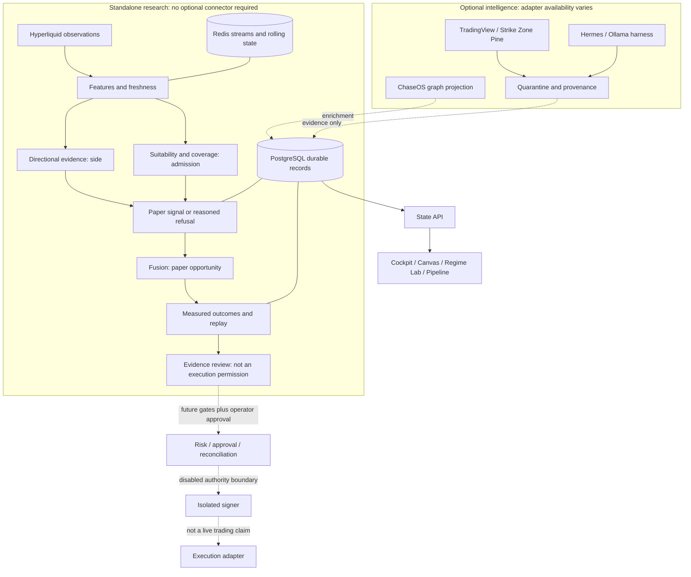
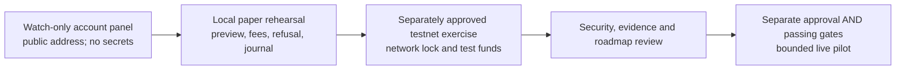

# TradeSync review: usability, evidence and wallet progression

9 September 2026. Review only: no strategy, authority, wallet, provider or runtime configuration changed.

## Verified delta

The September 7 continuation plan is superseded by implementation at HEAD `f63b49b`. The checkout was clean before this review. Scorer, fusion, market-data, State API, Cockpit, signer, PostgreSQL and Redis containers reported healthy. A read-only SQL query counted 12 signal rows from the previous five minutes. This proves recent production of signal records, not profitability or complete UI functionality. E: had about 317 GiB free.

The supplied handover reports replay, regime-separated outcomes, overlap adjustment, quarantine adapters, Market Canvas, reconciliation, preflight, approval/risk machinery and a guarded signer/wallet-preview backend. Those are substantial advances over September 2. Its 590 tests, 20 commits and connector security demonstrations are historical reported evidence, not independently rerun acceptance results from this review.

Source inspection confirmed the outcome calculation, public-address wallet-preview endpoint, separate test-runner processes and signer service files. Direct localhost:8000 API verification encountered a 12-second timeout. Container health therefore must not be substituted for operator-path responsiveness. No rendered-browser QA or full test/build rerun was performed in this review.

## Diagram 1: separate information from authority

Solid edges describe the intended implemented research structure, not independently verified receipts for every edge. Dashed edges explicitly carry optional or gated semantics. A running signer process does not mean signing is enabled, a wallet is configured, or a live executor is running.

## What the operator can use this for

- Inspect authoritative market observations, their age and missing coverage.
- Understand why a paper signal was admitted or refused and how suitability differs from direction.
- Review paper opportunities and subsequent outcomes at 15/60/240-minute horizons.
- Compare configurations on recorded evidence through replay, and learn the underlying mathematics.
- Inspect optional integrations and quarantine external material without granting trading authority.
- Develop public-address account visibility and synthetic paper-order rehearsal without funding an account or unlocking a signer.

These are research capabilities, not a demonstrated profitable strategy. End-to-end operator acceptance still needs a responsive browser session and inspectable evidence chain.

## Review findings, in priority order

### 1. Measurement is not yet a release-quality skill gate

In `services/state-api/app/main.py`, `/state/outcomes/by-regime` assigns regime from the average forward return of the same hour's recorded outcomes. This is a retrospective label, not an entry-time observable regime. It can be used for descriptive analysis but must not be represented as deployable regime prediction. Persist a separately defined, entry-time regime for prospective evaluations.

Effective sample size is approximated by elapsed span divided by horizon multiplied by symbol count. This counts correlated symbols generously and can bridge collection gaps or disjoint regime periods. It is not measured independence. Validate against actual non-overlapping windows, time-block resampling and correlated-asset handling before using significance to open a gate.

The `significant` flag uses absolute skill: sufficiently negative skill is also significant. Keep statistical detectability separate from positive, economically useful edge; do not use this flag directly as trading readiness.

The handover's “no demonstrated edge” conclusion is appropriate; “proven chance”, “a real edge does the opposite”, and fixed hours-until-answer claims are too strong. A real noisy effect can shrink as data grows. Failure to reject a null does not establish it. The stated 400 observations estimates a rough uncertainty width under simplifying assumptions, not a complete power calculation or a promise that collection will unlock anything. See [NIST statistical techniques](https://www.itl.nist.gov/div898/handbook/eda/section3/eda35.htm).

Add net expectancy after fees, spread, slippage and funding, drawdown and losses, out-of-sample evaluation, configuration versioning, and controls on repeated testing. Accuracy alone does not establish profitable trading. These are review requirements, not findings that every relevant module has been exhaustively audited.

### 2. Wallet backend and operator UI are out of sync

The backend has `GET /state/execution/wallet-preview`, using a configured public address to read account state. The current Execution page still says wallet creation/signer wiring is future work, and Pipeline contains static “no wallet or signer in this runtime” copy despite a running signer container. Replace these assumptions with distinct live states: service reachable, public address configured, account read current, key provisioned, signing enabled, execution permitted. Never collapse these into one green “connected” light.

Build a public-address watch-only onboarding panel first: account label, address validation, explicit network, balances/positions/open-order readouts as supported, freshness, disconnect, and clear read-only authority. No seed phrase/private-key textbox. A pasted public address does not prove account ownership and must never authorize trades.

### 3. Operator-path responsiveness is not certified

The direct API read timed out during this review despite healthy containers. Diagnose port mapping, proxy path and endpoint response time before interpreting the timeout as a specific service defect. Test the browser's real API route, record timings, and show stale/unavailable states rather than empty panels. Do not run heavy tests concurrently with builds on this memory-constrained host.

### 4. Documentation and governance conflict

README remains dated September 2 and still says scorer/fusion and signer are absent. `AGENTS.md` and the current operator instructions identify `retired private ChaseOS stub`; the new handover and `CLAUDE.md` instead identify `active private ChaseOS instance`. Do not silently resolve this by changing mounts or moving data. Obtain operator confirmation and reconcile authoritative documents before ChaseOS integration changes. Neither vault was modified here.

**Resolved 2026-09-11:** the operator confirmed `active private ChaseOS instance` is canonical and that `retired private ChaseOS stub` must not be used for any canonical purpose. `AGENTS.md` and the dependent documents were corrected; no mount or vault content changed.

### 5. Integration and safety acceptance remains bounded

Webhook ingress needs separately authorized external setup; supplied runbooks are not deployed ingress. Snapshot cadence and delivery receipts need ownership. Confirm harness/graph adapters from live receipts before calling them connected. A digest-only signer needs security review of how an approved semantic order is bound to that digest, expiry, nonce/replay persistence and restart behavior; isolation alone is not proof of safe arbitrary-digest signing.

Signal-driven trading alerts remain gated under the current policy. Operational alerts for stale data, failed storage or stopped collection are a separate safety capability; do not silently disable them because the strategy lacks edge, or silently change the trading-alert gate.

## Diagram 2: wallet and test progression

Each transition is a gate, not an automatic progression. Paper rehearsal needs no wallet. Testnet proves mechanics, not profitable execution or mainnet liquidity. Do not toggle the existing mainnet signer to simulate testnet support.

Hyperliquid distinguishes the account address from API/agent-wallet signing identity and manages nonces per signer. Build to the venue model rather than assuming a Solana/Phantom private-key import is interchangeable. References: [official nonce/API-wallet documentation](https://hyperliquid.gitbook.io/hyperliquid-docs/for-developers/api/nonces-and-api-wallets), [official testnet agent example](https://github.com/hyperliquid-dex/hyperliquid-python-sdk/blob/master/examples/basic_agent.py). Solana research accounts should remain a separate future adapter.

## Next delivery sequence and acceptance

1. **Usability/health slice:** resolve actual UI/API responsiveness, surface dynamic service/authority states, verify one current observation -> admitted/refused signal -> opportunity/outcome in the browser. No authority changes.
2. **Watch-only wallet and paper rehearsal slice:** explicit public-address onboarding, network labels, readable account errors, synthetic balance mode, preview/approve-simulated/refuse/journal path. Test duplicate submissions and missing dependencies. This can be developed without waiting for strategy profitability.
3. **Measurement-hardening slice:** entry-time regimes, independent-window validation, net costs and out-of-sample reporting. Keep gates shut; describe uncertain evidence honestly.
4. **Testnet proposal:** document an isolated configuration and acceptance tests; obtain the necessary operator approval and confirm applicable gates before any signing.
5. **Live readiness:** only after engineering, security, risk and evidence gates pass AND explicit approval. No calendar promise.

Usable research is the near-term acceptance target, not “live trading”. The code already contains much of the research pipeline; remaining time depends on the observed responsiveness defect and operator acceptance, not the number of dashboards. Do not promise a funded live test in three weeks or after twelve hours of data.

Review checks: Git HEAD/status, disk capacity, Docker container listing, read-only recent-signal SQL and targeted source reads. No full build/test or browser acceptance claim. Current review and diagrams are indexed from `docs/README.md`; historical implementation details remain in `docs/changes/` and `docs/IMPLEMENTATION_SEQUENCE.md`.
