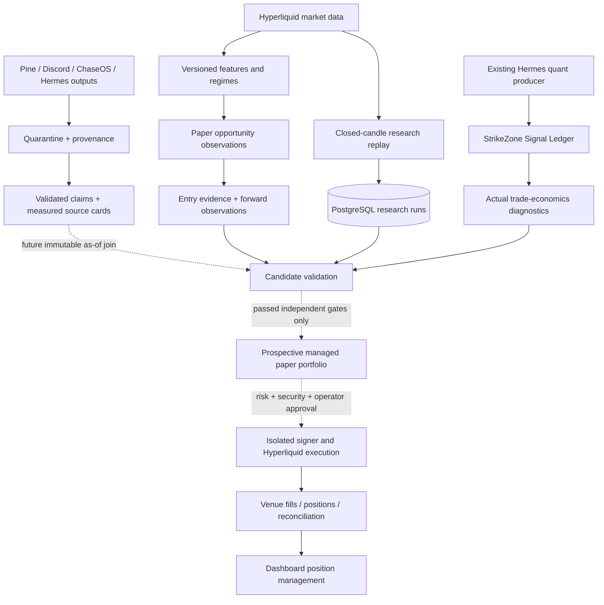

# TradeSync: current truth and remaining delivery gates

13 September 2026, late-evening continuation. Owner: Codex / Axiom-Codex.

## Repo-truth delta

The 2 September README and early roadmap status paragraphs are historical,
not a description of the running stack. Scorer, fusion, quarantine, Pine,
Discord intake, the Hermes gateway/bridge, Timeframes, Signal Ledger and an
isolated signer service now exist. A running signer is **not** permission to
sign: this task keeps paper mode and disabled execution unchanged.

Checkout: `E:/Projects/TradeSync/dashboard-overhaul-2026-09-01`.
Branch: `codex/2026-09-01-dashboard-overhaul`. Existing work was preserved;
this continuation is uncommitted and unpushed. The current repo documents
identify `${CHASEOS_HOME}` as the canonical
vault; old error receipts naming `retired private ChaseOS stub` are historical. No vault
migration or canonical writeback was performed here.

## Changes and what is usable now

- Mission Control's context-only card fits its available width, including
  the DefiLlama / Hyperliquid TVL label. No context feed gained authority.
- Fleet reads current job state through the gateway, with a 15-second cache,
  labelled bridge fallback, refresh, search and failed-job filtering. Usage
  and run history remain bridge snapshots. Existing controls cover schedule
  presets, enable/disable, pause/resume, run-now and delivery selection.
  Schedule and enabled changes now confirm intent; run-now already confirms
  possible publishing. An API permission denial cannot silently fall back
  to editing the registry. New jobs await their bridge inventory entry.
- Signal Ledger now has **Trade economics & research**: actual per-market /
  chart results, target and captured move sizes, holding time, profit factor,
  cost accounting, sample denominators, and source/claim coverage.
- Separate frozen scalp and swing candidates can be replayed and saved from
  that panel. They use closed bars, next-open entries, ATR stops, cost gates,
  bounded holding periods and one position at a time. Same-candle stop/target
  ambiguity resolves against the candidate. These are experiments, not a
  replacement of the legacy producer or promoted strategies.
- Migration `021_trade_research.sql` stores input candles, assumptions,
  version, fingerprint and complete results in PostgreSQL. No replay can
  create an order, grant approval or access a wallet.
- Candle-proxy time bounds now reach market-data. Flat-series RSI is neutral
  at 50, and long RSI labels describe daily bars rather than claiming weekly
  aggregation. Non-overlapping windows are no longer called independent.

## Untouched boundaries

No live order, wallet, key, pairing project ID, risk-policy change, source
weight promotion, new provider, DNS change, canonical graph write, Discord
publication, or manual publishing-job run was performed. Existing scheduled
jobs continue under their existing authority. No unrelated process was killed.

The self-review fix changes one runtime **test**, not a safety gate or job
schedule: it verifies the portable launcher's resolved interpreter with a
temporary fake runtime. It does not run the real research job. Backup:
`E:/Projects/TradeSync/dashboard-runtime/backups/2026-09-13-hermes-launcher-test`.

## Measured trading reality

Live diagnostics at 23:19 BST, active methodology
`strikezone_hyperliquid_shadow_eval_v1_3`:

| Measurement | Observed value |
|---|---:|
| Trade signals / resolved | 600 / 598 |
| Net paper P&L | -867.8501 USDC |
| Average net per resolved trade | -1.4513 USDC |
| Win rate | 33.11% |
| Profit factor | 0.377 |
| Median target distance | 0.4216% |
| Median captured directional price move | -0.1382% |
| Captured moves of at least +3% | 0 / 598 |
| Median holding time | 60 minutes |
| Exits: expiry / target / stop | 210 / 137 / 251 |
| Recorded gross-minus-net cost drag | 538.5564 USDC |

Every market/chart cohort was net negative at this observation. Dollar P&L
depends on position size; increasing size or leverage would not repair a
negative strategy. A 3% move is not a requirement for every scalp. It is a
useful measurement for longer trades, not a target to manufacture.

The existing TradeSync 15/60/240-minute opportunity outcomes measure forward
market observations, not managed positions. Keep them separate from the
StrikeZone paper ledger and from the new experiments.

### First saved BTC experiments (not tuned after seeing results)

Both used 1,000 closed venue candles and 1,000 USDC fixed notional per trade;
4.5 bps fee and 2 bps slippage per fill; adverse funding 0.125 bps/hour.
These are editable assumptions, not an account-tier or historical-funding claim.

| Candidate | Development trades / net | Final 30% trades / net | Holdout +3% moves |
|---|---:|---:|---:|
| Scalp, 15m, at most 3h | 3 / +1.96 USDC | 2 / +5.02 USDC | 0 |
| Swing, 4h, at most 7d | 22 / +39.42 USDC | 8 / -27.72 USDC | 2 |

Run IDs: `cf4fef28-43a0-4181-a760-19ec3da3048c` (scalp),
`aeb85d2f-98b9-4e5d-9ed0-1e5292ddaf87` (swing).
The swing experiment captures larger moves but still loses on its held-out
segment. Two scalp trades prove nothing. OHLC simulation cannot establish
fill liquidity. Repeated inspection/tuning contaminates a holdout; a new
version needs new untouched data and forward observation.

### Ingestion is not trading influence

At the live intake check: 613 agent-harness receipts, 524 ChaseOS receipts,
351 Discord receipts and 6 TradingView receipts. The claim table contained
9 measured Discord claims and 2 measured TradingView claims. These counts
change as the system runs and are not counts of profitable trades.

Harness extraction is a reader: resulting claims belong to the original
post's source. A zero claim count in the `agent_harness` source is not proof
that no harness analysis occurred. Not every document contains a directional
market claim. The new replays use candles only. They do **not** retrospectively
attach today's news, graph or agent opinion to historical entries.

## Architecture and promotion boundary

No arrow from an agent explanation directly to signing exists. Core observation
and research continue without Hermes or ChaseOS; execution fails closed when
its required approval/reconciliation authority is unavailable.

## Handover closure register

| Item from 13 September handover | Current status / next acceptance |
|---|---|
| Context-only TVL fit | Implemented; populated desktop, tablet and phone checks passed in prior continuation |
| ETH Timeframes, phone, feature-link scroll | Real-browser checks passed at 1366 and 375 pixels |
| Completed Hermes timeframe reading | ETH reading returned `ok`, about 165s; rendered paragraphs and feature links verified; advisory only |
| Feature charts | Earlier readback: 17 drawn, four honestly unavailable; no invented forward prediction |
| Causal feature calculations | Added seven regression checks; flat RSI fixed; no claim of complete statistical validation |
| Horizon performance | Rolling calculations and cached charts already landed; live latency remains vulnerable to host RAM contention |
| First repaired key-levels run `cd7d95dd50ca` | Gateway reports `ok` at 23:21:23 BST, no error; normal scheduled run |
| Publication audit `32fc6f83e99f` | Gateway reports `ok` at 23:07:54 BST; older Chrome error is historical |
| Four morning/evening repaired jobs | Await next normal 14 September receipts at 07:30, 07:50, 08:00 and 19:00; do not manually publish to create proof |
| Weekly recap missing files | Both canonical input paths now exist. Outcome file was last modified 11 July; market model 13 September 21:31. Existing file is not proof of current evidence: next scheduled recap 14 September 10:00 still needs success and semantic input-freshness validation |
| Two self-review test failures | Found hard-coded-path assertion incompatible with portable launcher; replaced with isolated invocation check. All 105 focused tests pass; next normal self-review job receipt remains pending |
| Fresh closeout evidence | Open: genuine recent governed closeout required; do not fabricate or relax 14-day freshness |
| Graph hygiene timeout | Open: incremental/batched graph scan with checkpointed coverage; no global timeout increase or canonical bulk rewrite |
| Interrupted job ownership / WSL network faults | Open: lifecycle and transport investigation; WSL commands work now, which does not prove long-term reliability |
| Live Fleet state + controls checks | Gateway overlay live, 85 jobs; desktop/phone filters and cancelled schedule confirmation verified, no live job mutation during QA |
| Candle proxy start/end | Fixed and tested; deployed |
| 1001 vs 1000 candles | Extra current partial slot remains in provider response; replay explicitly excludes unclosed candles |
| Weekly candles + continuous archive | Open; replay snapshots are not a continuously maintained historical archive |
| Pre-2023 era split, block bootstrap, horizon holdout | Open; non-overlap alone is not independence and sparse long-horizon samples remain unproven |
| Forecast drawings / shared charts / thesis deep links | Partial existing links; further harmonisation and calibrated forecast drawings remain open |

## Overall roadmap: what remains, in working order

1. **Reliable research data and measurable strategy changes.** Retain immutable
   candles and funding; validate gaps, duplicates, timestamps and source era.
   Preserve the 1m/5m measurement distinction in by-regime aggregates. Record
   candidate configuration, rejection reasons and all attempted versions.
   Do not cherry-pick positive runs or tune a test set repeatedly.
2. **Use external evidence properly.** Join facts known and received before
   entry, with expiry, source identity, confidence and missingness. Evaluate
   each addition against the same candle-only baseline, across regimes and
   unseen periods. Implement approved earned-weight changes only after
   incremental value survives cost, dependence and multiple-test checks.
   Current intake plumbing does not complete this trading-policy work.
3. **Managed prospective paper positions.** Separate scalp and swing lifecycles;
   persistent entry/stop/target/time/trailing rules, fills, historical funding,
   MFE/MAE, account capital, concurrent/correlated exposure, drawdown, kill
   switch and restart reconciliation. Replays are research, not this service.
4. **Hermes reliability.** Finish the register above; show run progress/output
   receipts and ownership, not merely successful submission. Custom schedules
   and job creation/prompt editing remain outside the bounded controls. Keep
   publication targets under explicit operator control.
5. **Wallet visibility and rehearsal can proceed without a profitable strategy.**
   Existing watch-only public-address lookup and pairing UI are foundations.
   Complete account selection, portfolio/position/open-order/fill views and
   refresh/reconnect semantics. WalletConnect QR still needs a public project
   ID and real pairing acceptance; finish dependency-security triage first.
   No seed phrase/private key goes into TradeSync's dashboard or an agent.
6. **Approval-controlled execution acceptance.** The isolated signer and digest
   boundary exist, but a live readiness badge needs testnet/non-broadcast proof,
   single-use approval, expired/changed payload refusal, nonce ownership,
   partial fills, cancel/replace, reduce-only safety, account reconciliation,
   security review and explicit operator-funded wallet setup. Previewing an
   address is not permission to manage its positions.
7. **Bounded autonomy only after evidence and risk gates.** One version/market,
   explicit capital/daily-loss/exposure limits, no self-increasing limits,
   stale-state refusal, kill switch and audited rollback. Profitability cannot
   be promised or substituted by UI completion. Live trading remains disabled.
8. **Alerts and Rust runtime.** Rust contracts exist; reusable router, PWA/Web
   Push or ntfy devices, consent, quiet hours, dedupe, retries, dead letters and
   device delivery receipts remain. Health/price alerts can be developed
   separately from unproven trade recommendations. No Xcode requirement.
9. **Market coverage and UI maturity.** Continuous WebSocket recovery and long
   history; direct liquidation/ETF/event inputs where free and defensible;
   never turn proxies into observed facts. Keep regime trace/freshness and
   missing-feature explanations. Finish MFE/MAE, unified incident/reconciliation
   views, settings/profile/session authority, audit exports and latency soaks.
10. **Learning and later expansion.** Add hand-worked examples and exercises to
    each statistical change; map to the actual Year 2 syllabus when supplied.
    Video thesis delivery remains a separate planned slice. Solana discovery,
    Phantom visibility, Rust decoding and eventual separate signing stay in
    their own research/security namespace, not Hyperliquid execution.

## Next safe action and what the operator can do

Use `/fleet` for job inspection and deliberately confirmed controls. Use
`/signal-ledger` to inspect the real loss-making ledger and open the two saved
experiments; costs are adjustable, but repeated tuning is not validation.

The next development slice should be the immutable entry-evidence join plus
managed paper-position lifecycle. Wallet visibility can be built alongside
that without granting execution. The first live autonomous trade is gated by
measured evidence and security/risk acceptance, not by a promised calendar date.

Tests, build/deployment evidence and agent activity are recorded in
[the continuation log](changes/2026-09-13_fleet-and-trade-research.md).
