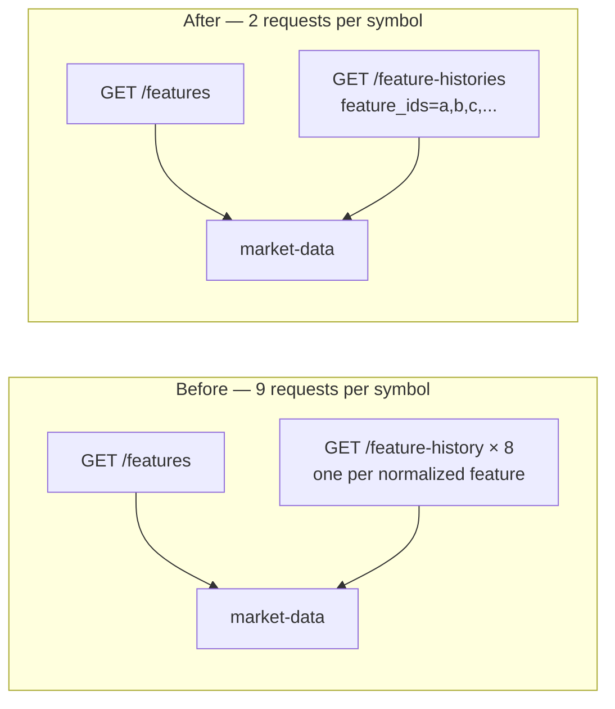

# Failure Modes

How this system breaks. Every diagram here is a failure that actually happened
on 2026-09-07/08, not a hypothetical.

The recurring theme is worth stating once, up front:

> Every component behaved correctly, and the system as a whole did nothing.

Politeness at each layer produces silence at the top. These diagrams exist so
that shape is recognisable next time.

## 1. Silent freeze: unbounded stream fills the memory ceiling

```mermaid
flowchart TD
  A["x:market.norm written every poll<br/>no maxlen, nothing ever reads it"]
  B["181,683 entries / 173 MB<br/>over ~10.5 days"]
  C["Redis reaches maxmemory 160mb<br/>policy noeviction"]
  D["every Redis WRITE rejected<br/>'command not allowed when used memory > maxmemory'"]
  E["market-data keeps polling Hyperliquid<br/>HTTP 200, no errors upstream"]
  F["try/except logs and continues<br/>service does not crash"]
  G["/healthz still returns 200<br/>Docker reports Up (healthy)"]
  H["no new snapshot stored"]
  I["last snapshot ages past stale_after_ms"]
  J["every feature stale, quality 0"]
  K["coverage 0.0"]
  L["288 refusals: all four gates firing"]

  A --> B --> C --> D
  D --> E --> F --> G
  D --> H --> I --> J --> K --> L

  style G fill:#3a1a1a,stroke:#a33
  style L fill:#2a2416,stroke:#a8883a
```



The red box is the dangerous one. **The healthcheck asked whether the HTTP
server answered, not whether the service was doing its job.** That is the
difference between *liveness* and *readiness*, and a healthcheck that cannot
tell them apart will lie to you at exactly the moment you need the truth.

Fixed by bounding all three stream writes with `maxlen` (20,000 / 20,000 /
5,000, environment-configurable) and trimming the live stream. Memory fell from
160.02 MB to 28.93 MB and polling resumed within seconds.

Still outstanding: the healthcheck should assert data freshness, not port
availability.

### Why `noeviction` was still the right setting

```mermaid
flowchart LR
  Q{"Redis is full.<br/>What should happen?"}
  Q -->|"allkeys-lru"| L1["Silently delete<br/>least-recently-used keys"]
  L1 --> L2["Could delete the feature history —<br/>the actually valuable data"]
  L2 --> L3["Corruption you may never notice"]
  Q -->|"noeviction"| N1["Refuse new writes"]
  N1 --> N2["Loud, total, recoverable stop"]
  N2 --> N3["But YOU must bound the writers"]

  style L3 fill:#3a1a1a,stroke:#a33
  style N3 fill:#132a1f,stroke:#3a8a5a
```



Choosing `noeviction` is a promise to manage retention yourself. You cannot pick
it and also leave a stream unbounded.

## 2. Fan-out saturation: cost that scales with the catalog

Adding one feature to the catalog added one HTTP round trip *per symbol, per
cycle*.



At three symbols every 60 seconds that was 27 requests per minute against a
single-worker service also serving the Cockpit. Individual history calls began
exceeding state-api's 5-second inner timeout, and **35% of producer cycles were
silently skipped**:

```
[RegimePaper] BTC-PERP: no admissible evidence: regime_read_failed: 
[RegimePaper] ETH-PERP: no admissible evidence: market observations are unavailable
```

That empty reason after `regime_read_failed:` is an `httpx.ReadTimeout`, which
stringifies to nothing — a failure mode worth recognising on sight.

Raising the timeout would have hidden it. The cost was structural, so the fix
was structural: batch the histories into one request. Round trips per symbol
went 9 → 2 and the cost no longer grows with the catalog.

## 3. Gap propagation: an outage costs more than its duration

The 62-minute freeze left a hole in the mark-price series. The 1-hour return
anchors on "the stored mark price at or before t − 1h", and the hole landed
exactly there.

```mermaid
flowchart LR
  subgraph TL["Mark-price history after recovery"]
    P1["... older data ...<br/>up to t-65.5 min"]
    GAP["THE HOLE<br/>t-65.5 min → t-2.8 min"]
    P2["fresh data<br/>t-2.8 min → now"]
  end
  BAND["anchor band needed:<br/>t-65 min → t-60 min"]
  BAND -.->|"falls inside the hole"| GAP
  GAP --> REFUSE["derive_return_1h_pct returns None"]
  REFUSE --> OK["feature correctly unavailable"]

  style GAP fill:#3a1a1a,stroke:#a33
  style OK fill:#132a1f,stroke:#3a8a5a
```



This is the safety rule working. The alternative — widening the comparator
across the gap — would have reported a "one-hour return" that actually spanned
two hours. Silently wrong is far worse than loudly absent.

**An outage costs its own duration plus every derived value whose look-back
window still overlaps the hole.**

## 4. Latent defects downstream of something that never worked

Two bugs surfaced within minutes of the first opportunity ever being produced.

```mermaid
flowchart TD
  N["Nothing upstream ever produced an opportunity"]
  N --> D1["Overview.tsx asks status=all<br/>API compares it literally<br/>WHERE status = 'all' matches nothing"]
  N --> D2["MOCK_OPP missing 'confluence'<br/>handler raises KeyError → HTTP 500"]
  D1 --> INV["Both invisible.<br/>Empty panel looked correct.<br/>Failing test looked pre-existing."]
  D2 --> INV
  WORK["First opportunity produced"] --> SURF["Both surface within minutes"]

  style INV fill:#2a2416,stroke:#a8883a
```



The lesson generalises well beyond this repo: **a latent defect downstream of
something that never worked is indistinguishable from correct behaviour.**
Making a feature work for the first time is also the first real test of
everything downstream of it. Budget for that.

## 5. Structurally impossible states

The Tier A readiness counter could never reach 7/7:

```mermaid
flowchart LR
  H["ready_count counts status ∈ {live, healthy}"]
  R1["regime_status = 'partial' if ... else 'offline'"]
  R2["performance_status = 'partial' if ... else 'offline'"]
  R1 -->|"cannot return 'live'"| CAP["ceiling was 5/7, not 7/7"]
  R2 -->|"cannot return 'live'"| CAP
  H --> CAP
  CAP --> MIS["operator reads 4/7 as a diagnosis<br/>when part of it is an artefact"]

  style MIS fill:#3a1a1a,stroke:#a33
```



Both now resolve against real evidence — recent signal and opportunity
timestamps, bounded by a freshness window so a stage cannot claim to be live on
the strength of a row written days ago.

Worth checking any status enum you write against this question: **can every
value in my healthy set actually be produced by my code?**

## Checklist distilled from the above

| Ask this | Because |
|---|---|
| What deletes the old entries? | Unbounded growth fails weeks later, not on write. |
| Does the healthcheck prove the *job*, or the port? | "Healthy" lied for an hour. |
| Does this cost scale with the catalog? | One feature added 3 requests/minute. |
| Can my "healthy" status actually be produced? | Two states were unreachable. |
| Does a refusal name its own cause? | Diagnosis required reading a combination. |
| What downstream code has never run? | It has never been tested either. |
