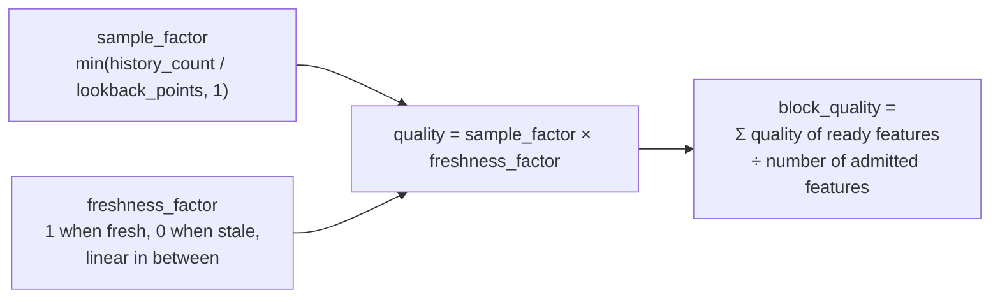

# Feature and Regime Mathematics

How a raw number from an exchange becomes part of a score, explained in
ordinary language with every symbol named before it is used.

Read [Paper signal dataflow](PAPER_SIGNAL_DATAFLOW.md) for where this sits in
the pipeline.

## 1. Vocabulary, before any formula

| Term | Plain meaning |
|---|---|
| **observation** | One measured number at one moment, with its timestamp and source. |
| **normalization** | Rewriting a number as "how unusual is this, versus its own recent history". |
| **z-score** | How many standard deviations a value sits from its mean. 0 is typical, +2 is unusually high. |
| **robust z-score** | The same idea, but built from the median and the median absolute deviation, so one freak value cannot distort it. |
| **quality** | 0 to 1. How much of the required history exists, times how fresh the reading is. **Not** a probability of being right. |
| **block** | A themed group of features, e.g. everything about liquidity. |
| **weight** | How much the rulebook lets a block matter. All weights sum to 1. |
| **coverage** | How much of the total weight actually had usable evidence behind it. |
| **deadband** | A band around zero treated as "no direction", so noise cannot become a trade. |

Two distinctions that matter and are easy to blur:

- **Coverage is not confidence.** Coverage says how much evidence showed up. It
  says nothing about whether the evidence is right.
- **A paper-risk cap is a policy, not a prediction.** Halving paper size is a
  rule chosen in advance, not a forecast that the trade is half as good.

## 2. The lifecycle of one feature

```mermaid
flowchart TD
  RAW["Raw venue field<br/>e.g. markPx = 79017.7"]
  OBS["Observation<br/>value + observed_at + source_event_id"]
  CAT{"Catalog admits it?<br/>availability = implemented"}
  GATE1["status: unavailable<br/>reason names the catalog state"]
  HIST{"enough history?<br/>>= minimum_history_points"}
  GATE2["status: collecting_history<br/>shows progress e.g. 47/168"]
  DISP{"normalization = none?"}
  GATE3["status: not_normalized<br/>DISPLAY ONLY"]
  NORMZ["z-score or robust z-score"]
  MAD{"any dispersion?<br/>(robust with MAD zero falls back to the ordinary z-score, recorded)"}
  GATE4["status: unavailable<br/>flat: every recent value identical"]
  BOUND["tanh compression to -1..+1"]
  MODE{"score_mode?"}
  PB["playbook_specific<br/>CONTEXT READY, visible, cannot score"]
  ADM["direct or inverse<br/>ADMITTED, contributes to its block"]

  RAW --> OBS --> CAT
  CAT -->|no| GATE1
  CAT -->|yes| HIST
  HIST -->|no| GATE2
  HIST -->|yes| DISP
  DISP -->|yes| GATE3
  DISP -->|no| NORMZ --> MAD
  MAD -->|no| GATE4
  MAD -->|yes| BOUND --> MODE
  MODE -->|playbook_specific| PB
  MODE -->|direct / inverse| ADM

  style ADM fill:#132a1f,stroke:#3a8a5a
  style GATE4 fill:#2a2416,stroke:#a8883a
```



`hl_spread_bps` and `hl_buy_impact_5k_bps` move in whole ticks: the value sits
at 0.13 for most samples, so the median absolute deviation is exactly zero and a
robust z-score has no scale although the values do vary. Since 2026-09-14 the
ordinary z-score (mean and sample standard deviation) is used in that case and
the normalization records `method: ordinary_zscore`, `requested_method:
robust_zscore` and the fallback. Only when every recent value is identical is
there no dispersion at all; that reading stays unavailable with the reason
`flat: every recent value identical`. Which features may score is unchanged.

## 3. The five blocks, and the coverage ceiling

Only features whose `score_mode` is `direct` or `inverse` can create a generic
direction. Funding, open interest, volume and oracle premium are deliberately
`playbook_specific`: visible as evidence, but not permitted to manufacture a
long or short on their own.

```mermaid
flowchart LR
  subgraph PV["price_volatility — weight 0.30"]
    PV1["hl_return_1h_pct — direct ✅"]
    PV2["hl_mark_price_usd — display"]
    PV3["hl_volume_24h_usd — playbook"]
    PV4["hl_direct_cvd — unavailable"]
  end
  subgraph LQ["liquidity — weight 0.25"]
    LQ1["hl_depth_25bp_usd — direct ✅"]
    LQ2["hl_orderbook_imbalance_1pct — direct ✅"]
    LQ3["hl_spread_bps — inverse, tick values: ordinary z-score fallback"]
    LQ4["hl_buy_impact_5k_bps — inverse, tick values: ordinary z-score fallback"]
  end
  subgraph PO["positioning — weight 0.20"]
    PO1["funding, OI, oracle premium<br/>all playbook_specific ❌"]
  end
  subgraph SP["spot_premium — weight 0.15"]
    SP1["coinbase_premium_bps<br/>no admitted source ❌"]
  end
  subgraph MF["macro_flows — weight 0.10"]
    MF1["ETF flow, event risk<br/>context_only ❌"]
  end

  style PO fill:#3a1a1a,stroke:#a33
  style SP fill:#3a1a1a,stroke:#a33
  style MF fill:#3a1a1a,stroke:#a33
```



**Three blocks have no generically-admitted feature at all.** So the maximum
attainable coverage today is:

```
0.30 (price_volatility) + 0.25 (liquidity) = 0.55
```

The rulebook wants 0.70 before it removes the `low_data_coverage` cap. It
therefore applies **on every evaluation**, permanently, until one of those three
blocks gains an admitted direct or inverse feature. That is a research decision
about what legitimately carries direction — not a bug to code around.

## 4. How a score is actually computed

The formula, then the same thing in words, then a real example.

```
weighted_score = Σ(weight × quality × score) / Σ(weight × quality)
coverage       = Σ(weight × quality)
```

In words: **each block votes, but its vote is scaled by how much it is allowed
to matter and by how much evidence it actually had.** Then divide by the total
scaled weight, so a system with two working blocks is not automatically
penalised against one with five — coverage records that separately.

A real admitted signal, BTC-PERP on 2026-09-07 at 23:54:22 UTC:

```mermaid
flowchart LR
  subgraph IN["Block evidence"]
    B1["price_volatility<br/>weight 0.30<br/>quality 0.6012<br/>score +0.50215"]
    B2["liquidity<br/>weight 0.25<br/>quality 0.5000<br/>score -0.17284"]
    B3["positioning / spot_premium / macro_flows<br/>quality 0.0"]
  end
  subgraph CALC["Arithmetic"]
    C1["0.30 × 0.6012 × +0.50215 = +0.090567"]
    C2["0.25 × 0.5000 × -0.17284 = -0.021605"]
    C3["numerator = +0.068962"]
    C4["coverage = 0.18036 + 0.125 = 0.305357"]
    C5["score = 0.068962 / 0.305357 = 0.225839"]
  end
  subgraph OUT["Verdict"]
    O1["direction LONG"]
    O2["coverage 30.54% — just over the 0.30 floor"]
    O3["paper_risk 0.5 — low_data_coverage cap"]
  end
  IN --> CALC --> OUT

  style OUT fill:#132a1f,stroke:#3a8a5a
```



Worth sitting with: **the liquidity block was negative** and the result was
still LONG, because price/volatility carried more weight and more quality. Before
`hl_return_1h_pct` was implemented, that block was empty and this opportunity was
arithmetically impossible — the system could only ever have refused.

## 5. Quality, in detail



The divisor is the count of features the block *could* have, not the count it
*did* have. A block with four admitted features and two ready ones scores
quality 0.5 even if both ready ones are perfect — because half its intended
evidence is missing. That is why liquidity reads 0.5 above.

This is also why `hl_return_1h_pct` took so long to become useful: its
`lookback_points` is 168, so at 47 stored points its sample factor was only
47/168 = 0.28, and coverage could not clear the floor until roughly 99 points
had accumulated at one per minute.
