# Paper Signal Dataflow

How one Hyperliquid reading becomes a paper opportunity on the dashboard, and
every place it can legitimately stop.

Read [System map](SYSTEM_MAP.md) first for the service topology.

## 1. The whole path, end to end

```mermaid
flowchart TD
  HL["Hyperliquid metaAndAssetCtxs + l2Book<br/>polled every 15s"]
  NORM["normalizer.py<br/>one NormalizedMarketEvent per metric"]
  SNAP["snapshotter.py<br/>assemble MarketSnapshot"]
  DERIV["attach_derived_features<br/>1h return, 24h change"]
  RSNAP[("redis<br/>market:snapshot:venue:symbol")]
  RSERIES[("redis<br/>market:feature:venue:symbol:feature<br/>7-day sorted sets")]

  FEAT["GET /features/venue/symbol<br/>stateless read"]
  HIST["GET /feature-histories<br/>batched, one call"]
  NORMZ["normalize_feature<br/>z-score or robust z-score"]
  BLOCKS["evaluate_blocks<br/>weight x quality x score"]

  DECIDE{"decide_paper_signal<br/>admission gates"}
  SIGROW[("postgres signals<br/>every verdict, admitted or refused")]
  STREAM[["redis x:signals.funding<br/>admitted only"]]
  OPP[("postgres opportunities<br/>UNIQUE signal_id")]
  APIR["GET /state/opportunities"]
  COCK["Cockpit: Mission Control + /opportunities"]

  HL --> NORM --> SNAP --> DERIV --> RSNAP
  DERIV --> RSERIES
  RSNAP --> FEAT
  RSERIES --> HIST
  FEAT --> NORMZ
  HIST --> NORMZ
  NORMZ --> BLOCKS --> DECIDE
  DECIDE -->|"refused, with reason codes"| SIGROW
  DECIDE -->|"admitted"| SIGROW
  DECIDE -->|"admitted only"| STREAM
  STREAM --> OPP --> APIR --> COCK

  style DECIDE fill:#2a2416,stroke:#a8883a
  style STREAM fill:#12233a,stroke:#3a6ea8
```



The important asymmetry: **a refusal is stored just as carefully as an
admission.** Only admissions are published to the stream. That is what lets an
empty opportunity panel explain itself instead of looking broken.

## 2. One producer cycle, in order

Runs every 60 seconds, once per symbol.

```mermaid
sequenceDiagram
  participant CS as core-scorer
  participant API as state-api
  participant MD as market-data
  participant PG as postgres
  participant RD as redis
  participant FE as fusion-engine

  loop every REGIME_CYCLE_INTERVAL (60s), per symbol
    CS->>API: GET /state/regime-lab/overview?symbol=BTC-PERP
    API->>MD: GET /features/hyperliquid/BTC-PERP
    API->>MD: GET /feature-histories (all normalized ids, one call)
    MD-->>API: observations + history series
    Note over API: normalize_feature per feature<br/>evaluate_blocks against rulebook
    API-->>CS: baseline_evaluation + feature_results + catalog

    alt source_status is not live
      CS->>CS: record nothing, log the reason
    else evidence available
      Note over CS: decide_paper_signal(...)
      CS->>PG: INSERT signals (verdict + full evidence)
      alt admitted
        CS->>RD: XADD x:signals.funding
        RD-->>FE: consumer group delivery
        FE->>PG: INSERT opportunities ON CONFLICT (signal_id) DO NOTHING
      else refused
        Note over CS: nothing published;<br/>reasons stored on the row
      end
    end
  end
```

Note the ordering guarantee in fusion-engine: the database write happens
**before** the `XACK`. If the process dies between them the message stays
pending and is reclaimed by `XCLAIM` on restart. Acknowledging first would lose
the opportunity silently.

## 3. The admission gates

Every gate produces a recorded reason code. None of them ever produces a
silent zero.

```mermaid
flowchart TD
  START["block evidence + feature results"] --> G1{"any feature with<br/>scoring_allowed?"}
  G1 -->|no| R1["no_admitted_evidence"]
  G1 -->|yes| G2{"provenance admissible?<br/>not proxy / context_only / unavailable"}
  G2 -->|no| R2["inadmissible_provenance"]
  G2 -->|yes| G3{"observed_at within<br/>120s, and not in the future?"}
  G3 -->|stale| R3["evidence_stale"]
  G3 -->|ahead| R4["evidence_timestamped_in_future"]
  G3 -->|ok| G4{"data_coverage >= 0.30?"}
  G4 -->|no| R5["coverage_below_emit_floor<br/>names the missing blocks"]
  G4 -->|yes| G5{"abs score > 0.05 deadband?"}
  G5 -->|no| R6["score_inside_deadband"]
  G5 -->|yes| G6{"paper_risk_multiplier > 0?"}
  G6 -->|no| R7["paper_risk_fully_capped"]
  G6 -->|yes| OK["ADMITTED<br/>direction LONG or SHORT"]

  R1 & R2 & R3 & R4 & R5 & R6 & R7 --> REF["stored as regime_paper_refusal<br/>direction NONE, reasons recorded"]

  style OK fill:#132a1f,stroke:#3a8a5a
  style REF fill:#2a2416,stroke:#a8883a
```



The floor, deadband and staleness bound are **policy choices, not measured
facts**. They are written onto every decision and folded into the evidence
digest, so a stored signal can always be re-read against the policy that
produced it.

### Reading refusal signatures

A refusal combination is diagnostic if you know how to read it:

| Signature | Meaning |
|---|---|
| `coverage_below_emit_floor` alone | Healthy. Evidence still accumulating. |
| All four gates firing together | The upstream data pipeline is dead. |
| `evidence_stale` on specific features | Those feeds are lagging, others fine. |

## 4. Replay safety

The same evidence must never create two opportunities.

```mermaid
flowchart LR
  EV["catalog digest<br/>rulebook digest<br/>admission policy<br/>each feature: id, observed_at, score, quality"]
  EV --> SHA["sha256 canonical JSON<br/>evidence_digest"]
  SHA --> SIG["signals row"]
  SHA --> LINK["opportunities.links.evidence_digest"]
  SIG --> UNIQ{"opportunities.signal_id<br/>UNIQUE constraint"}
  UNIQ -->|"first delivery"| INS["INSERT, opps_created + 1"]
  UNIQ -->|"redelivery"| SKIP["ON CONFLICT DO NOTHING<br/>counter unchanged"]

  style SKIP fill:#1d1d1d,stroke:#555
```



Feature ordering does not affect the digest — the contributing features are
sorted before hashing. Changing the policy *does* change it, which is correct: a
decision taken under different thresholds is a different decision.

## 5. Where the legacy path sits

The original design routed TradingView alerts and polled snapshots through an
`events` table into a funding/open-interest heuristic. That path still exists in
code and is still importable for replaying historical rows, but it no longer
drives the loop.

```mermaid
flowchart LR
  subgraph LEGACY["Legacy, not running"]
    TV["TradingView webhook"] --> IGW["ingest-gateway"]
    IGW --> EVT[("events table")]
    EVT --> HEUR["calculate_score<br/>funding + OI squeeze rules"]
  end

  subgraph CURRENT["Current, running"]
    CAT["17-feature catalog"] --> RB["versioned rulebook"]
    RB --> PS["decide_paper_signal"]
  end

  HEUR -.->|"REGIME_PAPER_ENABLED=false<br/>restores this"| OUT["signals"]
  PS -->|"default"| OUT

  style LEGACY fill:#1d1d1d,stroke:#555
```



Both write to the same `signals` table, and `fusion-engine` distinguishes them
by envelope: a `paper_signal_v1` envelope carries its evidence digest and is
passed through unscored, while a legacy envelope still requires `event_ids` and
goes through the microstructure `EnhancedScorer`. Re-scoring a regime signal
would double-count microstructure, because the regime liquidity block already
weighs depth and orderbook imbalance.
