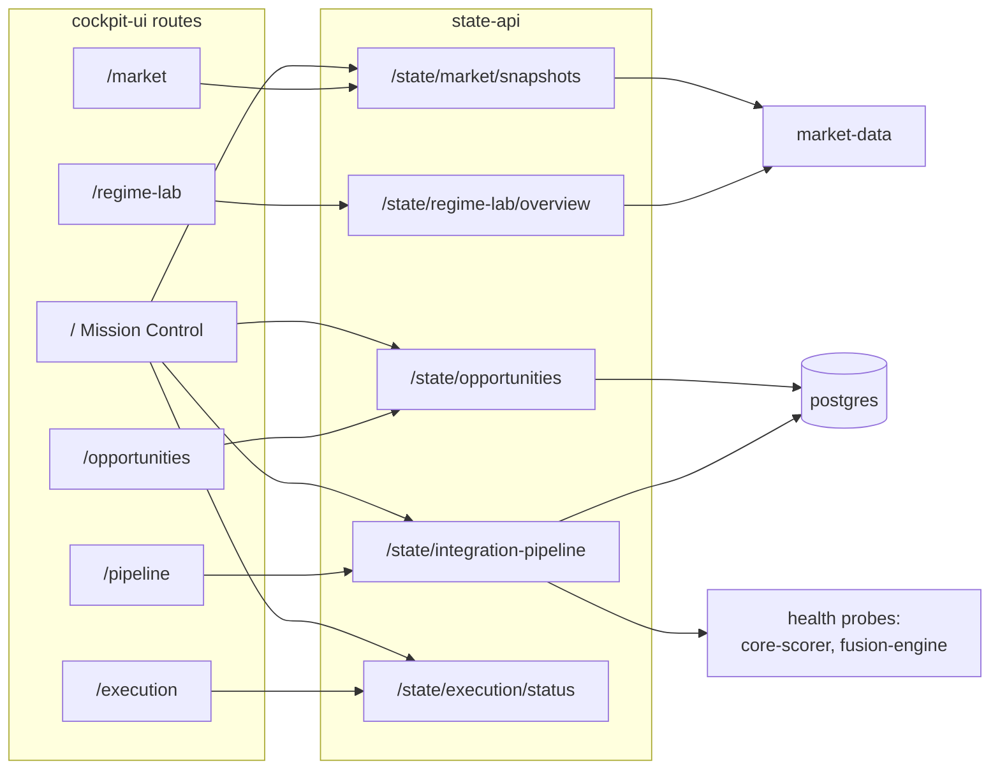

# TradeSync System Map

Start here. This is the whole system on one page, then four views of it.

Every diagram was checked against the running stack on 2026-09-08, not from
memory: container names and ports from `ops/compose.full.yml`, tables from
`pg_tables`, key patterns from Redis, routes from `App.tsx`.

Companion pages:

- [Paper signal dataflow](PAPER_SIGNAL_DATAFLOW.md) — how one market reading
  becomes a paper opportunity, and every gate that can stop it.
- [Feature and regime mathematics](FEATURE_AND_REGIME_MATH.md) — how numbers
  become a score, in plain language.
- [Failure modes](FAILURE_MODES.md) — how this system breaks, drawn out.

## 1. What the whole thing is

Three planes stacked on each other. Everything below is elaboration.

```mermaid
flowchart TD
  subgraph OBS["Observation plane — what is true about the market"]
    HL["Hyperliquid public API<br/>the only trading venue"]
    MD["market-data<br/>poll, normalize, snapshot"]
  end

  subgraph INT["Intelligence plane — what it might mean"]
    RG["Regime engine<br/>normalize to z-scores, weight into blocks"]
    SC["core-scorer<br/>admit or refuse, with reasons"]
    FU["fusion-engine<br/>build the opportunity"]
  end

  subgraph OPR["Operator plane — what a human sees and decides"]
    API["state-api<br/>read model"]
    UI["cockpit-ui<br/>Mission Control"]
    EX["exec-hl-svc<br/>LOCKED, no wallet"]
  end

  HL --> MD --> RG --> SC --> FU --> API --> UI
  API -. "never automatic" .-> EX

  style EX fill:#3a1a1a,stroke:#a33
  style OBS fill:#12233a,stroke:#3a6ea8
  style INT fill:#132a1f,stroke:#3a8a5a
  style OPR fill:#2a2416,stroke:#a8883a
```

The one rule that shapes everything: **evidence flows up, authority does not
flow down.** A good score never reaches the execution box on its own.

## 2. Service topology, as actually running

Ports shown as `host:container`. Solid lines are verified live traffic.

```mermaid
flowchart LR
  subgraph EXT["External, free tier only"]
    HLAPI["api.hyperliquid.xyz<br/>metaAndAssetCtxs, l2Book"]
    CG["CoinGecko / DefiLlama<br/>context only, never scores"]
  end

  subgraph CORE["Bounded dashboard profile"]
    MD["market-data<br/>8005:8005"]
    SAPI["state-api<br/>8000:8000"]
    UI["cockpit-ui<br/>3000:80"]
    PG[("postgres 16<br/>durable truth")]
    RD[("redis 7<br/>transport + rolling state")]
  end

  subgraph PAPER["Paper producers, admitted 2026-09-07"]
    CS["core-scorer<br/>8001:8000"]
    FE["fusion-engine<br/>8002:8002"]
  end

  subgraph DORMANT["Present but not running"]
    IG["ingest-gateway 8080<br/>legacy events path"]
    EXS["exec-hl-svc 8004<br/>fail closed"]
    BR["backtest-runner"]
    QD[("qdrant<br/>optional index")]
  end

  HLAPI --> MD
  CG --> SAPI
  MD --> RD
  MD --> SAPI
  SAPI --> PG
  SAPI --> RD
  CS -->|"reads regime evidence"| SAPI
  CS -->|"writes every verdict"| PG
  CS -->|"publishes admitted only"| RD
  RD -->|"x:signals.funding"| FE
  FE -->|"opportunities"| PG
  UI -->|"/api proxy"| SAPI

  style DORMANT fill:#1d1d1d,stroke:#555
  style EXS fill:#3a1a1a,stroke:#a33
```

Note the shape of the paper loop: **core-scorer asks state-api for the regime
verdict rather than recomputing it.** That is deliberate. If the scorer had its
own copy of the mathematics, a live signal and a Regime Lab comparison could
disagree about the same window, and you would have no way to tell which was
right.

## 3. Capability tiers, and what each is allowed to do

The tier decides authority, not importance.

```mermaid
flowchart TD
  subgraph A["Tier A — standalone. Must work with nothing else present."]
    A1["Hyperliquid market data"]
    A2["Feature normalization"]
    A3["Regime evidence engine"]
    A4["Scorer + fusion"]
    A5["Postgres + Redis"]
    A6["Performance journal"]
  end

  subgraph B["Tier B — federation. Enrichment only."]
    B1["TradingView + Pine"]
    B2["Strike Zone Crypto"]
    B3["Agent harnesses"]
    B4["ChaseOS knowledge + Gate"]
  end

  subgraph C["Tier C — execution. Fail closed."]
    C1["Wallet preview"]
    C2["Explicit human approval"]
    C3["Isolated signing"]
  end

  A -->|"Tier A alone is a complete product"| OUT["Paper opportunities<br/>with inspectable evidence"]
  B -.->|"may enrich, may never gate"| A
  A -.->|"never automatic"| C

  style A fill:#132a1f,stroke:#3a8a5a
  style B fill:#2a2416,stroke:#a8883a
  style C fill:#3a1a1a,stroke:#a33
```

**Tier B outages must be invisible to Tier A.** That is why all four Tier B
connectors currently reading `contract_only` do not reduce the Tier A count:
their URLs are simply unset, because none of those services is running on this
machine.

## 4. Cockpit routes to the services behind them

`/state/regime-lab/overview` is the expensive one. It fetches current features
plus a history series for every normalized feature, so it is the endpoint most
sensitive to how many features the catalog admits. See
[Failure modes](FAILURE_MODES.md) for what that cost did once.

## 5. Runtime profiles

Two compose files layer: `compose.full.yml` defines services, and
`compose.market-command.yml` overrides them with memory limits, restart policy,
log rotation, and the bounded environment.

```mermaid
flowchart TD
  F["ops/compose.full.yml<br/>service definitions, images, ports"]
  M["ops/compose.market-command.yml<br/>mem_limit, cpus, healthcheck, logging, env"]
  F --> COMBINED["docker compose -f full -f market-command"]
  M --> COMBINED
  COMBINED --> P1["postgres redis schema-init<br/>market-data state-api cockpit-ui"]
  COMBINED --> P2["core-scorer fusion-engine<br/>admitted deliberately"]
  COMBINED -.->|"never started casually"| P3["exec-hl-svc<br/>ingest-gateway qdrant"]

  style P3 fill:#3a1a1a,stroke:#a33
```

Never run `down -v`. That deletes the `pgdata` volume, and Postgres is the only
durable record of every signal, opportunity and regime experiment.
