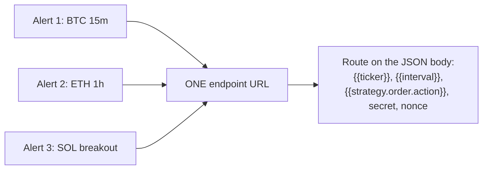

# Webhook Ingress: Security Analysis

The question asked: *if we expose a webhook endpoint through Cloudflare so
TradingView can reach TradeSync, is that a vulnerability point?*

**Yes. It is the single largest attack surface this project would have ever
had**, and it deserves to be designed rather than switched on. This page is the
analysis, not a recommendation to proceed or stop — that decision is yours.

## 1. The constraint that shapes everything

Verified from TradingView's own webhook documentation:

| Fact | Consequence |
|---|---|
| Only ports **80 and 443** | No obscure high port to hide behind. |
| **No custom HTTP headers** | You cannot send an `Authorization` header. Any secret must travel in the message body. |
| Sends from **four fixed IPs**: `52.89.214.238`, `34.212.75.30`, `54.218.53.128`, `52.32.178.7` | An IP allowlist is possible, and is the strongest single control available. |
| **3-second** processing timeout | No heavy verification inline; accept fast, verify after. |
| Requires 2FA on the account | Protects the alert config, not the endpoint. |
| No IPv6 | IPv4-only ingress. |

The "no custom headers" limitation is the crux. It rules out every
header-based authentication scheme and forces the secret into the payload.

## 2. What actually goes wrong

```mermaid
flowchart TD
  URL["Public webhook URL exists"]
  CT["Hostname appears in<br/>Certificate Transparency logs — public, scanned continuously"]
  SCAN["Automated scanners find it within hours"]
  URL --> CT --> SCAN
  SCAN --> A1["Unauthenticated POST<br/>anyone can send anything"]
  A1 --> R1["Signal injection:<br/>fabricated evidence in your journal"]
  A1 --> R2["Resource exhaustion:<br/>unbounded rows, the outage we just had"]
  A1 --> R3["Replay: capture one valid<br/>payload, resend forever"]
  A1 --> R4["Payload attacks:<br/>oversized bodies, malformed JSON, injection"]

  style R1 fill:#3a1a1a,stroke:#a33
  style R2 fill:#3a1a1a,stroke:#a33
```

**Obscurity is not a control.** Every TLS certificate issued for a hostname is
published to public Certificate Transparency logs, which are continuously
scraped. A "secret" subdomain is public within hours of its first certificate.

The most serious risk here is not theft — there is no wallet connected and
execution is disabled. It is **evidence poisoning**. This system's entire value
is that its stored evidence is trustworthy. An endpoint anyone can write to,
feeding a store you later use to judge strategies, corrupts the one thing that
makes the journal worth keeping.

## 3. Cloudflare Tunnel is genuinely safer than port forwarding

Worth being precise about why, because it is a real improvement:

```mermaid
flowchart LR
  subgraph PF["Port forward — do not do this"]
    I1["Router opens 443 inbound"]
    I2["Home IP exposed"]
    I3["Anything on the internet<br/>can reach the machine"]
    I1 --> I2 --> I3
  end
  subgraph CT["Cloudflare Tunnel"]
    C1["cloudflared makes an<br/>OUTBOUND connection"]
    C2["No inbound port opened<br/>No firewall change<br/>Home IP never published"]
    C3["Traffic arrives only<br/>via Cloudflare's edge"]
    C1 --> C2 --> C3
  end

  style I3 fill:#3a1a1a,stroke:#a33
  style C3 fill:#132a1f,stroke:#3a8a5a
```

A tunnel means there is no open port on your machine at all, and the edge gives
you a place to enforce controls *before* traffic reaches TradeSync. That is the
right shape. It does not, by itself, authenticate anyone.

## 4. Defence in depth, in the order it should be built

```mermaid
flowchart TD
  L1["1. Cloudflare WAF: allow ONLY the four TradingView IPs<br/>deny everything else at the edge"]
  L2["2. Rate limit at the edge<br/>e.g. 60 requests/min, well above real alert volume"]
  L3["3. Shared secret inside the JSON body<br/>constant-time comparison, since headers are impossible"]
  L4["4. Strict schema validation<br/>bounded body size, reject unknown fields"]
  L5["5. Nonce + timestamp<br/>reject replays and anything older than ~60s"]
  L6["6. Write to a QUARANTINE table<br/>never directly into signals"]
  L7["7. Bounded retention on quarantine<br/>the lesson from x:market.norm"]
  L8["8. Promotion only through the catalog<br/>with provenance and admission gates"]

  L1 --> L2 --> L3 --> L4 --> L5 --> L6 --> L7 --> L8
  L8 --> SAFE["A Pine alert becomes EVIDENCE,<br/>never a signal, never authority"]

  style L1 fill:#132a1f,stroke:#3a8a5a
  style L6 fill:#132a1f,stroke:#3a8a5a
  style SAFE fill:#132a1f,stroke:#3a8a5a
```

Layer 1 does most of the work. An allowlist of four IPs at Cloudflare's edge
means the general internet never reaches your endpoint at all, and the remaining
layers defend against a compromised or spoofed TradingView path.

Layers 6 and 8 are the ones this project's own governance already demands:
**quarantine → extraction → proposed delta → approved promotion**, never a
direct canonical write.

## 5. The architectural rule that must not bend

```mermaid
flowchart LR
  TV["TradingView / Pine alert"] --> Q[("quarantine table<br/>untrusted, bounded retention")]
  Q --> ADM{"admission:<br/>provenance, freshness,<br/>schema, catalog"}
  ADM -->|"admitted"| EV["Tier B evidence<br/>may enrich a score"]
  ADM -->|"rejected"| LOG["recorded with reason"]
  EV -.->|"NEVER"| EXEC["execution authority"]
  EV -.->|"NEVER"| GATE["Tier A gating"]

  style EXEC fill:#3a1a1a,stroke:#a33
  style GATE fill:#3a1a1a,stroke:#a33
```

TradingView is **Tier B**. Tier B enriches; it never gates Tier A and never
grants execution authority. A webhook that could create a signal directly would
invert the entire trust model of this system — an external, unauthenticated
party would be feeding the thing you use to decide whether a strategy works.

## 6. On making it public for the Strike Zone server

A separate and much larger question was raised: whether this could serve other
people, since Strike Zone Crypto "is made for everybody".

That changes the project category completely:

| Private operator tool (today) | Multi-user service |
|---|---|
| One trusted user | Untrusted users, per-user isolation required |
| No authentication needed | Accounts, sessions, authorization |
| Localhost only | Public availability, uptime expectations |
| Evidence poisoning affects only you | One user can corrupt shared state |
| No regulatory surface | Distributing trading signals to others carries real legal exposure in most jurisdictions |

The last row is the one to sit with. **Distributing trade signals to other
people is a materially different activity from running a private research tool**,
and it can attract financial-promotion or investment-advice regulation
depending on where you and your users are. I am not able to advise you on that,
and it should not be decided as a side effect of adding a webhook.

My recommendation: keep inbound webhooks **private and single-user** for now.
One TradingView account, one allowlisted endpoint, evidence into quarantine.
Outbound distribution to a Discord server is a completely separate design with a
completely different risk profile, and is much safer — pushing notifications out
carries none of the ingress risk analysed above.

## 7. One endpoint, many alerts

A practical point that resolves the "only one webhook" concern:

TradingView allows one webhook URL *per alert*, but you may have many alerts.
Point them all at the same endpoint and let each identify itself in its message
body. You are not limited to one webhook overall — only to one URL per alert.

## Summary

- The risk is real, and it is primarily **evidence poisoning**, not theft.
- Cloudflare Tunnel is the right transport: no inbound port, no exposed home IP.
- The **four-IP allowlist at the edge** is the strongest single control.
- Secrets must live in the body, because TradingView cannot send headers.
- Quarantine first, promote through admission gates, never write straight to
  `signals`.
- Keep it private. Serving others is a different project with legal weight.
