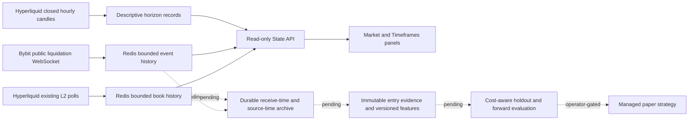

# 14 September — liquidity, intraday horizons and integration goal

## Repo-truth delta and activity

Codex / Axiom-Codex continued on the existing dirty
`codex/2026-09-01-dashboard-overhaul` checkout. E: had 342 GB free at 00:08 BST.
This is the project-local activity/build/handover record; canonical ChaseOS
writeback remains governed-writer work. No commit, push, external publication,
paid subscription, credential disclosure or live execution was performed.

The operator's integration goal remains **active**, not completed. Android and
iPhone are both explicit acceptance targets. Earlier handover gaps remain in
[the reconciled register](../ROADMAP_RECONCILIATION_2026-09-13.md).

## Changes implemented

- Trading-day horizons: 1h, 4h, 8h and 1d, measured from 1,000 closed hourly
  Hyperliquid candles. Closed-only, gap/duplicate/staleness checks, historical
  same-state records beside an unconditional baseline, non-overlapping return
  windows and thin-sample warnings. Flat comparisons are neutral. Descriptive
  price statistics do not establish independent trials or profitable trades.
- Hyperliquid observed liquidity heatmap: reuses existing L2 polling, records
  top 10 bids and asks into 15-second Redis buckets, retains at most 240
  snapshots / one hour. Atomic time and count pruning plus TTL. Local receipt
  time, explicit missing columns, stale/collecting states, relative price bins
  and brightness. Select 15 minutes or one hour; phone chart scrolls locally.
- Bybit public `allLiquidation` adapter: BTCUSDT, ETHUSDT and SOLUSDT only;
  subscription acknowledgement, application heartbeat, disconnect timeout,
  bounded retries and stop-on-access-denial. Normalizes position side correctly:
  Buy = liquidated long; Sell = liquidated short. Price is bankruptcy price,
  not an execution price. Notional is therefore explicitly labelled USDT at
  bankruptcy price. Deduplicates identical batches while retaining identical
  rows within a batch. Retention up to one hour / 1,000 events per symbol.
- Separate State API read-only routes and Market panels. Bybit observations
  never fill the Hyperliquid liquidation field. New displays have no scoring,
  signing or execution authority. Data-quality/dashboard skills drove the
  separation of missing coverage from zero and observation from inference.

## Verified runtime versus remaining uncertainty

Initial live readback at approximately 00:18 BST:

- `/state/market/book-history?symbol=BTC-PERP`: live, eight real snapshots.
- `/state/market/liquidation-context?symbol=BTC-PERP`: subscription connected,
  five real BTC events received. This proves receipt, not complete venue history.
- `/state/market/intraday-horizons?symbol=BTC-PERP`: 1/4/8/24-hour horizons,
  1,000 closed candles.
- Market-data, State API and Cockpit built and replaced locally without stopping
  unrelated services or deleting volumes. API secrets were not printed.

Tests/builds:

- Focused native tests: **14 passed** (intraday, book storage contract and
  liquidation normalization). Initial async-plugin mismatch fixed using the
  repository-compatible `asyncio.run` test style; no production workaround.
- `.venv/Scripts/python.exe tools/run_tests.py market-data state-api`:
  **126 market-data / 125 State API passed** before four new proxy tests.
- TypeScript/Vite build passed; existing bundle-size, Browserslist and dependency
  annotation warnings remain. Initial ES target errors fixed without raising
  the browser target.
- `node tools/qa_liquidity_intraday.cjs`: real-data renders at **1366 and 375px**,
  no document overflow or uncaught browser errors. First screenshots inspected;
  chart labels prompted an improved locally scrollable phone plot.
- Final `.venv/Scripts/python.exe tools/run_tests.py root state-api market-data`:
  **640 root passed** (17 integration deselected, two warnings, 10 subtests),
  **129 State API passed**, **126 market-data passed**.
- Final frontend build passed (28.29s), Cockpit repackaged/replaced successfully.
  Repeated responsive QA passed at both widths, including 15m/1h chart-window
  switching, real liquidation rows and no page overflow/errors. Final phone and
  desktop screenshots visually inspected. Phone plot permits local horizontal
  scrolling to retain readable chart labels rather than shrinking the whole SVG.
- Approximately 00:22 BST: six BTC liquidation events retained, connected;
  heatmap rendered 25 real snapshots. At 00:21 all healthchecked TradeSync
  containers were healthy; Discord reader was running without a healthcheck.
- `git diff --check` passed (Windows line-ending warnings only).

Evidence home:
`E:/Visual QA/TradeSync Visual QA/Current Reviews/2026-09-14-liquidity-intraday`.

Known limits: no historical liquidation backfill, no verified market-wide
Hyperliquid liquidation feed, no liquidation-price prediction map, no durable
research archive for these new streams. The temporary Bybit cache preserves
event time and identity but not first receipt time; it must **not** be reused
for causal backtests. Reconnect gaps and retention caps prevent complete totals.
Mobile-width Chromium QA is not physical Android/iPhone acceptance.

## Free-source gap plan and next safe actions

| Priority | Work | Gate / expected use |
|---|---|---|
| Next | Persist raw/new normalized observations with received-at, source-at, provenance, coverage, dedupe and schema version | Causal entry snapshots, not retroactive evidence |
| Next | Expose new feed heartbeat/receipt/recovery in integration inspector | Separate transport health, event freshness and strategy influence |
| Next | Managed paper positions for scalp/intraday/swing, realistic stops/targets, expiry, fees/funding/slippage | Forward trading-day rehearsal; never force large wins |
| Next | Android and iPhone notification enrollment, test receipt, dedupe/retry/expiry/quiet hours | No custom Xcode app; no sensitive data on public topics |
| Next | Wallet watch-only positions/orders/fills with explicit freshness and reconciliation | Public address first; pairing never imports seed/key into TradeSync |
| Then | Immutable source features, candidate registry, trial count, holdout and forward comparison | Measurable incremental value before any weight promotion |
| Later gate | Preview, approval, signer isolation, risk caps, kill switch and reconciliation | Explicit operator approval before live execution |

More ingestion is not automatically more accuracy. Correlated, delayed and
low-quality sources can increase overfitting. A candidate feed must justify its
storage, availability and incremental out-of-sample value. New observations
remain context-only until that evaluation exists. No profitability claim or
promise of readiness for live trading tomorrow is warranted by this slice.

Mobile route under investigation: ntfy supports Android and iOS clients;
self-hosted iOS instant push has an upstream dependency. Public hosted topics
are not an acceptable place for wallet/account/trade details. First prototype
must use generic notifications with explicit enrollment, or authenticated
private delivery. Physical-device receipt on **both** platforms stays open.

## Primary-source references and learning checkpoint

- [Bybit all-liquidation schema](https://bybit-exchange.github.io/docs/v5/websocket/public/all-liquidation)
- [Bybit public connection and heartbeat](https://bybit-exchange.github.io/docs/v5/ws/connect)
- [Hyperliquid WebSocket subscriptions](https://hyperliquid.gitbook.io/hyperliquid-docs/for-developers/api/websocket/subscriptions)
- [ntfy phone clients](https://docs.ntfy.sh/subscribe/phone/)
- [ntfy web/iOS constraints](https://docs.ntfy.sh/subscribe/web/)
- [ntfy authentication and iOS upstream configuration](https://docs.ntfy.sh/config/)

Topics: descriptive statistics, time series, experimental design, data systems.
Exact Year 2 module mapping requires the operator's syllabus. Exercise: compute
the bankruptcy-price notional of 0.2 BTC at 60,000 USDT (12,000 USDT), then explain
why that is neither the trader's loss nor the confirmed liquidation fill value.
For horizon records, explain why a historical median return before costs is not
a forecast, win probability or profitable strategy. Quant-paper-driven strategy
improvement remains a separate tested/registered task, not claimed completed here.
