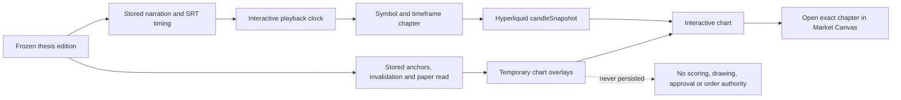

# Interactive thesis playback — 2026-09-17

## Repo-truth delta

The thesis edition previously attached a pre-rendered MP4 beneath the written
market cards. It could be watched, but it could not drive the chart, change a
timeframe, reveal a stored level, or hand the operator into Market Canvas.

The primary media surface is now an interactive chart story. The frozen
edition's existing ChaseOS-compatible Edge TTS narration and SRT timing drive
real Hyperliquid candles. Each spoken market chapter moves through 1d, 8h, 4h
and 1h views, draws the edition's stored high, low, close and invalidation
levels, shows a temporary paper-direction marker, then clears those
presentation overlays when the next chapter begins. The old MP4 remains under
an explicit fallback disclosure.

## Data and authority flow

## Behaviour

- Play and Pause control the attached edition narration.
- The SRT clock synchronizes symbol and timeframe changes with speech.
- The operator can scrub, move chapter by chapter, or interrupt playback by
  choosing a market or timeframe.
- The chart uses the real venue candle endpoint; unavailable candles produce an
  explicit empty state and are never substituted.
- Playback levels are price-aligned chart primitives derived only from the
  frozen edition. They are revealed progressively while the narrator speaks,
  cleared at the next chapter, and never written to `canvas_drawings`.
- Paper-direction arrows are explanatory examples, not entries or orders.
- The Market Canvas link preserves the current symbol and interval.
- The Market Canvas and candle service now accept native Hyperliquid `8h`
  candles as well as 1m, 5m, 15m, 1h, 4h and 1d.

## Voice

No new browser voice was introduced. The player uses the audio already
attached by `tools/thesis_video.py`, which follows the working ChaseOS pipeline
and its configured `THESIS_TTS_VOICE` (`en-US-AriaNeural` when no override is
set). This keeps rendered MP4, audio-only playback and the interactive player
on the same speaker rather than letting each browser choose a different voice.

## Safety boundary

The player is presentation and education only. It does not save its overlays,
change weights, create opportunities, open paper positions, request wallet
signatures or place live orders. Execution remains disabled and the edition's
`NO TRADE` verdict remains visible during playback.

## Verification

- Cockpit production build: passed.
- Cockpit suite: 254 passed, including four playback timing/level tests.
- Market-data candle tests: 12 passed, including the 8-hour window.
- Responsive rendered acceptance is stored under
  `E:\Visual QA\TradeSync Visual QA\Current Reviews\2026-09-17-interactive-thesis`.

## Remaining acceptance

- Listen to the physical workstation audio and confirm that it is the intended
  ChaseOS voice; code and stored media establish configuration continuity, not
  the operator's subjective voice acceptance.
- Playback proves synchronized explanation, not strategy profitability.
