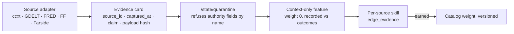

# Open data sources for Market Command — research for operator review

Date: 2026-09-12. Research only: nothing here is wired in. Every star count,
licence and last-push date was read from the GitHub API today; every term of
use was read from the source's own documentation. Where I could not verify
something, it says so.

**Path:** `E:\Projects\TradeSync\dashboard-overhaul-2026-09-01\docs\research\2026-09-12_open-data-sources-for-market-command.md`

## The question

TradingView has no data-export API, so what TradingView shows you must come
from somewhere else — and you want *more* than TradingView: derivatives,
fundamentals, ETF flows, the economic calendar, news, macro. Open source or
free-and-safe, private use only, nothing that can push a bad payload into the
system.

## The rule every source below is measured against

A source enters TradeSync **only through the quarantine intake** that already
exists (`/state/quarantine`): it lands with provenance, a content hash, and
`authority: none`; it is refused if it tries to name its own trust or any
scoring field; it stays **context-only** until its own track record earns it a
weight (the process in `MARKET_COMMAND_PLAN_2026-09-11.md` §5.1). That is what
"safe" means here — not "we trust the vendor", but "nothing the vendor sends can
become a signal on its own".

Hyperliquid stays the only authoritative price. Everything below is context.

---

## Verdict table

| Need | Recommended source | Stars / licence / last push | Terms (verified) | Safety class |
|---|---|---|---|---|
| **Multi-exchange candles, funding, OI, order books** | `ccxt/ccxt` | 43,953 · MIT · 2026-09-11 | Library; you call the exchanges' public endpoints directly | ✅ pull-only, typed, no third party in the middle |
| **Real-time multi-exchange streams (trades, books, liquidations where an exchange publishes them)** | `bmoscon/cryptofeed` | 2,902 · **AGPL-3.0** · 2026-09-08 | AGPL's network clause only bites if you *modify and serve it to others* — private single-operator use is fine | ✅ pull-only websocket client |
| **Economic calendar (FOMC, CPI, NFP…)** | FRED `releases/dates` (official) **+** ForexFactory weekly JSON feed | FRED: free key, official. FF: public JSON, fields verified | FRED: free with registered key. FF: terms not published for the feed — low-rate private use, cache locally | ✅ FRED; ⚠️ FF is a courtesy feed, may change |
| **Macro series (rates, CPI, M2, DXY…)** | FRED (already a TradeSync context provider) | `mortada/fredapi` 1,656 · Apache-2.0 | Free key | ✅ already in |
| **Spot reference, market caps, dominance** | CoinGecko Demo (already in) | — | **100 calls/min, 10,000/month, attribution required, non-commercial** | ✅ private use fits; keep the attribution line |
| **US spot ETF flows (BTC/ETH/SOL)** | `mikeoc61/farside` (scraper of Farside Investors) | 1 · MIT · 2026-09-03 | Scrapes a website; README says "respect Farside's terms, don't hammer" | ⚠️ scraper — once a day, cached, treated as Tier 3 context |
| **News with tone/sentiment, any language** | **GDELT DOC 2.0 API** | Official, no key | "unlimited and unrestricted use … without fee"; **citation required** | ✅ best-licensed news source found |
| **Crypto-specific news headlines** | `nirholas/cryptocurrency.cv` hosted API | 307 · **source-available, all rights reserved** · 2026-09-08 | Hosted API free with or without attribution; **self-hosting needs permission** | ⚠️ use the hosted API only; do not self-host or redistribute |
| **Equities / ETFs / broad market context** | `ranaroussi/yfinance` | 25,226 · Apache-2.0 · 2026-09-10 | Scrapes Yahoo; Yahoo's terms are personal-use | ⚠️ personal use only; fine for us |
| **One SDK over many of the above** | `OpenBB-finance/OpenBB` | 72,891 · **AGPL-3.0** · 2026-09-11 | Same AGPL note as cryptofeed; wraps yfinance, FRED, and paid providers behind one API | ✅ private use; large dependency — adopt only if we use ≥3 of its providers |
| **Liquidations, long/short ratios, aggregated OI** | Coinglass / CoinAnk | Closed, paid tiers (could not verify free-tier limits from docs) | Paid | ❌ not open; revisit only if a specific feature proves it needs them |
| **TradingView data via scrapers** | `rongardF/tvdatafeed` 661, `imxeno/tradingview-scraper` 299, others | Unofficial, most unmaintained (2022–2024) | Against TradingView's terms; brittle | ❌ **do not use** — the same data is available from the exchanges directly via ccxt |

### What this buys you versus TradingView

TradingView is a *view* over exchange data. `ccxt` reads the same exchanges
(Binance, Bybit, OKX, Coinbase, Hyperliquid — Hyperliquid is CCXT-certified)
without the view in the middle, so a "Binance BTCUSDT 4H structure" chart can
be reproduced from the source with no scraping. What TradingView has that no
open source replaces is **your Pine indicators running on their servers** — and
those already reach us as alert webhooks, which is the right path for them.

---

## Per-source notes

### ccxt — the backbone

Verified in `python/ccxt/hyperliquid.py` today: `fetch_ohlcv`, `fetch_trades`,
`fetch_order_book`, `fetch_funding_rate(s)`, and the capability flags
`fetchFundingRateHistory: True`, `fetchOpenInterest: True`,
`fetchOpenInterestHistory: False`, `fetchLiquidations: False`. So for
Hyperliquid itself ccxt adds nothing we lack — market-data already reads those
endpoints. Its value is **the other venues**: Binance/Bybit/OKX funding, OI and
liquidation streams for cross-venue context (the Coinbase premium feature is
exactly this pattern, and it earned a scoring weight). MIT, 43k stars, pushed
today. Adopt.

### cryptofeed — if we want liquidation streams

Liquidations are the one Tier-2 item Hyperliquid does not publish. Binance,
Bybit and OKX do, over websocket, and cryptofeed normalises them. AGPL-3.0 with
an attribution term ("This product includes software developed by Bryant
Moscon"). For a private single-operator system that never serves the modified
code to others, the network clause does not trigger; the attribution line goes
in the docs. Adopt when the liquidation feature is designed — not before.

### Economic calendar — two feeds, different trust

- **FRED `fred/releases/dates`** with `include_release_dates_with_no_data=true`
  returns *upcoming* release dates for every FRED release (CPI, employment,
  GDP…). Official, free key, the same key TradeSync's FRED provider already
  wants. FRED's own caveat: dates come from the publishing agencies.
- **ForexFactory** publishes a weekly JSON at
  `nfs.faireconomy.media/ff_calendar_thisweek.json` — verified today to be an
  array with `title, country, date, impact, forecast, previous`. It covers the
  non-US and non-FRED items (ECB, BoE, PMIs) and carries impact ratings. Its
  terms are not published; treat as a courtesy feed: fetch once an hour at
  most, cache, and expect it to change.

The SOP's "TradingDigits economic calendar" screenshot is replaced by these two
as structured data.

### GDELT — the news source with the cleanest terms

Free, no key, explicit permission for any use including commercial, with one
condition: cite the GDELT Project with a link. Returns articles plus a **tone
score (−100…+100)** and volume timelines, across 65 languages. Query operators
support phrase, boolean, domain and tone filters. That makes "news sentiment
on BTC over the last 15 minutes" a single request — and, more importantly for
us, a *measurable* feature: tone as a candidate directional input whose skill
can be tested like any other.

### cryptocurrency.cv — useful, but read the licence

300+ RSS feeds, 77 international outlets, no key, fair-use throttling. The
**code is not open source** ("source-available, all rights reserved");
self-hosting or building a competing service needs permission. The hosted API
is free with or without attribution. Use the hosted API as a context source,
identify our client with a User-Agent as they ask, and do not self-host.

### Farside ETF flows — a scraper, so a policy

`mikeoc61/farside` is a one-star MIT scraper of Farside's pages. That is fine
for what it is — the data is a small daily table — but it is a scraper of
someone's website. Policy: once a day after US close, cached, attributed,
Tier 3. If Farside ever publishes a feed, switch.

### CoinGecko — already in, and the free plan's limits now matter

Verified today: Demo plan is **100 calls/minute, 10,000 calls/month,
attribution required, non-commercial**. TradeSync's spot-reference panel polls
it; at 10,000/month that is one call every ~4.3 minutes averaged. Worth
checking the current poll cadence before adding any new CoinGecko-backed
feature. Private use fits the plan; keep the "Data provided by CoinGecko"
line the dashboard already shows.

### OpenBB — one door, big house

72k stars, AGPL-3.0, pushed today. `pip install openbb` or a FastAPI server at
`127.0.0.1:6900`, with modules for equity, crypto, currency, derivatives,
economy, ETF, fixed income, index, news and regulators, wrapping free providers
(yfinance, FRED, ECB, OECD, SEC…) and paid ones (FMP, Polygon, Intrinio…).
*Module and provider lists are from OpenBB's README and package layout; the
provider-by-provider docs page returned 404 today, so verify before adopting.*
Honest assessment: it would replace three or four small integrations with one
large dependency. Worth it only once we actually want equities and macro
breadth on the dashboard (your "equities, upcoming calendar meetings" ask). Not
for the first slice.

### What I am recommending against

- **TradingView scrapers.** Unofficial, against their terms, and mostly dead
  repositories. Everything they scrape is available from the exchanges.
- **Coinglass / CoinAnk as dependencies.** Closed and paid. The SOP used CoinAnk
  *screenshots* as Tier 2; cryptofeed plus ccxt gives the same funding/OI/
  liquidation facts as data.
- **Investing.com scrapers (`investpy`)** — 1,853 stars but scraping a site
  that actively blocks it; unreliable by design.

---

## How each source would enter (the same path, every time)

Every adapter is **pull-only** (we call them; nothing calls us) except the
TradingView webhook, which is why that one has an HMAC secret, an IP allowlist
and a tunnel design. A pulled payload can still be malformed or hostile, so
each adapter validates shape against a declared contract before the card is
built — the same `selector_contract` idea your source registry already uses.

## Suggested first three, in order

1. **FRED release calendar + ForexFactory feed** → a "this week" events strip on
   Mission Control. Smallest, official, immediately useful for the weekly view.
2. **GDELT tone on BTC/ETH/SOL** → a context feature recorded against outcomes.
   First genuinely new *measurable* evidence class.
3. **ccxt Binance/Bybit funding + OI** → cross-venue derivatives context, same
   pattern as the Coinbase premium that already earned a weight.

Liquidations (cryptofeed), ETF flows (Farside), OpenBB and the YouTube
transcript path come after those, each through the same door.

## Sources

- GitHub API (`api.github.com/repos/…`, `search/repositories`), read 2026-09-12
- ccxt `python/ccxt/hyperliquid.py` (raw, master)
- OpenBB `LICENSE`, `README.md` (raw, develop)
- cryptofeed `LICENSE` (raw, master)
- cryptocurrency.cv `README.md` (raw, main)
- mikeoc61/farside `README.md` (raw, main)
- FRED API docs: `fred/releases/dates`
- `nfs.faireconomy.media/ff_calendar_thisweek.json` (fetched, fields inspected)
- CoinGecko pricing page (Demo plan limits)
- GDELT `about.html` (terms of use) and the DOC 2.0 API announcement
