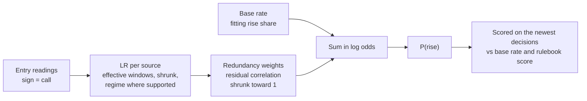

# Evidence combination — how measured sources become one probability

Date: 2026-09-15 · Status: research design, **shadow only** · Method `evidence-combination-v1`,
digest `96539f87951f05a9a4642d74f10681d1fe289589b35ad5c076fcaeafb73151e6`

Code: `libs/tradesync_core/tradesync_core/evidence_combination*.py` · Endpoint:
`GET /state/research/evidence-combination?horizon=15|60|240` · Cockpit: Opportunities → Learning →
Evidence combination · Every live table and the exercise answers: [appendix](2026-09-15_evidence-combination-appendix.md).

## 0. The question

The Market Command plan (§5.1, §8) left one piece of maths undesigned: the system "can tell you
whether a source has skill; it does not yet combine sources by their likelihood ratios". The skill
gate and the evidence cards ask whether *one* source beats a biased guesser. This asks: when several
sources speak at once, what probability of a rise do they justify *together*, and would that
probability have been any good? Nothing here reaches the scorer, the rulebook, the catalog, a weight
or a gate.

## 1. Vocabulary

| Term | Plain meaning |
|---|---|
| **call** | A source's sign at entry: a positive reading says up, negative says down, zero or missing says nothing. |
| **rose / fell** | What the market did over the horizon after entry, not whether the paper call won. Exactly flat windows are left out. |
| **base rate** | The share of fitting windows that rose: the forecast of someone who ignores every source. |
| **odds, log odds** | Odds are p / (1 − p): 60% is 1.5, 50% is 1. Log odds are ln(odds). Adding to log odds multiplies the odds. |
| **likelihood ratio (LR)** | How much more often a source made this call before a rise than before a fall. LR 1 says nothing. |
| **effective windows** | What overlapping calls are worth as independent evidence (Kish count over horizon-long clusters, symbols pooled). |
| **prior windows** | Imaginary windows of "no information" added before the data: 20 here, so data carries half the weight at 20 effective windows. |
| **residual correlation** | How much two sources' calls move together *within* rising windows and *within* falling windows. |
| **redundancy weight** | The share of a source's evidence still counted after overlap with other sources present is removed. |
| **calibration** | Whether things forecast at 60% rise about 60% of the time. |
| **Brier score, log loss** | Two scores of a probability against what happened; lower is better. Always saying 50% scores 0.25 and 0.6931. |
| **break-even probability** | The probability a call needs before its expected return covers the 0.12% round trip. |

## 2. Worked examples — numbers first

Every number below is checked by a test in `tests/test_evidence_combination_*.py`; each test names its example.

**Example 1 — one source, one call.** A source called on 200 independent windows. The market rose
in 100 and fell in 100; the source said *up* in 60 of the rises and 40 of the falls.
P(up call | rose) = 0.60 and P(up call | fell) = 0.40, so **LR(up call) = 1.5** and
**LR(down call) = 0.40 / 0.60 = 0.667**. From 50%: odds 1 × 1.5 = 1.5, p = 1.5 / 2.5 = **60%**. From a
45% base rate: odds 0.818 × 1.5 = 1.227, p = **55.1%**. The same call means less in a falling market.

**Example 2 — no evidence, no update.** Add 20 imaginary windows, 10 rises and 10 falls, in which the
source called up at its usual rate m = (up calls + 1) / (calls + 2).
- 200 windows: m = 101/202 = 0.5; (60 + 10 × 0.5) / (100 + 10) = 0.5909 and (40 + 5) / 110 = 0.4091; **LR 1.444**, not 1.5.
- 20 windows (6 up calls in 10 rises, 4 in 10 falls): (6 + 5) / 20 = 0.55 and (4 + 5) / 20 = 0.45; **LR 1.222, 95% interval 0.66 to 2.25**. The interval holds 1: twenty windows cannot tell this source from a coin.
- 0 windows: 0.5 / 0.5, **LR 1 exactly**.

The interval works on the log scale: Var[ln θ] ≈ (1 − θ) / (θ(N + 1)), with N the windows plus 10. For
20 windows, 0.45/(0.55 × 21) + 0.55/(0.45 × 21) = 0.0972, and ln 1.222 ± 1.96 × √0.0972 = 0.2007 ± 0.6110
gives e^−0.410 = 0.66 to e^0.812 = 2.25.

**Example 3 — overlap is not evidence.** Ten calls landing 4, 4, 1 and 1 in four hours are worth
(4+4+1+1)² / (4²+4²+1²+1²) = 100/34 = **2.94 effective windows**, not 10. Counts are scaled to
effective windows *before* shrinkage, so bunched calls cannot buy certainty. Base rate: 30 rises in
100 independent windows is (30 + ½)/(100 + 1) = **30.2%**; the same calls ten to an hour are 10
effective windows, (3 + ½)/(10 + 1) = **31.8%**.

**Example 4 — two sources in log odds.** Base rate 48%: log odds ln(0.48/0.52) = **−0.0800**. A calls
up with LR 1.25 (ln 0.2231), B with LR 1.10 (ln 0.0953). Independent: −0.0800 + 0.2231 + 0.0953 = 0.2384,
p = 1/(1 + e^−0.2384) = **55.93%**. If B is an exact copy of A, adding both gives
−0.0800 + 2 × 0.2231 → **59.06%**; weighting each copy ½ gives −0.0800 + 0.2231 → **53.57%**. The
5.5-point gap is double counting.

**Example 5 — partial redundancy.** Same A and B, with shrunk residual correlation 0.40. A source's
weight is 1 / (1 + ρ × min(1, other's evidence / own evidence)): B can repeat at most the evidence B gives.
A: 1/(1 + 0.40 × 0.0953/0.2231) = **0.854**; B: 1/(1 + 0.40) = **0.714**. Evidence
0.854 × 0.2231 + 0.714 × 0.0953 = 0.2587, log odds 0.1787, **54.45%** — between counted once and independent.

**Example 6 — a correlation needs evidence too.** 0.10 measured on 60 shared effective windows, with 20
prior windows at full redundancy: (60 × 0.10 + 20 × 1)/80 = **0.325**. No shared windows: **1**, the same
evidence until shown otherwise. 1,000 shared windows: **0.118**.

**Example 7 — agreement is not redundancy.** Two sources are each right in 3 windows of 4, with
independent mistakes. They agree 62.5% of the time, well above chance, because both track the market.
Within the rising windows and within the falling ones their calls are unrelated: **residual correlation 0**,
so both keep their full vote.

**Example 8 — a regime, only where supported.** Elsewhere a source's up calls came before 55% of rises.
In falling markets it has 20 effective rises, 14 with an up call. Shrunk: (14 + 10 × 0.55)/(20 + 10) = **65%**,
not 70%. Below 20 effective windows in a regime, its pooled ratio is used unchanged.

**Example 9 — scoring.** Forecasts 60%, 55%, 40%; the market rose, fell, fell. Brier
((0.4)² + (0.55)² + (0.4)²)/3 = **0.2075**; log loss −(ln 0.60 + ln 0.45 + ln 0.60)/3 = **0.6067**.
Saying 50% each time: 0.25 and 0.6931.

**Example 10 — calibration.** Five forecasts of 40% (one rose) and five of 60% (four rose): right
about direction, too timid. Reliability ½(0.40 − 0.20)² + ½(0.60 − 0.80)² = **0.04**; resolution
½(0.2 − 0.5)² + ½(0.8 − 0.5)² = **0.09**; uncertainty 0.5 × 0.5 = **0.25**; Brier 0.04 − 0.09 + 0.25 = **0.20**.
The gap is 20 points in each bin, yet with five windows a bin both 95% intervals (3.6%–62.4%,
37.6%–96.4%) still contain their forecasts: **not detectable** at this size.

**Example 11 — the rulebook score as a probability.** P(rise) = 1/(1 + e^−(a + b s)). With a = −0.04,
b = 0.30 and score s = 0.28: a + bs = 0.044, **51.1%**.

**Example 12 — what pays.** Rises and falls average 0.30% and the round trip costs 0.12%. A long
expects p × 0.30 − (1 − p) × 0.30 − 0.12, positive only above (0.30 + 0.12)/0.60 = **70%**. A short needs
below (0.30 − 0.12)/0.60 = **30%**.

**Example 13 — weak, correlated sources cannot get there.** 50% to 70% needs log odds
ln(0.7/0.3) = 0.847. Sources of LR 1.1 give 0.0953 each: **nine** independent agreeing sources. If every
pair shares redundancy 0.25, k sources give k × 0.0953/(1 + (k − 1) × 0.25), which never passes
0.0953/0.25 = 0.381: a ceiling of **59.4%**, however many sources are added.

## 3. The formulas



**3.1 Bayes' rule in log odds.** For a decision in regime g,
`ln odds(rise) = ln odds(π) + Σ w_i · ln LR_i(c_i | g)`, summed over the sources that called and have a
fitting record: π is the base rate, c_i the call, w_i ∈ (0, 1] the redundancy weight. A source that
abstained or has no record is simply not in the sum.

**3.2 A source's ratio.** Over the fitting decisions where source i called, n_R windows rose (a with an
up call) and n_F fell (b with an up call). Scale by f = ESS_i / (n_R + n_F), where ESS_i is the Kish count of
those calls. With κ = 20 and m = (f·a + f·b + 1)/(f·n_R + f·n_F + 2):

```
θ_R = (f·a + ½κ·m) / (f·n_R + ½κ)        P(up call | rose)
θ_F = (f·b + ½κ·m) / (f·n_F + ½κ)        P(up call | fell)
LR(up) = θ_R / θ_F                       LR(down) = (1 − θ_R) / (1 − θ_F)
Var[ln LR(up)] ≈ (1 − θ_R) / (θ_R (f·n_R + ½κ + 1)) + (1 − θ_F) / (θ_F (f·n_F + ½κ + 1))
95% interval = exp(ln LR ± 1.96 √Var)
```

The swing ln LR(up) − ln LR(down) is positive for a source that leans with the move and negative for a
contrarian one. No polarity test is needed: a contrarian's up call simply has LR below 1.

**3.3 Regime.** A source uses a regime-specific ratio only with at least 20 effective fitting windows in
that regime (the learning verdict policy's minimum). Its θ's are then shrunk toward what the source did
in the *other* regimes, so no window is used twice; with no other regime on record, toward m as in 3.2.
The prior stays pooled: the regime label is not evidence here.

**3.4 Base rate.** π = (ESS × share that rose + ½) / (ESS + 1) over the fitting decisions.

**3.5 Dependence.** For sources i and j over the S fitting decisions where both called, with calls coded
±1 and centred within the rising and within the falling windows:

```
ρ̂_ij = Σ_classes Σ (x_i − x̄_i)(x_j − x̄_j) / √(Σ_classes Σ (x_i − x̄_i)² · Σ_classes Σ (x_j − x̄_j)²)
ρ̃_ij = (ESS_S · s_i · s_j · ρ̂_ij + κ) / (ESS_S + κ)             s = sign of the source's swing
R_i  = 1 + Σ_{j present, j ≠ i} max(0, ρ̃_ij) · min(1, |ℓ_j| / |ℓ_i|)          w_i = 1 / R_i
```

ρ̂ is 0 when a call never varies within an outcome class: a constant has nothing to repeat. Tested
properties: exact copies get ½ each and count once; independent sources keep 1; k equally strong sources
with common ρ get 1/(1 + (k − 1)ρ), Kish's effective number; a source with ℓ = 0 dilutes no one; perfectly
correlated sources never add up to more than the strongest. In between, the rule is a conservative
interpolation judged out of sample. The textbook optimum, weights Σ⁻¹μ from the covariance of the log
ratios, is not used: on 20–80 effective windows those weights swing wildly and can turn negative.

**3.6 The rulebook baseline.** The stored `directional_score` is calibrated on the same fitting decisions
by maximising Σ f[y ln p + (1 − y) ln(1 − p)] + ½ ln σ(a) + ½ ln(1 − σ(a)) − ½λb², with
p = σ(a + b·s), f = ESS / n and λ = κ × ¼ × mean(s²): the same twenty windows of doubt, on the slope.
Decisions stored before the scorer recorded a score cannot be used. At 1 hour, 223 of 2,219 fitting
decisions had none and rose 83% of the time, against 46.5% for the rest. That is why the calibrated
intercept sits below the pooled base rate.

## 4. Validation design

1. **Split.** The attributed decisions of the 14-day learning window, in entry order; the newest 30% are
   tested. A fitting decision whose window ends after the first test decision opens is purged.
2. **Size.** Kish effective windows (`learning_stats`) and non-overlapping windows per symbol and pooled
   (`independence`), for both sides.
3. **Four forecasts per test decision.** Base rate π; calibrated rulebook score (π where no score);
   combined sources; combined *counted as independent* (every w = 1), an ablation that shows double counting.
4. **Scores.** Brier and log loss (forecasts clipped to [10⁻⁶, 1 − 10⁻⁶]); reliability in five equal-count
   bins that never split identical forecasts, each with a Wilson interval at its effective windows; Murphy's
   reliability, resolution and uncertainty; calibration gap = count-weighted mean |forecast − share that
   rose|, *detectable* only when a bin's interval excludes its forecast.
5. **Comparisons.** Loss differences decision by decision; mean and 95% interval at the test set's
   effective windows. Better or worse only when the whole interval sits on one side of zero.
6. **Economics.** U and D from the fitting windows; a long must exceed (D + c)/(U + D), a short stay under
   (D − c)/(U + D). Test decisions clearing either are counted with their net return, and the report says
   when the base rate alone clears a level.

Every constant (κ = 20, regime minimum 20, 30% hold-out, 5 bins, clip) was fixed by reasoning before the
first evaluation on live data, and all are hashed into the method digest. Changing one is a new version.

## 5. What the live data said

Computed at 01:19 UTC on 15 September from the live database, read-only (two SELECTs per horizon inside
read-only transactions), by the branch's `app/evidence_combination.build_response`, the function the
endpoint runs. **Local run, not the deployed endpoint.** Cost 0.12% round trip, 14-day window.

| Horizon | Fit: decisions · effective · independent · rose | Test: decisions · effective · independent · rose | Purged | Base rate |
|---|---|---|---|---|
| 15 min | 2,046 · 273.4 · 335 · 49.0% | 882 · 78.3 · 80 · 50.6% | 9 | 49.03% |
| 1 hour | 2,219 · 61.6 · 93 · 50.2% | 972 · 22.7 · 25 · 51.5% | 48 | 50.20% |
| 4 hours | 2,148 · 18.2 · 26 · 36.0% | 940 · 6.2 · 7 · 51.7% | 43 | 36.72% |

Fitting windows ran from 7 or 8 September to 13 September; test windows from 13 September (16:00 UTC at
4 hours, 19:39 UTC at 15 minutes) to 14 September (21:14 UTC at 4 hours, 23:54 UTC otherwise). "Independent"
is non-overlapping windows with symbols pooled.

**Scores on the test decisions** (lower is better; intervals are 95% at the test's effective windows):

| Horizon | Forecast | Brier | Log loss | Calibration gap | Log loss minus base rate |
|---|---|---|---|---|---|
| 15 min | Base rate | 0.2502 | 0.6936 | 1.54 pts | reference |
| | Rulebook score, calibrated | 0.2500 | 0.6932 | 1.69 pts | −0.0004 (−0.0038 to +0.0030) |
| | **Combined sources** | 0.2513 | 0.6958 | 4.21 pts | +0.0022 (−0.0121 to +0.0165) |
| | Counted as independent | 0.2518 | 0.6967 | 4.31 pts | +0.0031 (−0.0137 to +0.0200) |
| 1 hour | Base rate | 0.2499 | 0.6930 | 1.34 pts | reference |
| | Rulebook score, calibrated | 0.2523 | 0.6978 | 4.98 pts | +0.0047 (−0.0258 to +0.0353) |
| | **Combined sources** | 0.2501 | 0.6934 | 1.95 pts | +0.0004 (−0.0152 to +0.0159) |
| | Counted as independent | 0.2504 | 0.6940 | 3.15 pts | +0.0010 (−0.0222 to +0.0242) |
| 4 hours | Base rate | 0.2722 | 0.7390 | 14.99 pts | reference |
| | Rulebook score, calibrated | 0.2619 | 0.7172 | 11.05 pts | −0.0218 (−0.0877 to +0.0442) |
| | **Combined sources** | 0.2753 | 0.7461 | 15.93 pts | +0.0071 (−0.0349 to +0.0491) |
| | Counted as independent | 0.2777 | 0.7518 | 16.53 pts | +0.0128 (−0.0606 to +0.0861) |

Combined minus rulebook score, log loss: +0.0026 (−0.0119 to +0.0171) at 15 minutes, −0.0044 (−0.0360
to +0.0272) at 1 hour, +0.0289 (−0.0625 to +0.1202) at 4 hours. **Every difference is not
distinguishable, and every reliability bin of every forecast still contains its forecast.** The rulebook
score calibrated to slopes of +0.079 (15 min), **−0.073** (1 hour) and +0.044 (4 hours).

**Sources at 1 hour** (fitting window; all eight at every horizon are in the appendix):

| Source | Catalog | Calls · effective | LR up call | LR down call | Regime-conditioned | Counted at |
|---|---|---|---|---|---|---|
| 1h return | scoring | 2,123 · 59.0 | 0.99 (0.64–1.54) | 1.01 (0.66–1.55) | falling, rising | 46% |
| CVD order flow | scoring | 1,861 · 70.0 | 0.98 (0.65–1.48) | 1.02 (0.68–1.53) | falling, rising | 64% |
| Coinbase premium | scoring | 1,190 · 80.6 | 1.01 (0.83–1.23) | 0.97 (0.45–2.09) | falling, rising | 54% |
| Binance funding rate 8h | context only | 911 · 23.2 | 0.96 (0.69–1.33) | 1.15 (0.41–3.26) | none | 61% |
| Funding spread vs Binance | context only | 890 · 23.3 | 0.98 (0.70–1.37) | 1.06 (0.39–2.92) | none | 47% |
| GDELT news tone | context only | 50 · 8.2 | 0.94 (0.35–2.52) | 1.03 (0.62–1.73) | none | no test calls |
| Resting liquidity imbalance, liquidation-map skew | context only | 0 | — | — | — | nothing yet (257 and 253 newer calls) |

Binance funding's falling regime held 19.99 effective windows, one hundredth short of the minimum, so its
pooled ratio was used: the gate is a rule, not a judgement. At 15 minutes the largest ratio was the 1h
return's up call, 1.08 (0.85–1.37), and 1.26 in falling markets. GDELT tone's plain 15-minute up-call
ratio of 0.36 on 20.5 effective windows was shrunk to 0.66 (0.26–1.69): shrinkage doing its job.

**Dependence.** The residual correlations measured between recorded sources are small: at 1 hour the
scorer's two directional inputs, 1h return and CVD, correlate +0.07 over 67.7 shared effective windows,
and the largest pair with 20 or more is Coinbase premium with funding spread (−0.18 over 23.9, which,
with opposite polarities, is redundancy). Shared windows are few, so the prior toward redundancy
dominates: shrunk values run 0.13 to 0.85, and on the test decisions a source's evidence was counted at
**55%** of face value on average (78% at 15 minutes, 40% at 4 hours). The mean evidence moved per
decision was 0.062 log odds adjusted against 0.090 counted as independent. At 15 minutes, 1h return and
CVD correlate +0.08, but their point estimates lean opposite ways, so the rule reads their evidence as
cancelling rather than repeating: redundancy 0. No source's interval excludes ×1.00 at any horizon, so the
panel names no source's lean; the sign of a point estimate is used only inside the dependence arithmetic.

**Economics.**

| Horizon | Mean rise · fall | A long needs above | A short needs below | Test decisions clearing |
|---|---|---|---|---|
| 15 min | 0.167% · 0.177% | 86.4% | 16.5% | none (reliability-bin means 45.7%–53.8%) |
| 1 hour | 0.322% · 0.369% | 70.7% | 36.0% | none (bin means 47.7%–52.8%) |
| 4 hours | 0.521% · 0.746% | 68.4% | 49.4% | all 940 as shorts, −0.240% net (−1.662% to +1.182%) |

At 4 hours the fitting window fell more often and further than it rose, so the base rate alone (36.7%)
sat below the short level. Every decision "cleared" it, and those shorts lost 0.24% in a test window that
rose 51.7% of the time. It is the plainest lesson here that a period's drift is not a signal.

**The reading the endpoint gives at 1 hour, verbatim:**

> At 1 hour, combined sources would have been worse calibrated than the base rate on the newest 972
> decisions: their forecasts sat 2.0 points from what happened on average, against 1.3 points for the base
> rate. Every reliability bin's 95% interval still contains its forecast, so neither gap is detectable at
> this sample size. Log loss was 0.6934 for combined sources, against 0.6930 for the base rate (the 95%
> interval of the difference (-0.0152 to +0.0159) includes zero, so this test window cannot tell them
> apart); and 0.6978 for the rulebook score (the 95% interval of the difference (-0.0360 to +0.0272)
> includes zero, so this test window cannot tell them apart). No test decision's combined probability was
> above 70.7% for a long or below 36.0% for a short, the levels needed to cover the 0.12% round trip.
> Research reading only: nothing here changes scoring, weights or gates.

**What it means.** No source has a ratio distinguishable from 1 at any horizon, and combining sources
that carry no measurable information cannot create any: combined forecasts stayed within a few points of
the base rate, far from any break-even level. Out of sample the combination was indistinguishable from
both baselines everywhere, slightly worse in point estimate. Counting sources as independent was worse
than the adjusted version at every horizon, which is the direction double counting predicts, though not
distinguishably. The test windows are small (22.7 effective windows at 1 hour, 6.2 at 4 hours): an effect
of a few thousandths of log loss could hide inside these intervals, and that is what §6 is sized for.
The honest verdict is *not yet*; the machinery is ready for the first source that earns a ratio.

## 6. Governance and the promotion path

**Shadow now.** The endpoint runs two SELECTs, has no write path (a test asserts no execute call), is
served from the statistics cache in a worker thread, and labels itself `authority: research_only`,
`promotion_allowed: false`. The Cockpit panel says research reading. No scorer, rulebook, catalog, weight,
managed-paper or gate code reads it.

**Pre-registered forward comparison — proposed protocol, not yet registered.** Registration is the
operator's act, and freezing the fit needs a store (a research-trial specification or migration 034) that
this change does not build.
- *Method:* `evidence-combination-v1`, digest as above. The endpoint returns the digest; a different digest voids the comparison.
- *Frozen fit:* ratios, dependence, base rate and rulebook calibration fitted once, on every attributed decision opened before registration. Nothing refits during the comparison.
- *Population:* attributed decisions opened strictly after registration, same symbols and cost.
- *Primary:* 1 hour. Mean per-decision log loss of combined sources minus (a) the frozen base rate and (b) the frozen calibrated rulebook score.
- *When:* evaluated once, at 100 Kish effective windows at 1 hour (about five to six days at the recent 18 a day) or at 30 days, whichever comes first. Interim readings may be shown; they decide nothing.
- *Pass:* the upper 95% bound of both differences below zero, and no reliability bin of combined sources whose interval excludes its forecast.
- *Secondary, never decisive:* 15 minutes and 4 hours, Brier score, the counted-as-independent ablation, break-even clearance and its net return.
- *Changes:* any constant, source definition or population change is a new version and a new registration. Failed and inconclusive results are kept.

**Operator decision.** A pass permits nothing by itself. It is evidence the operator may cite to propose a
scoring change, which then goes through catalog versioning and the rulebook's own walk-forward replay and
adoption. A fail or an inconclusive result changes nothing; every source keeps recording. Execution stays
closed behind economic edge and explicit approval, as the roadmap requires.

## 7. Limitations and next steps

- A call is the reading's sign; magnitudes are ignored. Ordered categories (tertiles, a Dirichlet prior) extend the same maths.
- Ratios are measured at the moments the paper signal fired, not every hour.
- About seven days of data; test sets of 6 to 78 effective windows.
- Between its exact extremes the redundancy rule is a heuristic. With more effective windows, stacking (a logistic regression on the log ratios, with its own hold-out) becomes feasible.
- Move sizes are assumed not to depend on the probability, and the combined probability is not recalibrated (that would need a second hold-out).
- Claims from TradingView and Discord (source cards) are not yet aligned to decisions. "A claim active at entry" would make each a source here.

## 8. Exercises

Answers are in the [appendix](2026-09-15_evidence-combination-appendix.md#exercise-answers) and checked by
`tests/test_evidence_combination_exercises.py`.

1. A source called up in 45 of 60 independent rises and 30 of 60 falls. Find both plain LRs, then shrink them with 20 prior windows.
2. The base rate is 52%. Two independent sources call up with LR 1.2 and 1.3. What is the probability of a rise?
3. The same, but the second source is an exact copy of the first (LR 1.2). What now?
4. A source's up call has LR 0.8. Is the source useless?
5. Rises average 0.25%, falls 0.35%, the round trip costs 0.12%. What must a long exceed, and a short stay under?
6. A forecaster said 60% on 100 independent windows and 55 rose. Brier score? Calibration gap? Is the gap detectable?
7. Why is a regime's ratio shrunk toward the other regimes rather than toward the pooled ratio?
